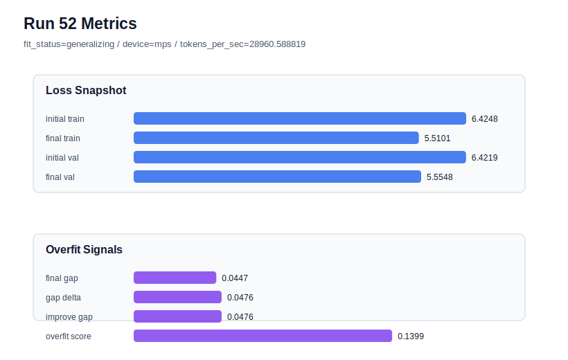

# run 052 실험 보고서

## 이번 가설

seed=134 저손실 과적합 구간에서 gelu_exact + drop_rate=0.12 결합 검증: run046은 seed=134, learning_rate=0.0003, max_steps=80, gelu_exact, drop_rate=0.10 조건에서 final_val_loss=5.554613으로 저손실을 유지했지만 gap=0.047528, overfit_score=0.148358로 overfit_risk였다. run050과 run051은 같은 gelu_exact 저손실 계열에서 drop_rate=0.12가 seed=202와 seed=151의 overfit_score를 낮추는 방향을 보였다. 따라서 run046과 동일한 seed=134 조건에서 drop_rate만 0.12로 올리면, 어려운 seed에서도 validation을 유지하면서 gap과 overfit_score를 낮춰 이 조합을 세 seed 평균 후보로 승격할 수 있는지 확인한다.

## 왜 이 가설을 세웠는가

최근 dashboard의 추세는 learning_rate=0.0003/max_steps=80 계열이 validation loss 최저권을 만들지만, seed=134에서 train 쪽 개선이 과하게 진행되어 overfit_score가 커지는 패턴을 보여준다. gelu_exact 단독은 seed=134의 과적합을 거의 줄이지 못했지만(run046), drop_rate=0.12는 seed=202에서 best를 만들고(run050), seed=151에서도 validation을 유지하면서 gap과 overfit_score를 낮췄다(run051). 이제 가장 어려운 seed=134에서 같은 regularization을 결합해 평균 후보인지, 아니면 seed134에는 learning_rate=0.000275 안정화 계열을 별도로 둬야 하는지 판단해야 한다. 구조 순서, attention 구현, FFN 형태, parameter_count는 유지하고 dropout 강도만 바꾸는 작은 실험이라 해석 가능성이 높다.

## 가설 작성 주체

llm_plan:docs/train/next_plan.json

## 바꾼 변수

```json
{
  "drop_rate": 0.12
}
```

## 고정한 변수

seed=134, vocab_size=600, context_length=48, stride=null, batch_size=8, max_steps=80, learning_rate=0.0003, weight_decay=0.01, grad_clip=1.0, emb_dim=128, n_heads=4, n_layers=2, qkv_bias=false, ffn_mult=4, norm_first=false, norm_eps=1e-5, activation_name=gelu_exact, ffn_dropout_position=none, attention_impl=sdpa, tie_embeddings=true, init_std=0.02

## 기대 결과

성공 기준은 run046 대비 final_val_loss가 5.56 이하를 유지하고, final_generalization_gap이 0.0475보다 낮아지며, overfit_score가 0.14 이하 또는 fit_status가 generalizing으로 내려오는 것이다. 특히 overfit_score가 0.12 이하에 가까워지면 gelu_exact + drop_rate=0.12 조합이 seed134 과적합 완화에도 의미 있다고 본다. final_val_loss가 5.565 이상으로 악화되면 seed134에서는 dropout 증가가 저손실 이득을 훼손한 것으로 본다. gap과 overfit_score가 거의 그대로면 seed134 문제는 dropout/activation보다 optimization 속도에 가깝다고 보고 learning_rate=0.000275 계열을 별도 안정 후보로 유지한다.

## 실험 설정

```json
{
  "run_id": 52,
  "hypothesis": "seed=134 저손실 과적합 구간에서 gelu_exact + drop_rate=0.12 결합 검증: run046은 seed=134, learning_rate=0.0003, max_steps=80, gelu_exact, drop_rate=0.10 조건에서 final_val_loss=5.554613으로 저손실을 유지했지만 gap=0.047528, overfit_score=0.148358로 overfit_risk였다. run050과 run051은 같은 gelu_exact 저손실 계열에서 drop_rate=0.12가 seed=202와 seed=151의 overfit_score를 낮추는 방향을 보였다. 따라서 run046과 동일한 seed=134 조건에서 drop_rate만 0.12로 올리면, 어려운 seed에서도 validation을 유지하면서 gap과 overfit_score를 낮춰 이 조합을 세 seed 평균 후보로 승격할 수 있는지 확인한다.",
  "seed": 134,
  "vocab_size": 600,
  "min_frequency": 2,
  "context_length": 48,
  "stride": null,
  "batch_size": 8,
  "max_steps": 80,
  "eval_batches": 4,
  "train_ratio": 0.9,
  "learning_rate": 0.0003,
  "weight_decay": 0.01,
  "grad_clip": 1.0,
  "emb_dim": 128,
  "n_heads": 4,
  "n_layers": 2,
  "drop_rate": 0.12,
  "qkv_bias": false,
  "ffn_mult": 4,
  "norm_first": false,
  "norm_eps": 1e-05,
  "activation_name": "gelu_exact",
  "ffn_dropout_position": "none",
  "attention_impl": "sdpa",
  "tie_embeddings": true,
  "init_std": 0.02
}
```

## 실행 환경

```json
{
  "timestamp": "2026-06-02T23:13:57+00:00",
  "hostname": "woonyong-MacBookPro.local",
  "platform": "macOS-26.3.1-arm64-arm-64bit-Mach-O",
  "machine": "arm64",
  "python": "3.13.13",
  "torch": "2.12.0",
  "cpu_count": 10,
  "memory_gb": 24.0,
  "cuda_available": false,
  "cuda_device_count": 0,
  "mps_available": true,
  "resolved_device": "mps",
  "profile": "mps_balanced"
}
```

- corpus: `src/learning/the-verdict.txt`
- artifact_dir: `docs/train/runs/run_052_artifacts`

## 실제 결과

| 지표 | 값 |
| --- | --- |
| initial_train_loss | 6.4247660636901855 |
| initial_val_loss | 6.421878337860107 |
| final_train_loss | 5.510072708129883 |
| final_val_loss | 5.554793834686279 |
| final_generalization_gap | 0.044721126556396484 |
| generalization_gap_delta | 0.04760885238647461 |
| train_val_improvement_gap | 0.04760885238647461 |
| overfit_score | 0.1399388313293457 |
| fit_status | generalizing |
| parameter_count | 478976 |
| tokens_per_sec | 28960.588819073047 |
| elapsed_sec | 1.0276034160051495 |
| device | mps |

## 시각 지표




- 대시보드: `../dashboard.md`
- 지표 요약 CSV: `../metrics_summary.csv`

## 과적합 판단

일반화 개선 신호. final gap=0.0447, overfit_score=0.1399. seed 반복으로 재현성을 확인할 만하다.

## 결론

현재 best 후보: run 50 / val=5.553958892822266 / status=generalizing

## 다음 실험 제안

- 성공 시: 성공하면 learning_rate=0.0003/max_steps=80/gelu_exact/drop_rate=0.12 조합을 세 seed의 저손실 평균 후보로 정리하고, 다음에는 seed별 평균 점수를 계산해 run050 계열과 learning_rate=0.000275 안정 계열을 비교한다. 추가 실험은 max_steps=90 같은 더 긴 학습이 아니라, seed 반복이나 context/stride 같은 데이터 window 축으로 이동한다.
- 과적합 시: 과적합이 유지되면 seed134에서는 high learning rate 80-step 계열의 train 편향이 핵심이라고 판단한다. 다음에는 seed134를 learning_rate=0.000275/drop_rate=0.12 또는 max_steps=70 계열로 두고, seed202/151의 low-loss 계열과 별도로 운영하는 하이브리드 기준을 세운다. function 교체 축은 잠시 멈추고 optimization과 학습 길이 경계 실험을 우선한다.
