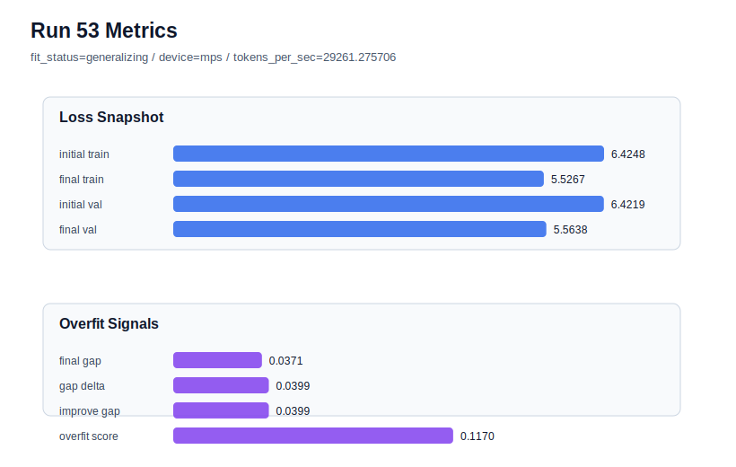

# run 053 실험 보고서

## 이번 가설

seed=134 gelu_exact + drop_rate=0.12 조건에서 learning_rate=0.000275 안정화 검증: run052는 seed=134, gelu_exact, drop_rate=0.12, learning_rate=0.0003, max_steps=80 조건에서 final_val_loss=5.554794로 저손실을 유지했지만 gap=0.044721, overfit_score=0.139939로 여전히 train 편향이 컸다. run037/run042는 learning_rate=0.000275가 seed134의 과적합 신호를 낮추는 가장 일관된 축임을 보여줬다. 따라서 run052와 동일한 함수/regularization 조합에서 learning_rate만 0.000275로 낮추면 validation 손실을 크게 늘리지 않으면서 gap과 overfit_score를 안정적으로 낮출 수 있는지 확인한다.

## 왜 이 가설을 세웠는가

최근 결과를 종합하면 seed134의 문제는 gelu_exact 단독(run046)이나 dropout 증가(run052)만으로 충분히 해결되지 않았다. 반대로 learning_rate=0.000275 계열은 seed134에서 final_val_loss를 약간 희생하지만 gap과 overfit_score를 낮추는 안정화 효과가 반복적으로 관찰됐다. 이번 실험은 run052를 기준으로 learning_rate만 바꾸는 단일축 optimization 테스트라, drop_rate=0.12와 gelu_exact를 유지한 상태에서도 낮은 learning_rate가 핵심인지 분리할 수 있다. MPS balanced 장비에서 80 step은 약 1초 내외라 자동화 점유도 안전하다.

## 가설 작성 주체

llm_plan:docs/train/next_plan.json

## 바꾼 변수

```json
{
  "learning_rate": 0.000275
}
```

## 고정한 변수

seed=134, vocab_size=600, context_length=48, stride=null, batch_size=8, max_steps=80, weight_decay=0.01, grad_clip=1.0, emb_dim=128, n_heads=4, n_layers=2, drop_rate=0.12, qkv_bias=false, ffn_mult=4, norm_first=false, norm_eps=1e-5, activation_name=gelu_exact, ffn_dropout_position=none, attention_impl=sdpa, tie_embeddings=true, init_std=0.02

## 기대 결과

성공 기준은 run052 대비 final_generalization_gap이 0.04 이하로 내려가고 overfit_score가 0.12 이하로 낮아지며, final_val_loss가 5.57 이하에 머무는 것이다. run042와 비슷한 validation을 보이면서 gap이나 overfit_score가 더 낮아지면 seed134 안정 후보로 채택한다. final_val_loss가 5.58 이상이면 learning_rate 감소가 under-training을 만든 것으로 본다. gap과 overfit_score가 거의 줄지 않으면 seed134 안정화는 learning_rate 단독보다 max_steps 또는 데이터 window 축을 필요로 한다.

## 실험 설정

```json
{
  "run_id": 53,
  "hypothesis": "seed=134 gelu_exact + drop_rate=0.12 조건에서 learning_rate=0.000275 안정화 검증: run052는 seed=134, gelu_exact, drop_rate=0.12, learning_rate=0.0003, max_steps=80 조건에서 final_val_loss=5.554794로 저손실을 유지했지만 gap=0.044721, overfit_score=0.139939로 여전히 train 편향이 컸다. run037/run042는 learning_rate=0.000275가 seed134의 과적합 신호를 낮추는 가장 일관된 축임을 보여줬다. 따라서 run052와 동일한 함수/regularization 조합에서 learning_rate만 0.000275로 낮추면 validation 손실을 크게 늘리지 않으면서 gap과 overfit_score를 안정적으로 낮출 수 있는지 확인한다.",
  "seed": 134,
  "vocab_size": 600,
  "min_frequency": 2,
  "context_length": 48,
  "stride": null,
  "batch_size": 8,
  "max_steps": 80,
  "eval_batches": 4,
  "train_ratio": 0.9,
  "learning_rate": 0.000275,
  "weight_decay": 0.01,
  "grad_clip": 1.0,
  "emb_dim": 128,
  "n_heads": 4,
  "n_layers": 2,
  "drop_rate": 0.12,
  "qkv_bias": false,
  "ffn_mult": 4,
  "norm_first": false,
  "norm_eps": 1e-05,
  "activation_name": "gelu_exact",
  "ffn_dropout_position": "none",
  "attention_impl": "sdpa",
  "tie_embeddings": true,
  "init_std": 0.02
}
```

## 실행 환경

```json
{
  "timestamp": "2026-06-02T23:19:02+00:00",
  "hostname": "woonyong-MacBookPro.local",
  "platform": "macOS-26.3.1-arm64-arm-64bit-Mach-O",
  "machine": "arm64",
  "python": "3.13.13",
  "torch": "2.12.0",
  "cpu_count": 10,
  "memory_gb": 24.0,
  "cuda_available": false,
  "cuda_device_count": 0,
  "mps_available": true,
  "resolved_device": "mps",
  "profile": "mps_balanced"
}
```

- corpus: `src/learning/the-verdict.txt`
- artifact_dir: `docs/train/runs/run_053_artifacts`

## 실제 결과

| 지표 | 값 |
| --- | --- |
| initial_train_loss | 6.4247660636901855 |
| initial_val_loss | 6.421878337860107 |
| final_train_loss | 5.526697516441345 |
| final_val_loss | 5.563757101694743 |
| final_generalization_gap | 0.03705958525339792 |
| generalization_gap_delta | 0.039947311083476045 |
| train_val_improvement_gap | 0.039947311083476045 |
| overfit_score | 0.11695420742035001 |
| fit_status | generalizing |
| parameter_count | 478976 |
| tokens_per_sec | 29261.27570577581 |
| elapsed_sec | 1.0170438329223543 |
| device | mps |

## 시각 지표




- 대시보드: `../dashboard.md`
- 지표 요약 CSV: `../metrics_summary.csv`

## 과적합 판단

일반화 개선 신호. final gap=0.0371, overfit_score=0.1170. seed 반복으로 재현성을 확인할 만하다.

## 결론

현재 best 후보: run 50 / val=5.553958892822266 / status=generalizing

## 다음 실험 제안

- 성공 시: 성공하면 seed134는 learning_rate=0.000275 + drop_rate=0.12 + gelu_exact를 안정 경로로 두고, seed151/202의 low-loss 경로(run50/run51)와 분리한 하이브리드 전략을 문서화한다. 다음 실험은 seed151 또는 seed202에서 learning_rate=0.000275 + drop_rate=0.12 + gelu_exact를 반복해 평균 안정성 점수를 비교하거나, context_length/stride 축으로 넘어간다.
- 과적합 시: 과적합이 유지되면 learning_rate만으로는 부족하다고 보고 max_steps=70과 learning_rate=0.000275의 결합을 seed134에서 확인한다. validation이 크게 나빠지면 learning_rate=0.0003 저손실 후보는 유지하되, seed134에는 early stop 또는 max_steps 경계 실험을 우선한다. function 교체 축은 추가하지 않는다.
