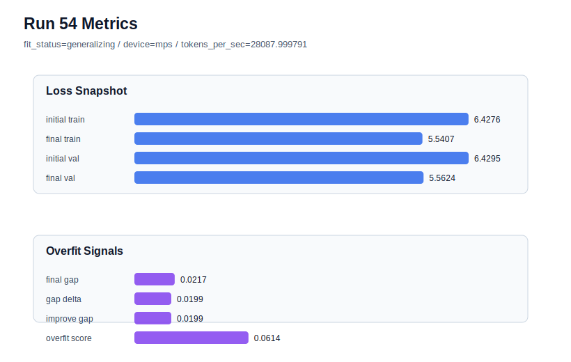

# run 054 실험 보고서

## 이번 가설

seed=151에서 learning_rate=0.000275 + drop_rate=0.12 + gelu_exact 안정 후보 검증: run051은 seed=151, learning_rate=0.0003, drop_rate=0.12, gelu_exact 조건에서 final_val_loss=5.553612로 저손실을 유지했지만 gap=0.030143, overfit_score=0.086745로 medium risk였다. run053은 seed=134에서 learning_rate=0.000275가 validation을 일부 희생하더라도 gap과 overfit_score를 안정화한다는 것을 보였다. 따라서 seed=151에서도 run051과 동일한 함수/regularization 조합에서 learning_rate만 0.000275로 낮추면, validation 손실을 크게 키우지 않으면서 overfit_score를 더 낮춰 안정 평균 후보가 될 수 있는지 확인한다.

## 왜 이 가설을 세웠는가

현재 best는 seed202의 run050이지만, seed134와 seed151은 같은 저손실 계열에서 gap이 더 크다. seed134에는 learning_rate=0.000275가 반복적으로 안정화 효과를 보였고, seed151도 기존 run039에서 learning_rate=0.000275가 final_val_loss=5.561801, overfit_score=0.068929로 꽤 안정적이었다. 이번 실험은 run051을 기준으로 learning_rate만 낮추는 단일축 테스트이며, gelu_exact와 drop_rate=0.12가 seed151에서 안정화와 validation 사이의 더 나은 균형을 만드는지 확인한다. 구조와 parameter_count는 그대로 유지한다.

## 가설 작성 주체

llm_plan:docs/train/next_plan.json

## 바꾼 변수

```json
{
  "learning_rate": 0.000275
}
```

## 고정한 변수

seed=151, vocab_size=600, context_length=48, stride=null, batch_size=8, max_steps=80, weight_decay=0.01, grad_clip=1.0, emb_dim=128, n_heads=4, n_layers=2, drop_rate=0.12, qkv_bias=false, ffn_mult=4, norm_first=false, norm_eps=1e-5, activation_name=gelu_exact, ffn_dropout_position=none, attention_impl=sdpa, tie_embeddings=true, init_std=0.02

## 기대 결과

성공 기준은 run051 대비 final_generalization_gap과 overfit_score가 낮아지고, final_val_loss가 5.57 이하에 머무는 것이다. 특히 overfit_score가 0.07 이하로 내려가면 learning_rate=0.000275 + drop_rate=0.12 + gelu_exact를 seed151 안정 후보로 본다. final_val_loss가 5.58 이상이면 learning_rate 감소와 dropout 조합이 under-training을 만든 것으로 본다. validation이 run039와 비슷하고 overfit_score가 더 낮으면 안정 후보로 유지한다.

## 실험 설정

```json
{
  "run_id": 54,
  "hypothesis": "seed=151에서 learning_rate=0.000275 + drop_rate=0.12 + gelu_exact 안정 후보 검증: run051은 seed=151, learning_rate=0.0003, drop_rate=0.12, gelu_exact 조건에서 final_val_loss=5.553612로 저손실을 유지했지만 gap=0.030143, overfit_score=0.086745로 medium risk였다. run053은 seed=134에서 learning_rate=0.000275가 validation을 일부 희생하더라도 gap과 overfit_score를 안정화한다는 것을 보였다. 따라서 seed=151에서도 run051과 동일한 함수/regularization 조합에서 learning_rate만 0.000275로 낮추면, validation 손실을 크게 키우지 않으면서 overfit_score를 더 낮춰 안정 평균 후보가 될 수 있는지 확인한다.",
  "seed": 151,
  "vocab_size": 600,
  "min_frequency": 2,
  "context_length": 48,
  "stride": null,
  "batch_size": 8,
  "max_steps": 80,
  "eval_batches": 4,
  "train_ratio": 0.9,
  "learning_rate": 0.000275,
  "weight_decay": 0.01,
  "grad_clip": 1.0,
  "emb_dim": 128,
  "n_heads": 4,
  "n_layers": 2,
  "drop_rate": 0.12,
  "qkv_bias": false,
  "ffn_mult": 4,
  "norm_first": false,
  "norm_eps": 1e-05,
  "activation_name": "gelu_exact",
  "ffn_dropout_position": "none",
  "attention_impl": "sdpa",
  "tie_embeddings": true,
  "init_std": 0.02
}
```

## 실행 환경

```json
{
  "timestamp": "2026-06-02T23:24:14+00:00",
  "hostname": "woonyong-MacBookPro.local",
  "platform": "macOS-26.3.1-arm64-arm-64bit-Mach-O",
  "machine": "arm64",
  "python": "3.13.13",
  "torch": "2.12.0",
  "cpu_count": 10,
  "memory_gb": 24.0,
  "cuda_available": false,
  "cuda_device_count": 0,
  "mps_available": true,
  "resolved_device": "mps",
  "profile": "mps_balanced"
}
```

- corpus: `src/learning/the-verdict.txt`
- artifact_dir: `docs/train/runs/run_054_artifacts`

## 실제 결과

| 지표 | 값 |
| --- | --- |
| initial_train_loss | 6.427632451057434 |
| initial_val_loss | 6.429474512736003 |
| final_train_loss | 5.540651798248291 |
| final_val_loss | 5.562357584635417 |
| final_generalization_gap | 0.021705786387125947 |
| generalization_gap_delta | 0.01986372470855713 |
| train_val_improvement_gap | 0.01986372470855713 |
| overfit_score | 0.061433235804240205 |
| fit_status | generalizing |
| parameter_count | 478976 |
| tokens_per_sec | 28087.99979138207 |
| elapsed_sec | 1.059527208097279 |
| device | mps |

## 시각 지표




- 대시보드: `../dashboard.md`
- 지표 요약 CSV: `../metrics_summary.csv`

## 과적합 판단

일반화 개선 신호. final gap=0.0217, overfit_score=0.0614. seed 반복으로 재현성을 확인할 만하다.

## 결론

현재 best 후보: run 50 / val=5.553958892822266 / status=generalizing

## 다음 실험 제안

- 성공 시: 성공하면 learning_rate=0.000275 + drop_rate=0.12 + gelu_exact를 seed134/151 안정 경로로 두고, 다음에는 seed202에도 같은 조합을 반복해 안정 경로의 세 seed 평균을 완성한다. 이후 run050/run051의 low-loss 경로와 안정 경로를 평균 score, pure validation, overfit_score 기준으로 비교한다.
- 과적합 시: gap이나 overfit_score가 줄지 않으면 seed151은 run051의 low-loss 경로를 유지하고, 안정화는 seed134에만 적용하는 하이브리드 전략으로 둔다. validation이 크게 악화되면 learning_rate=0.000275와 drop_rate=0.12의 결합은 seed151에서 과도 regularization으로 판단하고, 다음에는 context_length/stride 같은 데이터 window 축을 본다.
