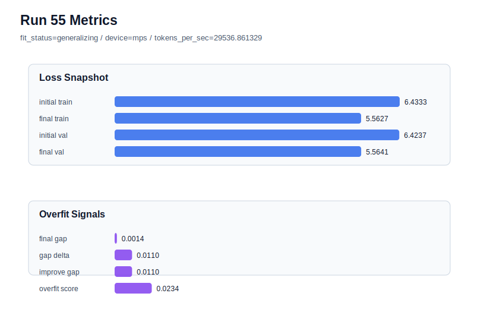

# run 055 실험 보고서

## 이번 가설

seed=202에서 learning_rate=0.000275 + drop_rate=0.12 + gelu_exact 안정 경로 검증: run050은 seed=202, learning_rate=0.0003, drop_rate=0.12, gelu_exact 조건에서 현재 best(final_val_loss=5.553959, gap=0.007347, overfit_score=0.041182)를 만들었다. run053/run054는 seed134/151에서 learning_rate=0.000275가 validation을 일부 희생하더라도 gap과 overfit_score를 낮춰 안정화한다는 것을 보였다. 따라서 run050과 동일한 함수/regularization 조합에서 learning_rate만 0.000275로 낮추면, seed202에서도 validation 손실 증가를 작게 유지하면서 overfit_score를 더 낮춰 안정 경로의 세 seed 평균 비교를 완성할 수 있는지 확인한다.

## 왜 이 가설을 세웠는가

현재 leaderboard는 learning_rate=0.0003 계열이 pure validation loss 최저권을 만들고, learning_rate=0.000275 계열이 seed134/151에서 과적합 지표를 낮추는 경향을 보여준다. 다만 seed202의 best run050은 이미 gap이 매우 낮아서 낮은 learning_rate가 실제로 의미 있는 안정성 개선인지, 아니면 validation만 희생하는지 아직 분리되지 않았다. 이번 실험은 run050을 기준으로 learning_rate만 바꾸는 단일축 optimization 테스트라 해석 가능성이 높고, Transformer 구조와 activation/attention/FFN 형태는 모두 유지한다. MPS 환경에서 max_steps=80은 짧은 회차로 끝나므로 자동 루프 점유도 안전하다.

## 가설 작성 주체

llm_plan:docs/train/next_plan.json

## 바꾼 변수

```json
{
  "learning_rate": 0.000275
}
```

## 고정한 변수

vocab_size, context_length, stride, batch_size, weight_decay, grad_clip, emb_dim, n_heads, n_layers, drop_rate, qkv_bias, ffn_mult, norm_first, norm_eps, activation_name, ffn_dropout_position, attention_impl, tie_embeddings, init_std, max_steps, seed

## 기대 결과

성공 기준은 run050 대비 final_generalization_gap이나 overfit_score가 낮아지고, final_val_loss가 5.57 이하에 머무는 것이다. 특히 final_val_loss가 5.56대 초반 이하이고 overfit_score가 0.03 이하로 내려가면 seed202에서도 안정 경로가 의미 있다고 본다. final_val_loss가 5.575 이상으로 상승하면 learning_rate 감소는 seed202 best 경로에서 과도한 under-training 비용으로 판단한다.

## 실험 설정

```json
{
  "run_id": 55,
  "hypothesis": "seed=202에서 learning_rate=0.000275 + drop_rate=0.12 + gelu_exact 안정 경로 검증: run050은 seed=202, learning_rate=0.0003, drop_rate=0.12, gelu_exact 조건에서 현재 best(final_val_loss=5.553959, gap=0.007347, overfit_score=0.041182)를 만들었다. run053/run054는 seed134/151에서 learning_rate=0.000275가 validation을 일부 희생하더라도 gap과 overfit_score를 낮춰 안정화한다는 것을 보였다. 따라서 run050과 동일한 함수/regularization 조합에서 learning_rate만 0.000275로 낮추면, seed202에서도 validation 손실 증가를 작게 유지하면서 overfit_score를 더 낮춰 안정 경로의 세 seed 평균 비교를 완성할 수 있는지 확인한다.",
  "seed": 202,
  "vocab_size": 600,
  "min_frequency": 2,
  "context_length": 48,
  "stride": null,
  "batch_size": 8,
  "max_steps": 80,
  "eval_batches": 4,
  "train_ratio": 0.9,
  "learning_rate": 0.000275,
  "weight_decay": 0.01,
  "grad_clip": 1.0,
  "emb_dim": 128,
  "n_heads": 4,
  "n_layers": 2,
  "drop_rate": 0.12,
  "qkv_bias": false,
  "ffn_mult": 4,
  "norm_first": false,
  "norm_eps": 1e-05,
  "activation_name": "gelu_exact",
  "ffn_dropout_position": "none",
  "attention_impl": "sdpa",
  "tie_embeddings": true,
  "init_std": 0.02
}
```

## 실행 환경

```json
{
  "timestamp": "2026-06-02T23:29:44+00:00",
  "hostname": "woonyong-MacBookPro.local",
  "platform": "macOS-26.3.1-arm64-arm-64bit-Mach-O",
  "machine": "arm64",
  "python": "3.13.13",
  "torch": "2.12.0",
  "cpu_count": 10,
  "memory_gb": 24.0,
  "cuda_available": false,
  "cuda_device_count": 0,
  "mps_available": true,
  "resolved_device": "mps",
  "profile": "mps_balanced"
}
```

- corpus: `src/learning/the-verdict.txt`
- artifact_dir: `docs/train/runs/run_055_artifacts`

## 실제 결과

| 지표 | 값 |
| --- | --- |
| initial_train_loss | 6.433309078216553 |
| initial_val_loss | 6.42373784383138 |
| final_train_loss | 5.562682151794434 |
| final_val_loss | 5.564117431640625 |
| final_generalization_gap | 0.0014352798461914062 |
| generalization_gap_delta | 0.011006514231364228 |
| train_val_improvement_gap | 0.011006514231364228 |
| overfit_score | 0.023448308308919863 |
| fit_status | generalizing |
| parameter_count | 478976 |
| tokens_per_sec | 29536.861328979998 |
| elapsed_sec | 1.0075545830186456 |
| device | mps |

## 시각 지표




- 대시보드: `../dashboard.md`
- 지표 요약 CSV: `../metrics_summary.csv`

## 과적합 판단

일반화 개선 신호. final gap=0.0014, overfit_score=0.0234. seed 반복으로 재현성을 확인할 만하다.

## 결론

현재 best 후보: run 50 / val=5.553958892822266 / status=generalizing

## 다음 실험 제안

- 성공 시: 성공하면 learning_rate=0.000275 + drop_rate=0.12 + gelu_exact 안정 경로의 seed134/151/202 평균을 run050/run051/run052의 저손실 경로 평균과 비교한다. 평균 validation 손실 차이가 작고 overfit_score 평균이 낮으면 안정 경로를 기본 후보로 승격하고, 다음에는 context_length/stride 같은 데이터 window 축을 실험한다.
- 과적합 시: 과적합 신호가 줄지 않거나 validation만 악화되면 seed202는 run050의 learning_rate=0.0003 저손실 경로를 유지한다. 이후 seed134/151에는 안정 경로, seed202에는 저손실 경로를 쓰는 하이브리드 기준을 문서화하고, 다음 실험은 max_steps=70 또는 context/stride 축으로 이동한다.
