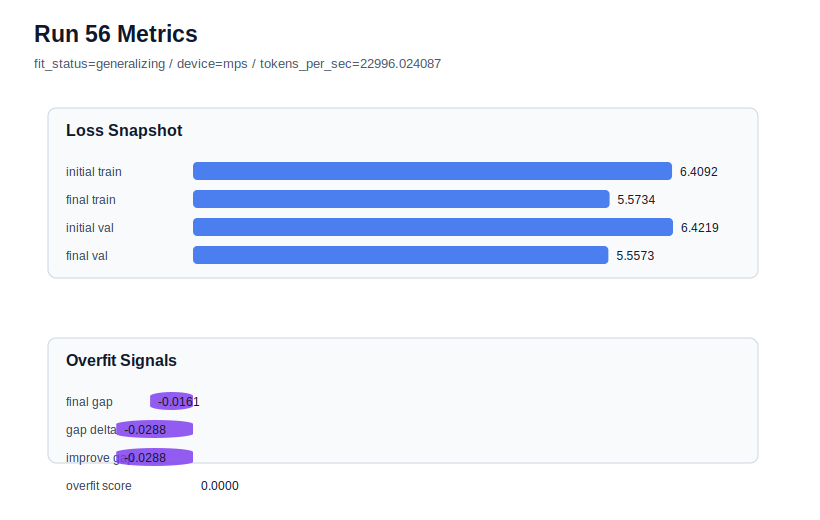

# run 056 실험 보고서

## 이번 가설

seed=134 저손실 경로에서 stride=24 데이터 window 축 검증: run050/run051/run052의 learning_rate=0.0003 + drop_rate=0.12 + gelu_exact 저손실 경로는 세 seed 평균 validation이 안정 경로보다 좋았지만, seed=134 run052는 gap=0.044721, overfit_score=0.139939로 train 편향이 여전히 컸다. 반대로 learning_rate=0.000275 안정 경로는 overfit_score를 낮췄지만 validation을 약 0.009 올렸다. 따라서 run052와 동일한 모델/함수/학습률 조건에서 stride만 null에서 24로 줄여 overlapping training windows를 늘리면, 구조를 바꾸지 않고 데이터 노출 다양성을 늘려 validation 손실을 유지하면서 seed134의 gap과 overfit_score를 낮출 수 있는지 확인한다.

## 왜 이 가설을 세웠는가

지금까지 activation, dropout 강도, norm_eps, learning_rate를 확인한 결과, low-loss를 만드는 핵심은 learning_rate=0.0003 + max_steps=80 계열이고 과적합 위험은 특히 seed134에서 커졌다. learning_rate를 낮추면 overfit_score는 낮아지지만 validation이 확실히 악화된다. 다음으로 해석 가능한 작은 축은 Transformer 구조가 아니라 데이터 window 구성이다. stride=24는 context_length=48과 모델 크기를 유지하면서 학습 샘플의 시작점을 더 촘촘히 만들어 작은 corpus에서 같은 80 step 동안 더 다양한 국소 문맥을 보게 한다. MPS balanced 하드웨어에서는 batch_size=8, max_steps=80이 계속 짧은 회차이므로 안전하다.

## 가설 작성 주체

llm_plan:docs/train/next_plan.json

## 바꾼 변수

```json
{
  "stride": 24
}
```

## 고정한 변수

vocab_size, context_length, batch_size, weight_decay, grad_clip, emb_dim, n_heads, n_layers, drop_rate, qkv_bias, ffn_mult, norm_first, norm_eps, activation_name, ffn_dropout_position, attention_impl, tie_embeddings, init_std, max_steps, seed, learning_rate

## 기대 결과

성공 기준은 run052 대비 final_val_loss가 5.56 이하를 유지하면서 final_generalization_gap이 0.04 이하, overfit_score가 0.12 이하로 내려가는 것이다. validation이 5.554-5.558 범위에 머무르고 overfit_score만 낮아지면 stride 축은 seed134 과적합 완화에 의미 있다고 본다. final_val_loss가 5.57 이상이면 overlapping window가 데이터 분포를 바꾸거나 noisy optimization을 만들어 저손실 장점을 훼손한 것으로 판단한다.

## 실험 설정

```json
{
  "run_id": 56,
  "hypothesis": "seed=134 저손실 경로에서 stride=24 데이터 window 축 검증: run050/run051/run052의 learning_rate=0.0003 + drop_rate=0.12 + gelu_exact 저손실 경로는 세 seed 평균 validation이 안정 경로보다 좋았지만, seed=134 run052는 gap=0.044721, overfit_score=0.139939로 train 편향이 여전히 컸다. 반대로 learning_rate=0.000275 안정 경로는 overfit_score를 낮췄지만 validation을 약 0.009 올렸다. 따라서 run052와 동일한 모델/함수/학습률 조건에서 stride만 null에서 24로 줄여 overlapping training windows를 늘리면, 구조를 바꾸지 않고 데이터 노출 다양성을 늘려 validation 손실을 유지하면서 seed134의 gap과 overfit_score를 낮출 수 있는지 확인한다.",
  "seed": 134,
  "vocab_size": 600,
  "min_frequency": 2,
  "context_length": 48,
  "stride": 24,
  "batch_size": 8,
  "max_steps": 80,
  "eval_batches": 4,
  "train_ratio": 0.9,
  "learning_rate": 0.0003,
  "weight_decay": 0.01,
  "grad_clip": 1.0,
  "emb_dim": 128,
  "n_heads": 4,
  "n_layers": 2,
  "drop_rate": 0.12,
  "qkv_bias": false,
  "ffn_mult": 4,
  "norm_first": false,
  "norm_eps": 1e-05,
  "activation_name": "gelu_exact",
  "ffn_dropout_position": "none",
  "attention_impl": "sdpa",
  "tie_embeddings": true,
  "init_std": 0.02
}
```

## 실행 환경

```json
{
  "timestamp": "2026-06-02T23:34:16+00:00",
  "hostname": "woonyong-MacBookPro.local",
  "platform": "macOS-26.3.1-arm64-arm-64bit-Mach-O",
  "machine": "arm64",
  "python": "3.13.13",
  "torch": "2.12.0",
  "cpu_count": 10,
  "memory_gb": 24.0,
  "cuda_available": false,
  "cuda_device_count": 0,
  "mps_available": true,
  "resolved_device": "mps",
  "profile": "mps_balanced"
}
```

- corpus: `src/learning/the-verdict.txt`
- artifact_dir: `docs/train/runs/run_056_artifacts`

## 실제 결과

| 지표 | 값 |
| --- | --- |
| initial_train_loss | 6.409173369407654 |
| initial_val_loss | 6.421878337860107 |
| final_train_loss | 5.573354721069336 |
| final_val_loss | 5.557267347971599 |
| final_generalization_gap | -0.016087373097737334 |
| generalization_gap_delta | -0.028792341550190947 |
| train_val_improvement_gap | -0.028792341550190947 |
| overfit_score | 0.0 |
| fit_status | generalizing |
| parameter_count | 478976 |
| tokens_per_sec | 22996.024087294878 |
| elapsed_sec | 1.3275338329840451 |
| device | mps |

## 시각 지표




- 대시보드: `../dashboard.md`
- 지표 요약 CSV: `../metrics_summary.csv`

## 과적합 판단

일반화 개선 신호. final gap=-0.0161, overfit_score=0.0000. seed 반복으로 재현성을 확인할 만하다.

## 결론

현재 best 후보: run 56 / val=5.557267347971599 / status=generalizing

## 다음 실험 제안

- 성공 시: 성공하면 같은 stride=24 조건을 seed151 또는 seed202 저손실 경로에 반복해 평균 validation과 overfit_score가 동시에 개선되는지 확인한다. 세 seed 평균에서 low-loss 경로의 validation 장점을 유지하며 overfit_score가 낮아지면 stride=24를 기본 데이터 window 후보로 승격한다.
- 과적합 시: gap이나 overfit_score가 줄지 않으면 seed134의 문제는 데이터 window 부족보다 high learning_rate의 train 편향에 가깝다고 본다. 그 경우 stride 축은 중단하고 run052 기준에서 max_steps=70 조기 종료 또는 seed별 하이브리드 전략을 다음 후보로 둔다. validation이 크게 악화되면 stride는 null로 되돌린다.
