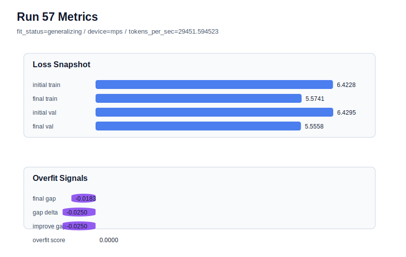

# run 057 실험 보고서

## 이번 가설

seed=151 저손실 경로에서 stride=24 재현성 검증: run056은 seed=134에서 stride를 null에서 24로 줄이자 final_val_loss=5.557267로 저손실 범위를 유지하면서 gap=-0.016087, overfit_score=0.0까지 낮춰 overfit-aware best가 되었다. run051은 seed=151, learning_rate=0.0003, drop_rate=0.12, gelu_exact 조건에서 final_val_loss=5.553612로 pure validation은 뛰어났지만 gap=0.030143, overfit_score=0.086745로 아직 train 편향이 남아 있었다. 따라서 run051과 동일한 모델/함수/학습 조건에서 stride만 24로 줄이면, seed151에서도 validation을 크게 잃지 않으면서 gap과 overfit_score를 낮춰 stride=24가 seed134 특이 효과가 아니라 평균적으로 유효한 데이터 window 축인지 확인할 수 있다.

## 왜 이 가설을 세웠는가

최근 결과는 learning_rate=0.0003 + max_steps=80 + gelu_exact + drop_rate=0.12가 pure validation loss 최저권을 만들고, learning_rate=0.000275는 과적합을 낮추는 대신 validation 비용을 만든다는 것을 보여줬다. run056은 learning_rate를 낮추지 않고 데이터 window만 바꿔 seed134의 과적합을 크게 줄였기 때문에, 이 축이 가장 유망한 다음 후보가 되었다. seed151은 seed134보다 과적합이 덜하지만 seed202보다 gap이 커서, stride 효과의 재현성과 과도 regularization 위험을 동시에 확인하기 좋은 중간 난이도 seed다. Transformer 구조, activation, attention, parameter_count는 모두 유지한다.

## 가설 작성 주체

llm_plan:docs/train/next_plan.json

## 바꾼 변수

```json
{
  "stride": 24
}
```

## 고정한 변수

vocab_size, context_length, batch_size, learning_rate, weight_decay, grad_clip, emb_dim, n_heads, n_layers, drop_rate, qkv_bias, ffn_mult, norm_first, norm_eps, activation_name, ffn_dropout_position, attention_impl, tie_embeddings, init_std, max_steps, seed

## 기대 결과

성공 기준은 run051 대비 final_generalization_gap과 overfit_score가 낮아지고 final_val_loss가 5.56 이하에 머무는 것이다. 특히 final_val_loss가 5.553-5.558 범위에 남으면서 overfit_score가 0.05 이하로 내려가면 stride=24를 저손실 계열의 강한 평균 후보로 본다. final_val_loss가 5.565 이상으로 악화되면 seed151에서는 overlapping window가 under-training 또는 데이터 분포 변화를 만든 것으로 판단한다.

## 실험 설정

```json
{
  "run_id": 57,
  "hypothesis": "seed=151 저손실 경로에서 stride=24 재현성 검증: run056은 seed=134에서 stride를 null에서 24로 줄이자 final_val_loss=5.557267로 저손실 범위를 유지하면서 gap=-0.016087, overfit_score=0.0까지 낮춰 overfit-aware best가 되었다. run051은 seed=151, learning_rate=0.0003, drop_rate=0.12, gelu_exact 조건에서 final_val_loss=5.553612로 pure validation은 뛰어났지만 gap=0.030143, overfit_score=0.086745로 아직 train 편향이 남아 있었다. 따라서 run051과 동일한 모델/함수/학습 조건에서 stride만 24로 줄이면, seed151에서도 validation을 크게 잃지 않으면서 gap과 overfit_score를 낮춰 stride=24가 seed134 특이 효과가 아니라 평균적으로 유효한 데이터 window 축인지 확인할 수 있다.",
  "seed": 151,
  "vocab_size": 600,
  "min_frequency": 2,
  "context_length": 48,
  "stride": 24,
  "batch_size": 8,
  "max_steps": 80,
  "eval_batches": 4,
  "train_ratio": 0.9,
  "learning_rate": 0.0003,
  "weight_decay": 0.01,
  "grad_clip": 1.0,
  "emb_dim": 128,
  "n_heads": 4,
  "n_layers": 2,
  "drop_rate": 0.12,
  "qkv_bias": false,
  "ffn_mult": 4,
  "norm_first": false,
  "norm_eps": 1e-05,
  "activation_name": "gelu_exact",
  "ffn_dropout_position": "none",
  "attention_impl": "sdpa",
  "tie_embeddings": true,
  "init_std": 0.02
}
```

## 실행 환경

```json
{
  "timestamp": "2026-06-02T23:43:35+00:00",
  "hostname": "woonyong-MacBookPro.local",
  "platform": "macOS-26.3.1-arm64-arm-64bit-Mach-O",
  "machine": "arm64",
  "python": "3.13.13",
  "torch": "2.12.0",
  "cpu_count": 10,
  "memory_gb": 24.0,
  "cuda_available": false,
  "cuda_device_count": 0,
  "mps_available": true,
  "resolved_device": "mps",
  "profile": "mps_balanced"
}
```

- corpus: `src/learning/the-verdict.txt`
- artifact_dir: `docs/train/runs/run_057_artifacts`

## 실제 결과

| 지표 | 값 |
| --- | --- |
| initial_train_loss | 6.4228023290634155 |
| initial_val_loss | 6.429474512736003 |
| final_train_loss | 5.574132084846497 |
| final_val_loss | 5.555843353271484 |
| final_generalization_gap | -0.018288731575012207 |
| generalization_gap_delta | -0.02496091524759958 |
| train_val_improvement_gap | -0.02496091524759958 |
| overfit_score | 0.0 |
| fit_status | generalizing |
| parameter_count | 478976 |
| tokens_per_sec | 29451.594522594547 |
| elapsed_sec | 1.0365482920315117 |
| device | mps |

## 시각 지표




- 대시보드: `../dashboard.md`
- 지표 요약 CSV: `../metrics_summary.csv`

## 과적합 판단

일반화 개선 신호. final gap=-0.0183, overfit_score=0.0000. seed 반복으로 재현성을 확인할 만하다.

## 결론

현재 best 후보: run 57 / val=5.555843353271484 / status=generalizing

## 다음 실험 제안

- 성공 시: 성공하면 seed202에서도 같은 stride=24 조건을 반복해 세 seed 평균을 완성한다. seed202에서도 validation을 유지하고 gap/overfit_score가 낮아지면 stride=24를 기본 데이터 window 후보로 승격하고, 이후 context_length=64 또는 max_steps 경계 실험을 보수적으로 진행한다.
- 과적합 시: gap이나 overfit_score가 줄지 않으면 run056은 seed134 특이 개선일 수 있다. 그 경우 seed134에만 stride=24를 적용하는 하이브리드 전략을 문서화하고, seed151/202는 stride=null 저손실 경로를 유지한다. validation이 크게 악화되면 stride 축은 seed134 전용 완화책으로 제한한다.
