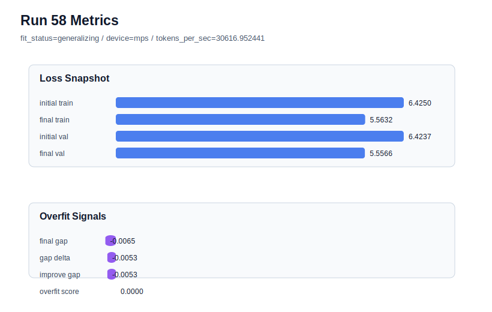

# run 058 실험 보고서

## 이번 가설

seed=202 저손실 경로에서 stride=24 세 번째 seed 검증: run056(seed134)과 run057(seed151)은 learning_rate=0.0003, drop_rate=0.12, gelu_exact 조건에서 stride를 24로 줄였을 때 validation 손실을 저손실 범위에 유지하면서 final_generalization_gap을 음수로 만들고 overfit_score를 0.0까지 낮췄다. run050은 seed=202의 기존 stride=null 저손실 best로 final_val_loss=5.553959, gap=0.007347, overfit_score=0.041182를 보였다. 따라서 run050과 동일한 모델/함수/학습 조건에서 stride만 24로 줄이면, seed202에서도 validation을 크게 잃지 않으면서 gap과 overfit_score를 낮춰 stride=24를 세 seed 평균 기본 후보로 승격할 수 있는지 확인한다.

## 왜 이 가설을 세웠는가

최근 두 번의 실험은 구조나 parameter_count를 바꾸지 않고 데이터 window만 촘촘히 만드는 stride=24가 과적합 지표를 강하게 줄인다는 신호를 줬다. seed134는 어려운 seed였고 seed151은 중간 난이도였는데 둘 다 overfit_score=0.0이 되었다. 이제 seed202는 기존 pure validation이 가장 좋은 seed라서, stride=24가 단순히 어려운 seed의 regularization 도구인지, 아니면 저손실 best seed에서도 과적합-aware score를 개선하는 범용 데이터 조건인지 판단할 수 있다. MPS balanced 장비에서 80 step은 계속 짧은 회차라 안전하다.

## 가설 작성 주체

llm_plan:docs/train/next_plan.json

## 바꾼 변수

```json
{
  "stride": 24
}
```

## 고정한 변수

vocab_size, context_length, batch_size, learning_rate, weight_decay, grad_clip, emb_dim, n_heads, n_layers, drop_rate, qkv_bias, ffn_mult, norm_first, norm_eps, activation_name, ffn_dropout_position, attention_impl, tie_embeddings, init_std, max_steps, seed

## 기대 결과

성공 기준은 run050 대비 final_generalization_gap과 overfit_score가 낮아지고 final_val_loss가 5.56 이하에 머무는 것이다. 특히 final_val_loss가 5.553-5.558 범위에 남으면서 overfit_score가 0.02 이하 또는 0.0으로 내려가면 stride=24를 세 seed 평균 기본 후보로 본다. final_val_loss가 5.565 이상이면 seed202에서는 overlap window가 best validation을 훼손한 것으로 판단한다.

## 실험 설정

```json
{
  "run_id": 58,
  "hypothesis": "seed=202 저손실 경로에서 stride=24 세 번째 seed 검증: run056(seed134)과 run057(seed151)은 learning_rate=0.0003, drop_rate=0.12, gelu_exact 조건에서 stride를 24로 줄였을 때 validation 손실을 저손실 범위에 유지하면서 final_generalization_gap을 음수로 만들고 overfit_score를 0.0까지 낮췄다. run050은 seed=202의 기존 stride=null 저손실 best로 final_val_loss=5.553959, gap=0.007347, overfit_score=0.041182를 보였다. 따라서 run050과 동일한 모델/함수/학습 조건에서 stride만 24로 줄이면, seed202에서도 validation을 크게 잃지 않으면서 gap과 overfit_score를 낮춰 stride=24를 세 seed 평균 기본 후보로 승격할 수 있는지 확인한다.",
  "seed": 202,
  "vocab_size": 600,
  "min_frequency": 2,
  "context_length": 48,
  "stride": 24,
  "batch_size": 8,
  "max_steps": 80,
  "eval_batches": 4,
  "train_ratio": 0.9,
  "learning_rate": 0.0003,
  "weight_decay": 0.01,
  "grad_clip": 1.0,
  "emb_dim": 128,
  "n_heads": 4,
  "n_layers": 2,
  "drop_rate": 0.12,
  "qkv_bias": false,
  "ffn_mult": 4,
  "norm_first": false,
  "norm_eps": 1e-05,
  "activation_name": "gelu_exact",
  "ffn_dropout_position": "none",
  "attention_impl": "sdpa",
  "tie_embeddings": true,
  "init_std": 0.02
}
```

## 실행 환경

```json
{
  "timestamp": "2026-06-02T23:49:21+00:00",
  "hostname": "woonyong-MacBookPro.local",
  "platform": "macOS-26.3.1-arm64-arm-64bit-Mach-O",
  "machine": "arm64",
  "python": "3.13.13",
  "torch": "2.12.0",
  "cpu_count": 10,
  "memory_gb": 24.0,
  "cuda_available": false,
  "cuda_device_count": 0,
  "mps_available": true,
  "resolved_device": "mps",
  "profile": "mps_balanced"
}
```

- corpus: `src/learning/the-verdict.txt`
- artifact_dir: `docs/train/runs/run_058_artifacts`

## 실제 결과

| 지표 | 값 |
| --- | --- |
| initial_train_loss | 6.424985885620117 |
| initial_val_loss | 6.42373784383138 |
| final_train_loss | 5.563153982162476 |
| final_val_loss | 5.5566205978393555 |
| final_generalization_gap | -0.006533384323120117 |
| generalization_gap_delta | -0.005285342534382842 |
| train_val_improvement_gap | -0.005285342534382842 |
| overfit_score | 0.0 |
| fit_status | generalizing |
| parameter_count | 478976 |
| tokens_per_sec | 30616.952440724384 |
| elapsed_sec | 0.9970946670509875 |
| device | mps |

## 시각 지표




- 대시보드: `../dashboard.md`
- 지표 요약 CSV: `../metrics_summary.csv`

## 과적합 판단

일반화 개선 신호. final gap=-0.0065, overfit_score=0.0000. seed 반복으로 재현성을 확인할 만하다.

## 결론

현재 best 후보: run 57 / val=5.555843353271484 / status=generalizing

## 다음 실험 제안

- 성공 시: 성공하면 stride=24 + learning_rate=0.0003 + drop_rate=0.12 + gelu_exact를 기본 데이터 window 후보로 승격한다. 다음 실험은 같은 stride=24 위에서 context_length=64 또는 max_steps=90처럼 학습/문맥 확장 축을 보수적으로 한 번에 하나씩 확인한다.
- 과적합 시: gap이나 overfit_score가 줄지 않으면 seed202는 stride=null의 run050을 pure validation 기준으로 유지하고, stride=24는 seed134/151에 더 강한 안정화 축으로 제한한다. validation이 크게 악화되면 stride=24의 세 seed 평균 이득을 다시 계산해 seed별 하이브리드 전략을 문서화한다.
