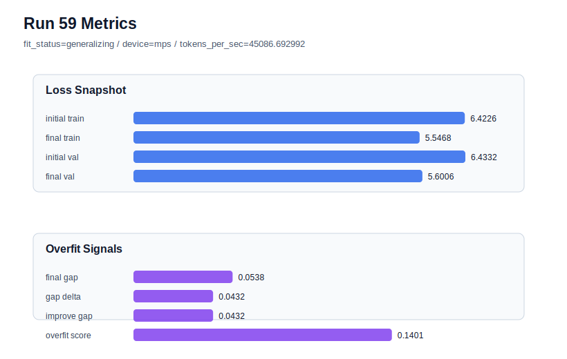

# run 059 실험 보고서

## 이번 가설

stride=24 안정 후보 위에서 context_length=64 문맥 확장 검증: run056, run057, run058은 context_length=48, stride=24, learning_rate=0.0003, drop_rate=0.12, gelu_exact 조건에서 세 seed 모두 overfit_score=0.0을 만들었다. 그중 run057(seed151)은 final_val_loss=5.555843, gap=-0.018289로 현재 overfit-aware best다. 따라서 run057을 기준으로 Transformer 구조와 모델 크기는 유지하고 context_length를 48에서 64로 늘리며 stride도 24에서 32로 비례 조정하면, 50% overlap 데이터 window의 안정성은 유지하면서 더 긴 문맥이 validation loss를 더 낮출 수 있는지 확인한다.

## 왜 이 가설을 세웠는가

세 seed 반복으로 stride=24는 seed 특이 효과가 아니라 안정적인 데이터 window 축임이 확인됐다. 이제 같은 안정 조건 위에서 다음으로 해석 가능한 작은 실험은 문맥 길이 확장이다. context_length=64는 모델 구조 순서를 바꾸지 않고 position embedding 길이와 학습 샘플 문맥만 늘린다. stride=32는 기존 context_length=48/stride=24와 같은 50% overlap 비율을 유지하므로, 단순히 overlap을 더 늘리는 실험이 아니라 더 긴 문맥 자체의 효과를 보는 데이터 window geometry 테스트가 된다. MPS balanced 장비에서 batch_size=8, max_steps=80은 여전히 짧은 회차로 안전하지만 tokens_per_sec 변화도 함께 확인한다.

## 가설 작성 주체

llm_plan:docs/train/next_plan.json

## 바꾼 변수

```json
{
  "context_length": 64,
  "stride": 32
}
```

## 고정한 변수

vocab_size, batch_size, learning_rate, weight_decay, grad_clip, emb_dim, n_heads, n_layers, drop_rate, qkv_bias, ffn_mult, norm_first, norm_eps, activation_name, ffn_dropout_position, attention_impl, tie_embeddings, init_std, max_steps, seed

## 기대 결과

성공 기준은 run057 대비 overfit_score가 0.02 이하 또는 0.0을 유지하고 final_val_loss가 5.556 이하에 머무르거나 개선되는 것이다. final_val_loss가 5.553-5.556 범위에 있고 gap이 안정적이면 context_length=64/stride=32를 stride 안정 후보 위의 개선 방향으로 본다. final_val_loss가 5.565 이상이면 더 긴 문맥이 작은 corpus와 80 step 조건에서 under-training 또는 데이터 희소성을 만든 것으로 판단한다.

## 실험 설정

```json
{
  "run_id": 59,
  "hypothesis": "stride=24 안정 후보 위에서 context_length=64 문맥 확장 검증: run056, run057, run058은 context_length=48, stride=24, learning_rate=0.0003, drop_rate=0.12, gelu_exact 조건에서 세 seed 모두 overfit_score=0.0을 만들었다. 그중 run057(seed151)은 final_val_loss=5.555843, gap=-0.018289로 현재 overfit-aware best다. 따라서 run057을 기준으로 Transformer 구조와 모델 크기는 유지하고 context_length를 48에서 64로 늘리며 stride도 24에서 32로 비례 조정하면, 50% overlap 데이터 window의 안정성은 유지하면서 더 긴 문맥이 validation loss를 더 낮출 수 있는지 확인한다.",
  "seed": 151,
  "vocab_size": 600,
  "min_frequency": 2,
  "context_length": 64,
  "stride": 32,
  "batch_size": 8,
  "max_steps": 80,
  "eval_batches": 4,
  "train_ratio": 0.9,
  "learning_rate": 0.0003,
  "weight_decay": 0.01,
  "grad_clip": 1.0,
  "emb_dim": 128,
  "n_heads": 4,
  "n_layers": 2,
  "drop_rate": 0.12,
  "qkv_bias": false,
  "ffn_mult": 4,
  "norm_first": false,
  "norm_eps": 1e-05,
  "activation_name": "gelu_exact",
  "ffn_dropout_position": "none",
  "attention_impl": "sdpa",
  "tie_embeddings": true,
  "init_std": 0.02
}
```

## 실행 환경

```json
{
  "timestamp": "2026-06-02T23:54:35+00:00",
  "hostname": "woonyong-MacBookPro.local",
  "platform": "macOS-26.3.1-arm64-arm-64bit-Mach-O",
  "machine": "arm64",
  "python": "3.13.13",
  "torch": "2.12.0",
  "cpu_count": 10,
  "memory_gb": 24.0,
  "cuda_available": false,
  "cuda_device_count": 0,
  "mps_available": true,
  "resolved_device": "mps",
  "profile": "mps_balanced"
}
```

- corpus: `src/learning/the-verdict.txt`
- artifact_dir: `docs/train/runs/run_059_artifacts`

## 실제 결과

| 지표 | 값 |
| --- | --- |
| initial_train_loss | 6.422633647918701 |
| initial_val_loss | 6.4332194328308105 |
| final_train_loss | 5.546812176704407 |
| final_val_loss | 5.6005859375 |
| final_generalization_gap | 0.05377376079559326 |
| generalization_gap_delta | 0.04318797588348389 |
| train_val_improvement_gap | 0.04318797588348389 |
| overfit_score | 0.14014971256256104 |
| fit_status | generalizing |
| parameter_count | 481024 |
| tokens_per_sec | 45086.692992091055 |
| elapsed_sec | 0.9084720409009606 |
| device | mps |

## 시각 지표




- 대시보드: `../dashboard.md`
- 지표 요약 CSV: `../metrics_summary.csv`

## 과적합 판단

일반화 개선 신호. final gap=0.0538, overfit_score=0.1401. seed 반복으로 재현성을 확인할 만하다.

## 결론

현재 best 후보: run 57 / val=5.555843353271484 / status=generalizing

## 다음 실험 제안

- 성공 시: 성공하면 context_length=64/stride=32를 seed134 또는 seed202에 반복해 세 seed 평균을 확인한다. 세 seed에서도 overfit_score가 낮고 validation이 유지되면 이 window geometry를 기본 후보로 승격하고, 이후 max_steps=90을 한 번에 하나씩 확인한다.
- 과적합 시: gap이나 overfit_score가 다시 커지면 context_length=64는 안정 후보가 아니라고 보고 context_length=48/stride=24로 되돌린다. validation이 크게 나빠지면 더 긴 문맥은 현 corpus와 80 step에서 under-training으로 판단하고, 다음에는 context_length를 유지하지 말고 max_steps=90만 단일축으로 확인한다.
