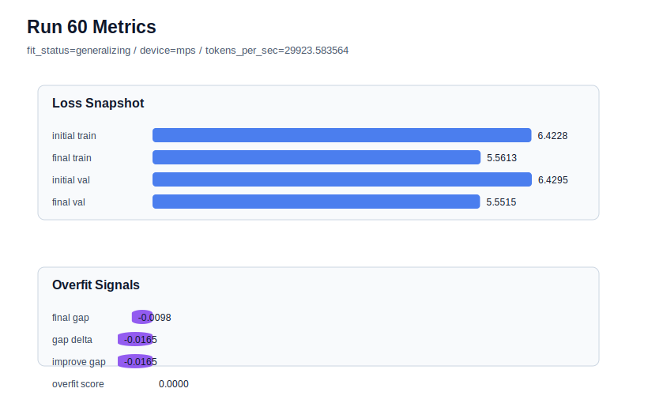

# run 060 실험 보고서

## 이번 가설

context_length=64 실패 이후 best window로 복귀한 max_steps=90 단일축 검증: run059는 context_length=64, stride=32가 final_val_loss=5.600586, gap=0.053774, overfit_score=0.140150으로 악화되어 더 긴 문맥이 현재 corpus와 80-step 조건에서 안정적이지 않다는 신호를 줬다. 반면 run056, run057, run058의 context_length=48, stride=24, learning_rate=0.0003, drop_rate=0.12, gelu_exact 계열은 세 seed 모두 overfit_score=0.0을 유지했다. 따라서 현재 overfit-aware best인 run057(seed151) 설정으로 되돌리고 max_steps만 80에서 90으로 늘리면, 안정적인 overlapping window 위에서 추가 optimization이 validation을 더 낮추는지 또는 train-only 개선으로 gap을 다시 키우는지 분리해 확인할 수 있다.

## 왜 이 가설을 세웠는가

최근 evidence는 stride=24가 구조 변경 없이 과적합 신호를 줄이는 가장 강한 축이고, context_length=64는 validation과 overfit 지표를 동시에 악화시키는 축임을 보여준다. 다음 실험은 새 함수나 모델 용량을 건드리지 않고 best 근방에서 학습 길이만 소폭 늘리는 실험이므로 해석이 쉽다. 성공하면 stride=24 조합이 더 긴 학습에서도 안정적이라는 근거가 되고, 실패하면 현재 조건의 early-stop 경계가 80 step 근처라는 결론을 얻는다. MPS balanced 하드웨어에서 90 step은 여전히 짧은 회차라 자동화 점유 시간이 안전하다.

## 가설 작성 주체

llm_plan:docs/train/next_plan.json

## 바꾼 변수

```json
{
  "max_steps": 90
}
```

## 고정한 변수

vocab_size, context_length, stride, batch_size, learning_rate, weight_decay, grad_clip, emb_dim, n_heads, n_layers, drop_rate, qkv_bias, ffn_mult, norm_first, norm_eps, activation_name, ffn_dropout_position, attention_impl, tie_embeddings, init_std, seed

## 기대 결과

성공 기준은 run057 대비 final_val_loss가 5.555 이하로 내려가거나 비슷하게 유지되면서 final_generalization_gap이 0.02 이하, overfit_score가 0.03 이하에 머무는 것이다. final_train_loss만 낮아지고 final_val_loss가 5.56 이상으로 오르거나 gap이 양수로 크게 커지면 90 step은 train-only fitting으로 판단한다. validation이 5.553대까지 내려가고 gap도 안정적이면 max_steps=90을 seed134 또는 seed202로 반복할 가치가 있다.

## 실험 설정

```json
{
  "run_id": 60,
  "hypothesis": "context_length=64 실패 이후 best window로 복귀한 max_steps=90 단일축 검증: run059는 context_length=64, stride=32가 final_val_loss=5.600586, gap=0.053774, overfit_score=0.140150으로 악화되어 더 긴 문맥이 현재 corpus와 80-step 조건에서 안정적이지 않다는 신호를 줬다. 반면 run056, run057, run058의 context_length=48, stride=24, learning_rate=0.0003, drop_rate=0.12, gelu_exact 계열은 세 seed 모두 overfit_score=0.0을 유지했다. 따라서 현재 overfit-aware best인 run057(seed151) 설정으로 되돌리고 max_steps만 80에서 90으로 늘리면, 안정적인 overlapping window 위에서 추가 optimization이 validation을 더 낮추는지 또는 train-only 개선으로 gap을 다시 키우는지 분리해 확인할 수 있다.",
  "seed": 151,
  "vocab_size": 600,
  "min_frequency": 2,
  "context_length": 48,
  "stride": 24,
  "batch_size": 8,
  "max_steps": 90,
  "eval_batches": 4,
  "train_ratio": 0.9,
  "learning_rate": 0.0003,
  "weight_decay": 0.01,
  "grad_clip": 1.0,
  "emb_dim": 128,
  "n_heads": 4,
  "n_layers": 2,
  "drop_rate": 0.12,
  "qkv_bias": false,
  "ffn_mult": 4,
  "norm_first": false,
  "norm_eps": 1e-05,
  "activation_name": "gelu_exact",
  "ffn_dropout_position": "none",
  "attention_impl": "sdpa",
  "tie_embeddings": true,
  "init_std": 0.02
}
```

## 실행 환경

```json
{
  "timestamp": "2026-06-02T23:59:34+00:00",
  "hostname": "woonyong-MacBookPro.local",
  "platform": "macOS-26.3.1-arm64-arm-64bit-Mach-O",
  "machine": "arm64",
  "python": "3.13.13",
  "torch": "2.12.0",
  "cpu_count": 10,
  "memory_gb": 24.0,
  "cuda_available": false,
  "cuda_device_count": 0,
  "mps_available": true,
  "resolved_device": "mps",
  "profile": "mps_balanced"
}
```

- corpus: `src/learning/the-verdict.txt`
- artifact_dir: `docs/train/runs/run_060_artifacts`

## 실제 결과

| 지표 | 값 |
| --- | --- |
| initial_train_loss | 6.4228023290634155 |
| initial_val_loss | 6.429474512736003 |
| final_train_loss | 5.56133234500885 |
| final_val_loss | 5.551509380340576 |
| final_generalization_gap | -0.009822964668273926 |
| generalization_gap_delta | -0.0164951483408613 |
| train_val_improvement_gap | -0.0164951483408613 |
| overfit_score | 0.0 |
| fit_status | generalizing |
| parameter_count | 478976 |
| tokens_per_sec | 29923.583564000914 |
| elapsed_sec | 1.1485255409497768 |
| device | mps |

## 시각 지표




- 대시보드: `../dashboard.md`
- 지표 요약 CSV: `../metrics_summary.csv`

## 과적합 판단

일반화 개선 신호. final gap=-0.0098, overfit_score=0.0000. seed 반복으로 재현성을 확인할 만하다.

## 결론

현재 best 후보: run 60 / val=5.551509380340576 / status=generalizing

## 다음 실험 제안

- 성공 시: max_steps=90이 run057에서 validation을 개선하고 overfit_score를 낮게 유지하면 같은 context_length=48, stride=24, learning_rate=0.0003, drop_rate=0.12, gelu_exact 조건으로 seed202 또는 seed134에 반복해 학습 길이 증가가 seed151 특이 효과인지 확인한다. 세 seed 평균에서도 안정적이면 max_steps=90을 stride=24 기본 후보로 승격한다.
- 과적합 시: gap이나 overfit_score가 커지면 max_steps=90은 현재 작은 corpus에서 과도 학습으로 보고 max_steps=80을 기본값으로 유지한다. 그 경우 다음 실험은 max_steps를 더 늘리지 않고 activation_name=silu 또는 ffn_mult=3처럼 구조 순서를 바꾸지 않는 작은 함수/용량 축으로 이동하거나, seed 반복으로 run057의 안정성을 더 확인한다.
