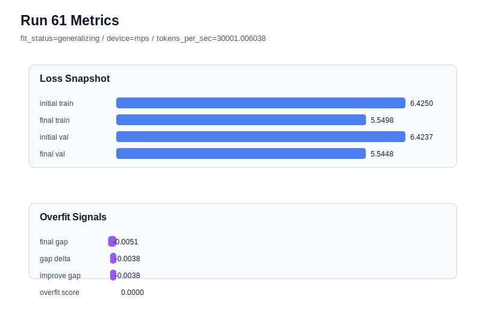

# run 061 실험 보고서

## 이번 가설

run060의 max_steps=90 개선이 seed151 특이 효과인지 확인하는 seed202 반복 검증: run060은 context_length=48, stride=24, learning_rate=0.0003, drop_rate=0.12, gelu_exact 조건에서 max_steps를 80에서 90으로 늘리자 final_val_loss=5.551509, gap=-0.009823, overfit_score=0.0으로 새 best가 되었다. 다만 run060은 seed151 한 번의 결과이므로, 같은 구조와 학습 조건에서 seed만 202로 바꾸면 max_steps=90이 안정적인 추가 optimization인지, 또는 seed151에서만 validation이 운 좋게 내려간 것인지 확인할 수 있다.

## 왜 이 가설을 세웠는가

현재 가장 중요한 미해결 질문은 새 함수나 용량 축이 아니라 run060의 재현성이다. run058은 seed202, context_length=48, stride=24, max_steps=80에서 final_val_loss=5.556621, gap=-0.006533, overfit_score=0.0으로 이미 안정적이었다. 같은 seed202에 max_steps=90을 적용하면 run058 대비 학습 길이만 늘린 효과를 볼 수 있고, run060과 비교하면 seed 간 분산도 해석할 수 있다. context_length=64는 run059에서 명확히 실패했으므로 유지하지 않고, Transformer 구조와 함수 조합은 그대로 둔다. MPS balanced 하드웨어에서 90 step은 약 1초대라 자동화 주기에도 안전하다.

## 가설 작성 주체

llm_plan:docs/train/next_plan.json

## 바꾼 변수

```json
{
  "seed": 202
}
```

## 고정한 변수

vocab_size, context_length, stride, batch_size, max_steps, learning_rate, weight_decay, grad_clip, emb_dim, n_heads, n_layers, drop_rate, qkv_bias, ffn_mult, norm_first, norm_eps, activation_name, ffn_dropout_position, attention_impl, tie_embeddings, init_std

## 기대 결과

성공 기준은 seed202의 기존 run058 대비 final_val_loss가 낮아지거나 5.556 이하를 유지하면서 final_generalization_gap이 0.02 이하, overfit_score가 0.03 이하에 머무는 것이다. final_val_loss가 5.553 이하로 내려가고 overfit_score가 0.0 근처이면 max_steps=90을 seed151/202 공통 개선 후보로 본다. final_val_loss가 5.565 이상으로 악화되거나 gap이 양수로 크게 커지면 90 step은 seed202에서는 train-only fitting 또는 불안정한 추가 학습으로 판단한다.

## 실험 설정

```json
{
  "run_id": 61,
  "hypothesis": "run060의 max_steps=90 개선이 seed151 특이 효과인지 확인하는 seed202 반복 검증: run060은 context_length=48, stride=24, learning_rate=0.0003, drop_rate=0.12, gelu_exact 조건에서 max_steps를 80에서 90으로 늘리자 final_val_loss=5.551509, gap=-0.009823, overfit_score=0.0으로 새 best가 되었다. 다만 run060은 seed151 한 번의 결과이므로, 같은 구조와 학습 조건에서 seed만 202로 바꾸면 max_steps=90이 안정적인 추가 optimization인지, 또는 seed151에서만 validation이 운 좋게 내려간 것인지 확인할 수 있다.",
  "seed": 202,
  "vocab_size": 600,
  "min_frequency": 2,
  "context_length": 48,
  "stride": 24,
  "batch_size": 8,
  "max_steps": 90,
  "eval_batches": 4,
  "train_ratio": 0.9,
  "learning_rate": 0.0003,
  "weight_decay": 0.01,
  "grad_clip": 1.0,
  "emb_dim": 128,
  "n_heads": 4,
  "n_layers": 2,
  "drop_rate": 0.12,
  "qkv_bias": false,
  "ffn_mult": 4,
  "norm_first": false,
  "norm_eps": 1e-05,
  "activation_name": "gelu_exact",
  "ffn_dropout_position": "none",
  "attention_impl": "sdpa",
  "tie_embeddings": true,
  "init_std": 0.02
}
```

## 실행 환경

```json
{
  "timestamp": "2026-06-03T00:04:32+00:00",
  "hostname": "woonyong-MacBookPro.local",
  "platform": "macOS-26.3.1-arm64-arm-64bit-Mach-O",
  "machine": "arm64",
  "python": "3.13.13",
  "torch": "2.12.0",
  "cpu_count": 10,
  "memory_gb": 24.0,
  "cuda_available": false,
  "cuda_device_count": 0,
  "mps_available": true,
  "resolved_device": "mps",
  "profile": "mps_balanced"
}
```

- corpus: `src/learning/the-verdict.txt`
- artifact_dir: `docs/train/runs/run_061_artifacts`

## 실제 결과

| 지표 | 값 |
| --- | --- |
| initial_train_loss | 6.424985885620117 |
| initial_val_loss | 6.42373784383138 |
| final_train_loss | 5.549840807914734 |
| final_val_loss | 5.544761975606282 |
| final_generalization_gap | -0.005078832308451631 |
| generalization_gap_delta | -0.0038307905197143555 |
| train_val_improvement_gap | -0.0038307905197143555 |
| overfit_score | 0.0 |
| fit_status | generalizing |
| parameter_count | 478976 |
| tokens_per_sec | 30001.00603831017 |
| elapsed_sec | 1.14556158403866 |
| device | mps |

## 시각 지표




- 대시보드: `../dashboard.md`
- 지표 요약 CSV: `../metrics_summary.csv`

## 과적합 판단

일반화 개선 신호. final gap=-0.0051, overfit_score=0.0000. seed 반복으로 재현성을 확인할 만하다.

## 결론

현재 best 후보: run 61 / val=5.544761975606282 / status=generalizing

## 다음 실험 제안

- 성공 시: seed202에서도 max_steps=90이 validation을 개선하고 overfit_score를 낮게 유지하면 다음 실험은 seed134 stress test로 이동한다. seed134에서도 안정적이면 context_length=48, stride=24, learning_rate=0.0003, drop_rate=0.12, gelu_exact, max_steps=90을 기본 후보로 승격하고 이후 activation_name=silu 같은 함수 교체는 이 기준 위에서만 작은 단일축으로 확인한다.
- 과적합 시: seed202에서 gap이나 overfit_score가 커지면 run060은 seed151 특이 개선일 수 있다. 그 경우 max_steps=90을 기본으로 승격하지 말고 seed151 전용 후보로 보류한다. 다음 실험은 max_steps=80으로 되돌린 뒤 seed 반복을 더 하거나, max_steps=85처럼 더 작은 학습 길이 경계를 확인한다.
