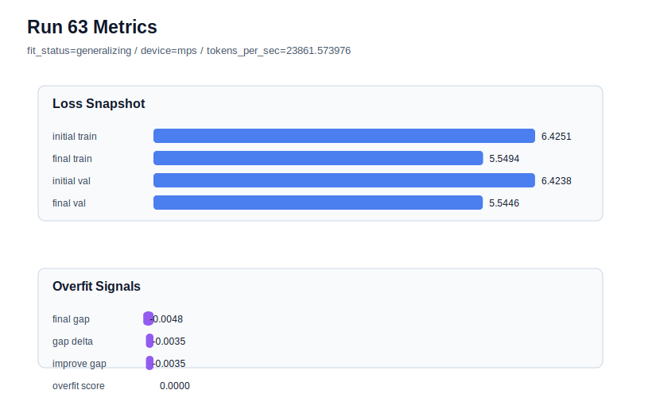

# run 063 실험 보고서

## 이번 가설

현재 기본 후보 위에서 activation_name=silu 단일축 함수 교체 검증: run060, run061, run062는 context_length=48, stride=24, learning_rate=0.0003, drop_rate=0.12, gelu_exact, max_steps=90 조건이 seed151/202/134 모두에서 overfit_score=0.0을 유지한다는 것을 보여줬다. 이제 구조나 parameter_count를 바꾸지 않는 activation 교체 축으로 넘어가도 된다. 따라서 현재 best인 run061(seed202)을 기준으로 activation_name만 gelu_exact에서 silu로 바꾸면, SiLU의 부드러운 gating-like 곡선이 안정적인 데이터 window와 90-step 학습 위에서 validation loss를 더 낮추는지 확인할 수 있다.

## 왜 이 가설을 세웠는가

max_steps=90 기준선은 세 seed에서 통과했고, context_length=64는 실패했으며, stride=24는 가장 강한 안정화 축으로 확인됐다. 다음 실험은 용량을 키우거나 Transformer 순서를 바꾸는 대신 FFN 내부 비선형 함수만 교체하는 것이 가장 해석 가능하다. silu는 swiglu/geglu처럼 gated FFN으로 parameter_count를 바꾸지 않고, mish보다 먼저 볼 만한 부드러운 activation 대안이다. seed202는 현재 best run061을 만든 seed라서 exploitation 관점에서 작은 개선 가능성을 확인하기 좋다. 성공하면 seed134 stress test로 일반화 여부를 확인하고, 실패하면 gelu_exact를 현재 기준 activation으로 유지한다.

## 가설 작성 주체

llm_plan:docs/train/next_plan.json

## 바꾼 변수

```json
{
  "activation_name": "silu"
}
```

## 고정한 변수

seed, vocab_size, context_length, stride, batch_size, max_steps, learning_rate, weight_decay, grad_clip, emb_dim, n_heads, n_layers, drop_rate, qkv_bias, ffn_mult, norm_first, norm_eps, ffn_dropout_position, attention_impl, tie_embeddings, init_std

## 기대 결과

성공 기준은 run061 대비 final_val_loss가 5.545 이하로 같거나 더 낮고, final_generalization_gap이 0.02 이하, overfit_score가 0.03 이하를 유지하는 것이다. final_val_loss가 5.54대 초반으로 내려가면 silu를 current baseline 위의 유망 activation 후보로 본다. final_val_loss가 5.555 이상으로 악화되거나 gap이 양수로 커지면 silu가 현 작은 corpus와 90-step 조건에서 gelu_exact보다 덜 맞는 것으로 판단한다.

## 실험 설정

```json
{
  "run_id": 63,
  "hypothesis": "현재 기본 후보 위에서 activation_name=silu 단일축 함수 교체 검증: run060, run061, run062는 context_length=48, stride=24, learning_rate=0.0003, drop_rate=0.12, gelu_exact, max_steps=90 조건이 seed151/202/134 모두에서 overfit_score=0.0을 유지한다는 것을 보여줬다. 이제 구조나 parameter_count를 바꾸지 않는 activation 교체 축으로 넘어가도 된다. 따라서 현재 best인 run061(seed202)을 기준으로 activation_name만 gelu_exact에서 silu로 바꾸면, SiLU의 부드러운 gating-like 곡선이 안정적인 데이터 window와 90-step 학습 위에서 validation loss를 더 낮추는지 확인할 수 있다.",
  "seed": 202,
  "vocab_size": 600,
  "min_frequency": 2,
  "context_length": 48,
  "stride": 24,
  "batch_size": 8,
  "max_steps": 90,
  "eval_batches": 4,
  "train_ratio": 0.9,
  "learning_rate": 0.0003,
  "weight_decay": 0.01,
  "grad_clip": 1.0,
  "emb_dim": 128,
  "n_heads": 4,
  "n_layers": 2,
  "drop_rate": 0.12,
  "qkv_bias": false,
  "ffn_mult": 4,
  "norm_first": false,
  "norm_eps": 1e-05,
  "activation_name": "silu",
  "ffn_dropout_position": "none",
  "attention_impl": "sdpa",
  "tie_embeddings": true,
  "init_std": 0.02
}
```

## 실행 환경

```json
{
  "timestamp": "2026-06-03T00:14:42+00:00",
  "hostname": "woonyong-MacBookPro.local",
  "platform": "macOS-26.3.1-arm64-arm-64bit-Mach-O",
  "machine": "arm64",
  "python": "3.13.13",
  "torch": "2.12.0",
  "cpu_count": 10,
  "memory_gb": 24.0,
  "cuda_available": false,
  "cuda_device_count": 0,
  "mps_available": true,
  "resolved_device": "mps",
  "profile": "mps_balanced"
}
```

- corpus: `src/learning/the-verdict.txt`
- artifact_dir: `docs/train/runs/run_063_artifacts`

## 실제 결과

| 지표 | 값 |
| --- | --- |
| initial_train_loss | 6.425078988075256 |
| initial_val_loss | 6.423814455668132 |
| final_train_loss | 5.549391746520996 |
| final_val_loss | 5.544584592183431 |
| final_generalization_gap | -0.0048071543375654 |
| generalization_gap_delta | -0.003542621930440859 |
| train_val_improvement_gap | -0.003542621930440859 |
| overfit_score | 0.0 |
| fit_status | generalizing |
| parameter_count | 478976 |
| tokens_per_sec | 23861.57397601543 |
| elapsed_sec | 1.4403073340654373 |
| device | mps |

## 시각 지표




- 대시보드: `../dashboard.md`
- 지표 요약 CSV: `../metrics_summary.csv`

## 과적합 판단

일반화 개선 신호. final gap=-0.0048, overfit_score=0.0000. seed 반복으로 재현성을 확인할 만하다.

## 결론

현재 best 후보: run 63 / val=5.544584592183431 / status=generalizing

## 다음 실험 제안

- 성공 시: silu가 seed202에서 validation을 개선하고 overfit_score를 낮게 유지하면 다음 실험은 같은 silu 설정을 seed134에 반복해 stress seed에서도 안정적인지 확인한다. seed134도 통과하면 seed151까지 반복해 silu를 gelu_exact와 세 seed 평균으로 비교한다.
- 과적합 시: silu에서 gap이나 overfit_score가 커지거나 validation이 악화되면 gelu_exact를 현재 기준 activation으로 유지한다. 다음 실험은 activation을 더 밀기보다 ffn_mult=3처럼 parameter_count를 줄이는 용량 축 또는 mish 같은 다른 smooth activation을 별도 단일축으로 작게 확인한다.
