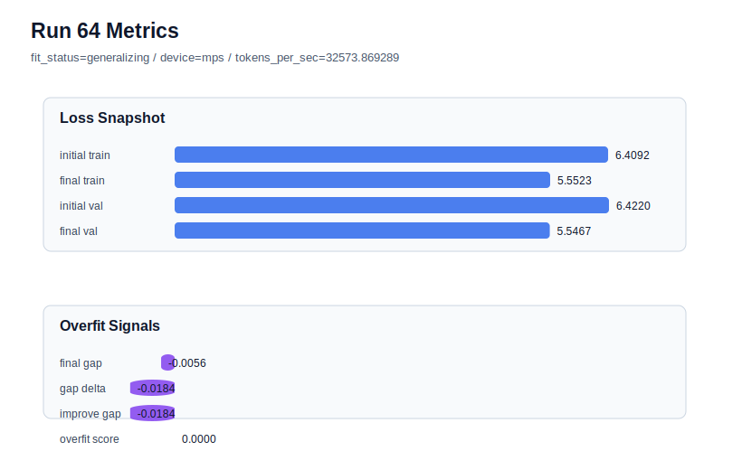

# run 064 실험 보고서

## 이번 가설

silu activation이 seed202에서 gelu_exact 기준선을 아주 작게 앞섰고 overfit_score=0.0을 유지했다. seed134는 이전 고학습률 실험에서 과적합 신호가 강하게 드러났던 stress seed이므로, 같은 안정 조건에서 silu를 반복하면 이 개선이 우연한 seed 효과인지 실제 activation 후보인지 구분할 수 있다.

## 왜 이 가설을 세웠는가

현재 best run063은 activation_name=silu, seed=202, final_val_loss=5.544585, final_generalization_gap=-0.004807, overfit_score=0.0으로 안정적이다. 바로 더 큰 구조나 길이로 확장하기보다 seed134에서 같은 activation을 검증하면 과적합 없이 validation 개선이 재현되는지 확인할 수 있다. 비교 기준은 run062의 gelu_exact seed134 결과(final_val_loss=5.546863, gap=-0.005851, overfit_score=0.0)다.

## 가설 작성 주체

llm_plan:docs/train/next_plan.json

## 바꾼 변수

```json
{
  "seed": 134
}
```

## 고정한 변수

vocab_size, context_length, stride, batch_size, learning_rate, weight_decay, grad_clip, emb_dim, n_heads, n_layers, drop_rate, qkv_bias, ffn_mult, norm_first, norm_eps, activation_name, ffn_dropout_position, attention_impl, tie_embeddings, init_std, max_steps

## 기대 결과

성공 기준은 final_val_loss가 run062의 5.546863과 같거나 낮고, final_generalization_gap이 0.02 이하이며, overfit_score가 0.03 이하로 유지되는 것이다. 이 경우 silu는 seed202 단발 개선이 아니라 안정적인 후보로 볼 수 있다.

## 실험 설정

```json
{
  "run_id": 64,
  "hypothesis": "silu activation이 seed202에서 gelu_exact 기준선을 아주 작게 앞섰고 overfit_score=0.0을 유지했다. seed134는 이전 고학습률 실험에서 과적합 신호가 강하게 드러났던 stress seed이므로, 같은 안정 조건에서 silu를 반복하면 이 개선이 우연한 seed 효과인지 실제 activation 후보인지 구분할 수 있다.",
  "seed": 134,
  "vocab_size": 600,
  "min_frequency": 2,
  "context_length": 48,
  "stride": 24,
  "batch_size": 8,
  "max_steps": 90,
  "eval_batches": 4,
  "train_ratio": 0.9,
  "learning_rate": 0.0003,
  "weight_decay": 0.01,
  "grad_clip": 1.0,
  "emb_dim": 128,
  "n_heads": 4,
  "n_layers": 2,
  "drop_rate": 0.12,
  "qkv_bias": false,
  "ffn_mult": 4,
  "norm_first": false,
  "norm_eps": 1e-05,
  "activation_name": "silu",
  "ffn_dropout_position": "none",
  "attention_impl": "sdpa",
  "tie_embeddings": true,
  "init_std": 0.02
}
```

## 실행 환경

```json
{
  "timestamp": "2026-06-03T00:20:40+00:00",
  "hostname": "woonyong-MacBookPro.local",
  "platform": "macOS-26.3.1-arm64-arm-64bit-Mach-O",
  "machine": "arm64",
  "python": "3.13.13",
  "torch": "2.12.0",
  "cpu_count": 10,
  "memory_gb": 24.0,
  "cuda_available": false,
  "cuda_device_count": 0,
  "mps_available": true,
  "resolved_device": "mps",
  "profile": "mps_balanced"
}
```

- corpus: `src/learning/the-verdict.txt`
- artifact_dir: `docs/train/runs/run_064_artifacts`

## 실제 결과

| 지표 | 값 |
| --- | --- |
| initial_train_loss | 6.40919303894043 |
| initial_val_loss | 6.422019799550374 |
| final_train_loss | 5.552300691604614 |
| final_val_loss | 5.546693166097005 |
| final_generalization_gap | -0.0056075255076093455 |
| generalization_gap_delta | -0.01843428611755371 |
| train_val_improvement_gap | -0.01843428611755371 |
| overfit_score | 0.0 |
| fit_status | generalizing |
| parameter_count | 478976 |
| tokens_per_sec | 32573.869288996462 |
| elapsed_sec | 1.0550788331311196 |
| device | mps |

## 시각 지표




- 대시보드: `../dashboard.md`
- 지표 요약 CSV: `../metrics_summary.csv`

## 과적합 판단

일반화 개선 신호. final gap=-0.0056, overfit_score=0.0000. seed 반복으로 재현성을 확인할 만하다.

## 결론

현재 best 후보: run 63 / val=5.544584592183431 / status=generalizing

## 다음 실험 제안

- 성공 시: silu를 seed151에서도 반복해 3-seed 평균을 gelu_exact의 3-seed 평균과 비교한다. 평균 validation이 개선되고 gap이 안정적이면 다음에는 ffn_mult=3 또는 dropout 위치를 한 축씩 검증한다.
- 과적합 시: silu 후보를 보류하고 gelu_exact 안정 기준선으로 되돌린다. 이후 regularization을 늘리기보다 activation 계열(mish 또는 quick_gelu)을 같은 seed134 조건에서 단일 축으로 비교한다.
