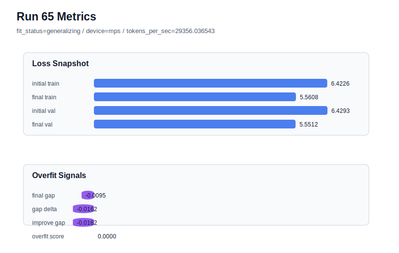

# run 065 실험 보고서

## 이번 가설

silu activation 후보의 3-seed 검증을 완성한다. run063(seed202)과 run064(seed134)는 activation_name=silu 조건에서 final_val_loss를 gelu_exact 대응 run보다 아주 작게 낮추면서 overfit_score=0.0을 유지했다. 남은 seed151에서도 같은 조건을 반복하면 silu 개선이 seed202/134에만 국한된 우연인지, 아니면 현재 안정 baseline 위에서 평균적으로 유효한 함수 교체인지 판단할 수 있다.

## 왜 이 가설을 세웠는가

현재 안정 baseline은 context_length=48, stride=24, learning_rate=0.0003, drop_rate=0.12, max_steps=90, tie_embeddings=True, attention_impl=sdpa, ffn_dropout_position=none이다. gelu_exact 기준은 seed151/202/134에서 각각 run060=5.551509, run061=5.544762, run062=5.546863으로 모두 overfit_score=0.0이었다. silu는 seed202에서 5.544585로 run061보다 미세하게 좋았고, seed134에서 5.546693으로 run062보다 미세하게 좋았다. 따라서 seed151에서 run060과 비교하면 silu의 평균 효과와 seed variance를 해석할 수 있다. 구조 순서, parameter_count, context/stride, optimizer 조건은 그대로 유지하므로 결과 해석은 activation 교체와 seed variance에 집중된다.

## 가설 작성 주체

llm_plan:docs/train/next_plan.json

## 바꾼 변수

```json
{
  "seed": 151
}
```

## 고정한 변수

vocab_size, context_length, stride, batch_size, learning_rate, weight_decay, grad_clip, emb_dim, n_heads, n_layers, drop_rate, qkv_bias, ffn_mult, norm_first, norm_eps, activation_name, ffn_dropout_position, attention_impl, tie_embeddings, init_std, max_steps

## 기대 결과

성공 기준은 seed151의 gelu_exact 기준 run060(final_val_loss=5.551509, gap=-0.009823, overfit_score=0.0)과 같거나 더 낮은 final_val_loss를 기록하고, final_generalization_gap이 0.02 이하이며, overfit_score가 0.03 이하로 유지되는 것이다. 이 경우 silu는 3-seed 평균에서 gelu_exact를 소폭 앞서는 후보로 승격할 수 있다. final_val_loss가 5.555 이상이거나 gap이 양수로 커지면 silu의 장점은 seed202/134에 치우친 것으로 본다.

## 실험 설정

```json
{
  "run_id": 65,
  "hypothesis": "silu activation 후보의 3-seed 검증을 완성한다. run063(seed202)과 run064(seed134)는 activation_name=silu 조건에서 final_val_loss를 gelu_exact 대응 run보다 아주 작게 낮추면서 overfit_score=0.0을 유지했다. 남은 seed151에서도 같은 조건을 반복하면 silu 개선이 seed202/134에만 국한된 우연인지, 아니면 현재 안정 baseline 위에서 평균적으로 유효한 함수 교체인지 판단할 수 있다.",
  "seed": 151,
  "vocab_size": 600,
  "min_frequency": 2,
  "context_length": 48,
  "stride": 24,
  "batch_size": 8,
  "max_steps": 90,
  "eval_batches": 4,
  "train_ratio": 0.9,
  "learning_rate": 0.0003,
  "weight_decay": 0.01,
  "grad_clip": 1.0,
  "emb_dim": 128,
  "n_heads": 4,
  "n_layers": 2,
  "drop_rate": 0.12,
  "qkv_bias": false,
  "ffn_mult": 4,
  "norm_first": false,
  "norm_eps": 1e-05,
  "activation_name": "silu",
  "ffn_dropout_position": "none",
  "attention_impl": "sdpa",
  "tie_embeddings": true,
  "init_std": 0.02
}
```

## 실행 환경

```json
{
  "timestamp": "2026-06-03T00:24:55+00:00",
  "hostname": "woonyong-MacBookPro.local",
  "platform": "macOS-26.3.1-arm64-arm-64bit-Mach-O",
  "machine": "arm64",
  "python": "3.13.13",
  "torch": "2.12.0",
  "cpu_count": 10,
  "memory_gb": 24.0,
  "cuda_available": false,
  "cuda_device_count": 0,
  "mps_available": true,
  "resolved_device": "mps",
  "profile": "mps_balanced"
}
```

- corpus: `src/learning/the-verdict.txt`
- artifact_dir: `docs/train/runs/run_065_artifacts`

## 실제 결과

| 지표 | 값 |
| --- | --- |
| initial_train_loss | 6.422625184059143 |
| initial_val_loss | 6.429281552632649 |
| final_train_loss | 5.5607670545578 |
| final_val_loss | 5.551222006479899 |
| final_generalization_gap | -0.009545048077900908 |
| generalization_gap_delta | -0.016201416651407285 |
| train_val_improvement_gap | -0.016201416651407285 |
| overfit_score | 0.0 |
| fit_status | generalizing |
| parameter_count | 478976 |
| tokens_per_sec | 29356.03654324668 |
| elapsed_sec | 1.1707302499562502 |
| device | mps |

## 시각 지표




- 대시보드: `../dashboard.md`
- 지표 요약 CSV: `../metrics_summary.csv`

## 과적합 판단

일반화 개선 신호. final gap=-0.0095, overfit_score=0.0000. seed 반복으로 재현성을 확인할 만하다.

## 결론

현재 best 후보: run 63 / val=5.544584592183431 / status=generalizing

## 다음 실험 제안

- 성공 시: silu 3-seed 평균을 gelu_exact 3-seed 평균과 문서화해 비교한다. 평균 validation이 낮고 overfit_score 평균이 0.0에 머무르면 silu를 새 activation 기준 후보로 두고, 다음 실험은 parameter_count를 줄이는 ffn_mult=3 또는 dropout 위치를 after_activation으로 바꾸는 단일축 안정성 테스트로 이동한다.
- 과적합 시: seed151에서 silu가 overfit_score를 키우거나 validation을 악화하면 gelu_exact를 기본 activation으로 유지한다. 그 다음에는 silu를 더 밀지 않고 quick_gelu 또는 mish를 seed202 단일축으로 비교하거나, ffn_mult=3으로 capacity를 줄여 안정성을 확인한다.
