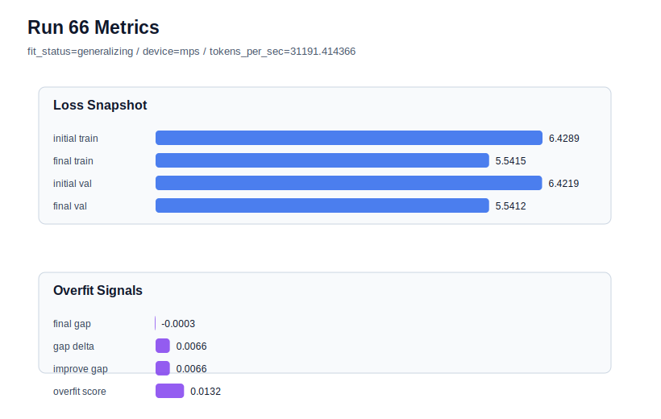

# run 066 실험 보고서

## 이번 가설

silu 3-seed 검증이 통과했으므로, 현재 안정 후보에서 FFN 내부 폭을 줄여도 validation과 과적합 안정성이 유지되는지 확인한다. ffn_mult를 4에서 3으로 낮추면 Transformer block 순서와 attention/activation 함수는 유지하면서 parameter_count만 줄어든다. 만약 seed202 best 조건에서 final_val_loss가 크게 악화되지 않고 overfit_score=0.0을 유지한다면 현재 모델은 FFN 폭 4가 약간 과한 용량일 수 있고, 더 작은 모델이 같은 일반화 성능을 낼 수 있다.

## 왜 이 가설을 세웠는가

run063, run064, run065는 activation_name=silu, context_length=48, stride=24, learning_rate=0.0003, drop_rate=0.12, max_steps=90 조건이 seed202/134/151에서 모두 overfit_score=0.0을 유지한다는 것을 보여줬다. silu 3-seed 평균은 gelu_exact보다 아주 작게 낮아 함수 후보로 유지할 근거가 생겼지만, 개선 폭은 작다. 이제 같은 함수 후보 위에서 capacity 축을 하나만 줄이면, 과적합 없이 validation이 유지되는지와 parameter_count/tokens_per_sec 개선 가능성을 동시에 확인할 수 있다. seed202는 현재 best run063을 만든 seed이므로 ffn_mult=3의 손실 비용을 가장 민감하게 볼 수 있다.

## 가설 작성 주체

llm_plan:docs/train/next_plan.json

## 바꾼 변수

```json
{
  "ffn_mult": 3
}
```

## 고정한 변수

seed, vocab_size, context_length, stride, batch_size, learning_rate, weight_decay, grad_clip, emb_dim, n_heads, n_layers, drop_rate, qkv_bias, norm_first, norm_eps, activation_name, ffn_dropout_position, attention_impl, tie_embeddings, init_std, max_steps

## 기대 결과

성공 기준은 run063(seed202, silu, ffn_mult=4)의 final_val_loss=5.544585 대비 final_val_loss가 5.548 이하에 머무르고, final_generalization_gap이 0.02 이하이며, overfit_score가 0.03 이하로 유지되는 것이다. parameter_count가 줄면서 validation 손실 증가가 0.003-0.004 이내라면 ffn_mult=3은 효율 후보가 된다. final_val_loss가 5.555 이상으로 올라가면 현재 corpus와 90-step 조건에서 FFN 폭 3은 underfit 또는 표현력 부족으로 본다.

## 실험 설정

```json
{
  "run_id": 66,
  "hypothesis": "silu 3-seed 검증이 통과했으므로, 현재 안정 후보에서 FFN 내부 폭을 줄여도 validation과 과적합 안정성이 유지되는지 확인한다. ffn_mult를 4에서 3으로 낮추면 Transformer block 순서와 attention/activation 함수는 유지하면서 parameter_count만 줄어든다. 만약 seed202 best 조건에서 final_val_loss가 크게 악화되지 않고 overfit_score=0.0을 유지한다면 현재 모델은 FFN 폭 4가 약간 과한 용량일 수 있고, 더 작은 모델이 같은 일반화 성능을 낼 수 있다.",
  "seed": 202,
  "vocab_size": 600,
  "min_frequency": 2,
  "context_length": 48,
  "stride": 24,
  "batch_size": 8,
  "max_steps": 90,
  "eval_batches": 4,
  "train_ratio": 0.9,
  "learning_rate": 0.0003,
  "weight_decay": 0.01,
  "grad_clip": 1.0,
  "emb_dim": 128,
  "n_heads": 4,
  "n_layers": 2,
  "drop_rate": 0.12,
  "qkv_bias": false,
  "ffn_mult": 3,
  "norm_first": false,
  "norm_eps": 1e-05,
  "activation_name": "silu",
  "ffn_dropout_position": "none",
  "attention_impl": "sdpa",
  "tie_embeddings": true,
  "init_std": 0.02
}
```

## 실행 환경

```json
{
  "timestamp": "2026-06-03T00:30:15+00:00",
  "hostname": "woonyong-MacBookPro.local",
  "platform": "macOS-26.3.1-arm64-arm-64bit-Mach-O",
  "machine": "arm64",
  "python": "3.13.13",
  "torch": "2.12.0",
  "cpu_count": 10,
  "memory_gb": 24.0,
  "cuda_available": false,
  "cuda_device_count": 0,
  "mps_available": true,
  "resolved_device": "mps",
  "profile": "mps_balanced"
}
```

- corpus: `src/learning/the-verdict.txt`
- artifact_dir: `docs/train/runs/run_066_artifacts`

## 실제 결과

| 지표 | 값 |
| --- | --- |
| initial_train_loss | 6.428861737251282 |
| initial_val_loss | 6.421913464864095 |
| final_train_loss | 5.541486859321594 |
| final_val_loss | 5.541161855061849 |
| final_generalization_gap | -0.000325004259745576 |
| generalization_gap_delta | 0.006623268127441406 |
| train_val_improvement_gap | 0.006623268127441406 |
| overfit_score | 0.013246536254882812 |
| fit_status | generalizing |
| parameter_count | 413184 |
| tokens_per_sec | 31191.414365873043 |
| elapsed_sec | 1.1018416669685394 |
| device | mps |

## 시각 지표




- 대시보드: `../dashboard.md`
- 지표 요약 CSV: `../metrics_summary.csv`

## 과적합 판단

일반화 개선 신호. final gap=-0.0003, overfit_score=0.0132. seed 반복으로 재현성을 확인할 만하다.

## 결론

현재 best 후보: run 66 / val=5.541161855061849 / status=generalizing

## 다음 실험 제안

- 성공 시: ffn_mult=3이 seed202에서 validation을 유지하면 seed134 stress test로 반복한다. seed134에서도 overfit_score=0.0과 낮은 validation을 유지하면 ffn_mult=3을 silu baseline의 효율 후보로 두고 seed151까지 평균 비교를 완성한다.
- 과적합 시: ffn_mult=3에서 validation이 악화되거나 gap이 커지면 ffn_mult=4를 유지한다. 그 다음에는 capacity를 더 줄이지 않고 ffn_dropout_position=after_activation 또는 activation_name=mish 같은 함수/드롭아웃 위치 단일축을 seed202에서 비교한다.
