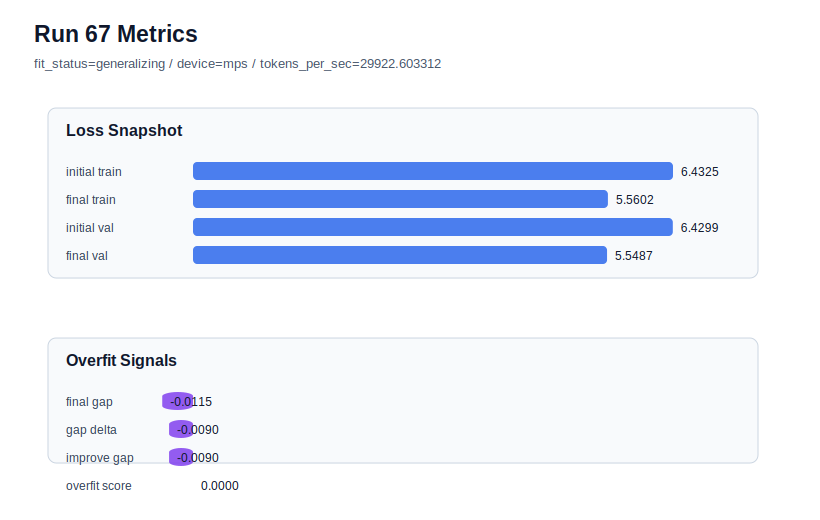

# run 067 실험 보고서

## 이번 가설

ffn_mult=3으로 줄인 silu 후보가 seed202에서 새 best를 만들었으므로, 같은 더 작은 FFN 폭이 seed134 stress seed에서도 validation과 과적합 안정성을 유지하는지 검증한다. seed134는 이전 고학습률 계열에서 과적합 신호가 강했던 seed라서, 여기서 ffn_mult=3이 통과하면 run066의 개선이 단순한 seed202 운이 아니라 작은 FFN이 현재 corpus에 더 잘 맞는다는 근거가 된다.

## 왜 이 가설을 세웠는가

run066은 seed202, activation_name=silu, ffn_mult=3에서 parameter_count를 478976에서 413184로 줄이면서 final_val_loss를 5.541162까지 낮췄고, final_generalization_gap=-0.000325, overfit_score=0.013247로 low risk를 유지했다. 비교 기준인 run063(seed202, silu, ffn_mult=4)은 final_val_loss=5.544585였다. 그러나 seed202는 현재 best를 자주 만든 seed이므로, 까다로운 seed134에서 같은 capacity 축소가 유지되는지 확인해야 한다. seed134의 직접 기준은 run064(seed134, silu, ffn_mult=4)의 final_val_loss=5.546693, gap=-0.005608, overfit_score=0.0이다. 이번 실험은 seed만 134로 바꾸고 ffn_mult=3 후보를 유지하므로, seed variance와 capacity 축소의 일반화 여부를 분리해 볼 수 있다.

## 가설 작성 주체

llm_plan:docs/train/next_plan.json

## 바꾼 변수

```json
{
  "seed": 134
}
```

## 고정한 변수

vocab_size, context_length, stride, batch_size, learning_rate, weight_decay, grad_clip, emb_dim, n_heads, n_layers, drop_rate, qkv_bias, ffn_mult, norm_first, norm_eps, activation_name, ffn_dropout_position, attention_impl, tie_embeddings, init_std, max_steps

## 기대 결과

성공 기준은 seed134의 silu ffn_mult=4 기준 run064(final_val_loss=5.546693)과 같거나 낮은 final_val_loss를 기록하고, final_generalization_gap이 0.02 이하이며, overfit_score가 0.03 이하로 유지되는 것이다. final_val_loss가 5.548 이하이고 parameter_count=413184를 유지하면 ffn_mult=3은 효율 후보로 강해진다. final_val_loss가 5.555 이상으로 오르거나 overfit_score가 0.08 이상으로 커지면 run066은 seed202 특이 개선 또는 seed134에서는 표현력 부족으로 판단한다.

## 실험 설정

```json
{
  "run_id": 67,
  "hypothesis": "ffn_mult=3으로 줄인 silu 후보가 seed202에서 새 best를 만들었으므로, 같은 더 작은 FFN 폭이 seed134 stress seed에서도 validation과 과적합 안정성을 유지하는지 검증한다. seed134는 이전 고학습률 계열에서 과적합 신호가 강했던 seed라서, 여기서 ffn_mult=3이 통과하면 run066의 개선이 단순한 seed202 운이 아니라 작은 FFN이 현재 corpus에 더 잘 맞는다는 근거가 된다.",
  "seed": 134,
  "vocab_size": 600,
  "min_frequency": 2,
  "context_length": 48,
  "stride": 24,
  "batch_size": 8,
  "max_steps": 90,
  "eval_batches": 4,
  "train_ratio": 0.9,
  "learning_rate": 0.0003,
  "weight_decay": 0.01,
  "grad_clip": 1.0,
  "emb_dim": 128,
  "n_heads": 4,
  "n_layers": 2,
  "drop_rate": 0.12,
  "qkv_bias": false,
  "ffn_mult": 3,
  "norm_first": false,
  "norm_eps": 1e-05,
  "activation_name": "silu",
  "ffn_dropout_position": "none",
  "attention_impl": "sdpa",
  "tie_embeddings": true,
  "init_std": 0.02
}
```

## 실행 환경

```json
{
  "timestamp": "2026-06-03T00:35:08+00:00",
  "hostname": "woonyong-MacBookPro.local",
  "platform": "macOS-26.3.1-arm64-arm-64bit-Mach-O",
  "machine": "arm64",
  "python": "3.13.13",
  "torch": "2.12.0",
  "cpu_count": 10,
  "memory_gb": 24.0,
  "cuda_available": false,
  "cuda_device_count": 0,
  "mps_available": true,
  "resolved_device": "mps",
  "profile": "mps_balanced"
}
```

- corpus: `src/learning/the-verdict.txt`
- artifact_dir: `docs/train/runs/run_067_artifacts`

## 실제 결과

| 지표 | 값 |
| --- | --- |
| initial_train_loss | 6.432457327842712 |
| initial_val_loss | 6.429895877838135 |
| final_train_loss | 5.560221791267395 |
| final_val_loss | 5.548690954844157 |
| final_generalization_gap | -0.011530836423237822 |
| generalization_gap_delta | -0.008969386418660186 |
| train_val_improvement_gap | -0.008969386418660186 |
| overfit_score | 0.0 |
| fit_status | generalizing |
| parameter_count | 413184 |
| tokens_per_sec | 29922.603312478775 |
| elapsed_sec | 1.1485631661489606 |
| device | mps |

## 시각 지표




- 대시보드: `../dashboard.md`
- 지표 요약 CSV: `../metrics_summary.csv`

## 과적합 판단

일반화 개선 신호. final gap=-0.0115, overfit_score=0.0000. seed 반복으로 재현성을 확인할 만하다.

## 결론

현재 best 후보: run 66 / val=5.541161855061849 / status=generalizing

## 다음 실험 제안

- 성공 시: seed134에서도 ffn_mult=3이 통과하면 seed151에서 같은 설정을 반복해 3-seed 평균을 완성한다. 세 seed 평균이 silu ffn_mult=4보다 낮거나 비슷하고 overfit_score 평균이 low risk이면 ffn_mult=3을 새 기본 FFN 폭 후보로 승격한다.
- 과적합 시: seed134에서 validation이 악화되거나 gap/overfit_score가 커지면 ffn_mult=3을 seed202 전용 후보로 보류하고 ffn_mult=4를 일반 기준으로 유지한다. 그 다음 실험은 ffn_dropout_position=after_activation 또는 activation_name=mish처럼 capacity를 더 줄이지 않는 단일축으로 이동한다.
