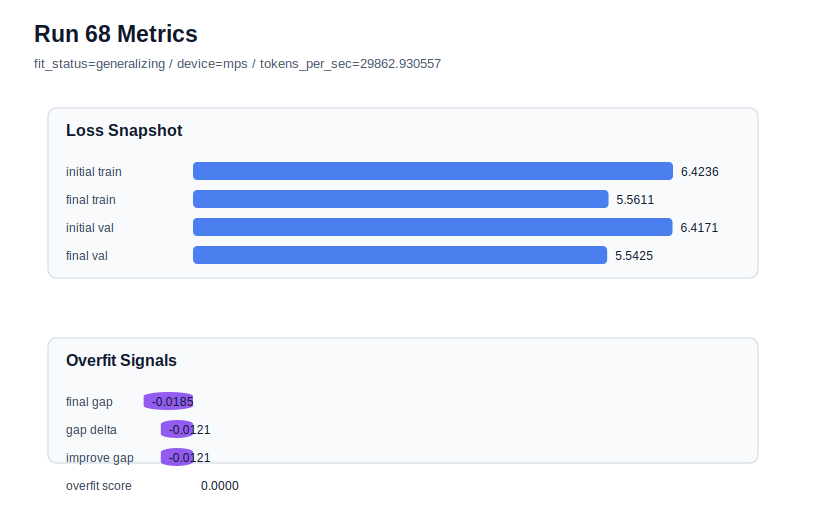

# run 068 실험 보고서

## 이번 가설

silu + ffn_mult=3 효율 후보의 3-seed 검증을 완성한다. run066(seed202)은 ffn_mult=3이 새 best를 만들었고, run067(seed134)은 ffn_mult=4보다 약간 높은 validation loss를 보였지만 overfit_score=0.0과 더 작은 parameter_count를 유지했다. 남은 seed151에서 같은 설정을 반복하면 ffn_mult=3이 평균적으로 ffn_mult=4를 대체할 수 있는 효율 후보인지, 아니면 seed202에 강하게 치우친 축소 모델인지 판단할 수 있다.

## 왜 이 가설을 세웠는가

현재 ffn_mult=3 결과는 seed202 final_val_loss=5.541162, seed134 final_val_loss=5.548691이다. 대응되는 silu ffn_mult=4 기준은 seed202 run063=5.544585, seed134 run064=5.546693, seed151 run065=5.551222이다. ffn_mult=3은 seed202에서는 크게 이겼고 seed134에서는 약 0.002 손실이 있지만 overfit_score=0.0을 유지했다. seed151은 중간 난이도 seed이며, 이 결과가 5.551 이하 또는 비슷한 수준이면 ffn_mult=3의 3-seed 평균이 ffn_mult=4보다 낮거나 매우 근접할 가능성이 있다. 이번 실험은 seed만 151로 바꾸고 구조 순서, activation, optimizer, context/stride, dropout 위치를 고정하므로 평균 비교에 필요한 마지막 조각이다.

## 가설 작성 주체

llm_plan:docs/train/next_plan.json

## 바꾼 변수

```json
{
  "seed": 151
}
```

## 고정한 변수

vocab_size, context_length, stride, batch_size, learning_rate, weight_decay, grad_clip, emb_dim, n_heads, n_layers, drop_rate, qkv_bias, ffn_mult, norm_first, norm_eps, activation_name, ffn_dropout_position, attention_impl, tie_embeddings, init_std, max_steps

## 기대 결과

성공 기준은 seed151의 silu ffn_mult=4 기준 run065(final_val_loss=5.551222, gap=-0.009545, overfit_score=0.0)과 같거나 크게 벗어나지 않는 final_val_loss를 기록하고, final_generalization_gap이 0.02 이하이며, overfit_score가 0.03 이하로 유지되는 것이다. final_val_loss가 5.552 이하이면 ffn_mult=3은 3-seed 평균에서 강한 효율 후보가 된다. final_val_loss가 5.557 이상이면 seed151에서는 FFN 폭 축소가 underfit 또는 표현력 부족을 만든 것으로 본다.

## 실험 설정

```json
{
  "run_id": 68,
  "hypothesis": "silu + ffn_mult=3 효율 후보의 3-seed 검증을 완성한다. run066(seed202)은 ffn_mult=3이 새 best를 만들었고, run067(seed134)은 ffn_mult=4보다 약간 높은 validation loss를 보였지만 overfit_score=0.0과 더 작은 parameter_count를 유지했다. 남은 seed151에서 같은 설정을 반복하면 ffn_mult=3이 평균적으로 ffn_mult=4를 대체할 수 있는 효율 후보인지, 아니면 seed202에 강하게 치우친 축소 모델인지 판단할 수 있다.",
  "seed": 151,
  "vocab_size": 600,
  "min_frequency": 2,
  "context_length": 48,
  "stride": 24,
  "batch_size": 8,
  "max_steps": 90,
  "eval_batches": 4,
  "train_ratio": 0.9,
  "learning_rate": 0.0003,
  "weight_decay": 0.01,
  "grad_clip": 1.0,
  "emb_dim": 128,
  "n_heads": 4,
  "n_layers": 2,
  "drop_rate": 0.12,
  "qkv_bias": false,
  "ffn_mult": 3,
  "norm_first": false,
  "norm_eps": 1e-05,
  "activation_name": "silu",
  "ffn_dropout_position": "none",
  "attention_impl": "sdpa",
  "tie_embeddings": true,
  "init_std": 0.02
}
```

## 실행 환경

```json
{
  "timestamp": "2026-06-03T00:40:10+00:00",
  "hostname": "woonyong-MacBookPro.local",
  "platform": "macOS-26.3.1-arm64-arm-64bit-Mach-O",
  "machine": "arm64",
  "python": "3.13.13",
  "torch": "2.12.0",
  "cpu_count": 10,
  "memory_gb": 24.0,
  "cuda_available": false,
  "cuda_device_count": 0,
  "mps_available": true,
  "resolved_device": "mps",
  "profile": "mps_balanced"
}
```

- corpus: `src/learning/the-verdict.txt`
- artifact_dir: `docs/train/runs/run_068_artifacts`

## 실제 결과

| 지표 | 값 |
| --- | --- |
| initial_train_loss | 6.423563361167908 |
| initial_val_loss | 6.417125384012858 |
| final_train_loss | 5.561050653457642 |
| final_val_loss | 5.542542775472005 |
| final_generalization_gap | -0.01850787798563669 |
| generalization_gap_delta | -0.012069900830587343 |
| train_val_improvement_gap | -0.012069900830587343 |
| overfit_score | 0.0 |
| fit_status | generalizing |
| parameter_count | 413184 |
| tokens_per_sec | 29862.930556885436 |
| elapsed_sec | 1.1508582499809563 |
| device | mps |

## 시각 지표




- 대시보드: `../dashboard.md`
- 지표 요약 CSV: `../metrics_summary.csv`

## 과적합 판단

일반화 개선 신호. final gap=-0.0185, overfit_score=0.0000. seed 반복으로 재현성을 확인할 만하다.

## 결론

현재 best 후보: run 68 / val=5.542542775472005 / status=generalizing

## 다음 실험 제안

- 성공 시: seed151에서도 ffn_mult=3이 통과하면 ffn_mult=3과 ffn_mult=4의 silu 3-seed 평균을 문서화하고, parameter_count와 tokens_per_sec까지 포함해 새 기본 후보를 정한다. 평균 validation이 낮거나 거의 같으면 ffn_mult=3을 기본 FFN 폭 후보로 승격한다.
- 과적합 시: seed151에서 validation이 크게 악화되거나 overfit_score가 커지면 ffn_mult=3을 seed202 전용 효율 후보로 보류하고 ffn_mult=4를 일반 기준으로 유지한다. 다음에는 ffn_dropout_position=after_activation 또는 activation_name=mish를 ffn_mult=4 기준에서 단일축으로 확인한다.
