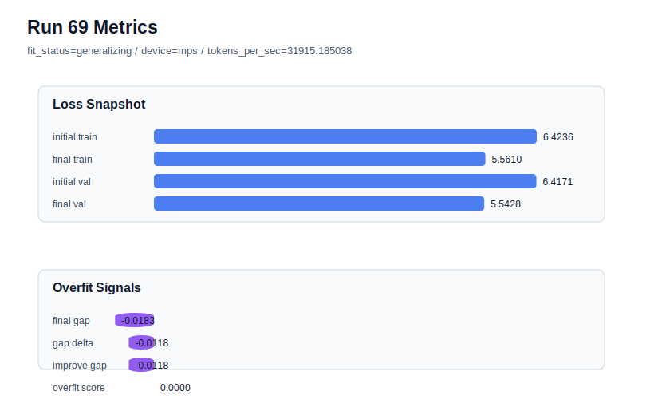

# run 069 실험 보고서

## 이번 가설

새 기준 후보인 silu + ffn_mult=3에서 FFN dropout 위치를 none에서 after_activation으로 바꾸면, Transformer 구조와 parameter_count를 유지하면서 activation 이후 hidden representation에만 약한 regularization을 줄 수 있다. run068은 seed151에서 현재 best를 만들었고 gap이 음수라 과적합은 없으므로, 이번 실험은 regularization 위치 변경이 validation 안정성을 더 높이는지 아니면 underfit을 만드는지 확인하는 단일축 테스트다.

## 왜 이 가설을 세웠는가

run066, run067, run068로 silu + ffn_mult=3의 3-seed 검증이 끝났고, ffn_mult=3 평균 validation은 ffn_mult=4 평균보다 낮으면서 parameter_count도 478976에서 413184로 줄었다. 최신 run068은 final_val_loss=5.542543, final_generalization_gap=-0.018508, overfit_score=0.0으로 현재 best다. 다만 gap이 이미 음수라 추가 regularization이 반드시 필요한 상황은 아니다. 따라서 seed151 best 조건을 그대로 유지하고 ffn_dropout_position만 after_activation으로 바꾸면, dropout 위치가 일반화에 주는 효과를 구조 변경 없이 직접 비교할 수 있다.

## 가설 작성 주체

llm_plan:docs/train/next_plan.json

## 바꾼 변수

```json
{
  "ffn_dropout_position": "after_activation"
}
```

## 고정한 변수

seed, vocab_size, context_length, stride, batch_size, learning_rate, weight_decay, grad_clip, emb_dim, n_heads, n_layers, drop_rate, qkv_bias, ffn_mult, norm_first, norm_eps, activation_name, attention_impl, tie_embeddings, init_std, max_steps

## 기대 결과

성공 기준은 run068 대비 final_val_loss가 같거나 낮아지거나, 적어도 5.545 이내로 유지되면서 final_generalization_gap이 0.02 이하이고 overfit_score가 0.03 이하로 유지되는 것이다. final_val_loss가 5.552 이상으로 악화되면 after_activation dropout은 현재 작은 FFN 후보에서는 regularization 이득보다 underfit 비용이 큰 것으로 판단한다.

## 실험 설정

```json
{
  "run_id": 69,
  "hypothesis": "새 기준 후보인 silu + ffn_mult=3에서 FFN dropout 위치를 none에서 after_activation으로 바꾸면, Transformer 구조와 parameter_count를 유지하면서 activation 이후 hidden representation에만 약한 regularization을 줄 수 있다. run068은 seed151에서 현재 best를 만들었고 gap이 음수라 과적합은 없으므로, 이번 실험은 regularization 위치 변경이 validation 안정성을 더 높이는지 아니면 underfit을 만드는지 확인하는 단일축 테스트다.",
  "seed": 151,
  "vocab_size": 600,
  "min_frequency": 2,
  "context_length": 48,
  "stride": 24,
  "batch_size": 8,
  "max_steps": 90,
  "eval_batches": 4,
  "train_ratio": 0.9,
  "learning_rate": 0.0003,
  "weight_decay": 0.01,
  "grad_clip": 1.0,
  "emb_dim": 128,
  "n_heads": 4,
  "n_layers": 2,
  "drop_rate": 0.12,
  "qkv_bias": false,
  "ffn_mult": 3,
  "norm_first": false,
  "norm_eps": 1e-05,
  "activation_name": "silu",
  "ffn_dropout_position": "after_activation",
  "attention_impl": "sdpa",
  "tie_embeddings": true,
  "init_std": 0.02
}
```

## 실행 환경

```json
{
  "timestamp": "2026-06-03T00:46:22+00:00",
  "hostname": "woonyong-MacBookPro.local",
  "platform": "macOS-26.3.1-arm64-arm-64bit-Mach-O",
  "machine": "arm64",
  "python": "3.13.13",
  "torch": "2.12.0",
  "cpu_count": 10,
  "memory_gb": 24.0,
  "cuda_available": false,
  "cuda_device_count": 0,
  "mps_available": true,
  "resolved_device": "mps",
  "profile": "mps_balanced"
}
```

- corpus: `src/learning/the-verdict.txt`
- artifact_dir: `docs/train/runs/run_069_artifacts`

## 실제 결과

| 지표 | 값 |
| --- | --- |
| initial_train_loss | 6.423563361167908 |
| initial_val_loss | 6.417125384012858 |
| final_train_loss | 5.561034560203552 |
| final_val_loss | 5.542765935262044 |
| final_generalization_gap | -0.01826862494150827 |
| generalization_gap_delta | -0.011830647786458925 |
| train_val_improvement_gap | -0.011830647786458925 |
| overfit_score | 0.0 |
| fit_status | generalizing |
| parameter_count | 413184 |
| tokens_per_sec | 31915.18503796571 |
| elapsed_sec | 1.0768541670404375 |
| device | mps |

## 시각 지표




- 대시보드: `../dashboard.md`
- 지표 요약 CSV: `../metrics_summary.csv`

## 과적합 판단

일반화 개선 신호. final gap=-0.0183, overfit_score=0.0000. seed 반복으로 재현성을 확인할 만하다.

## 결론

현재 best 후보: run 68 / val=5.542542775472005 / status=generalizing

## 다음 실험 제안

- 성공 시: after_activation이 run068과 동등하거나 더 낮은 validation을 보이면 seed202 또는 seed134에서 같은 조건을 반복해 3-seed 평균으로 ffn_dropout_position=none과 비교한다.
- 과적합 시: overfit_score가 커지거나 validation이 악화되면 ffn_dropout_position=none을 유지하고, 다음에는 activation_name=mish 또는 learning_rate의 작은 하향 조정을 ffn_mult=3 baseline 위에서 단일축으로 확인한다.
