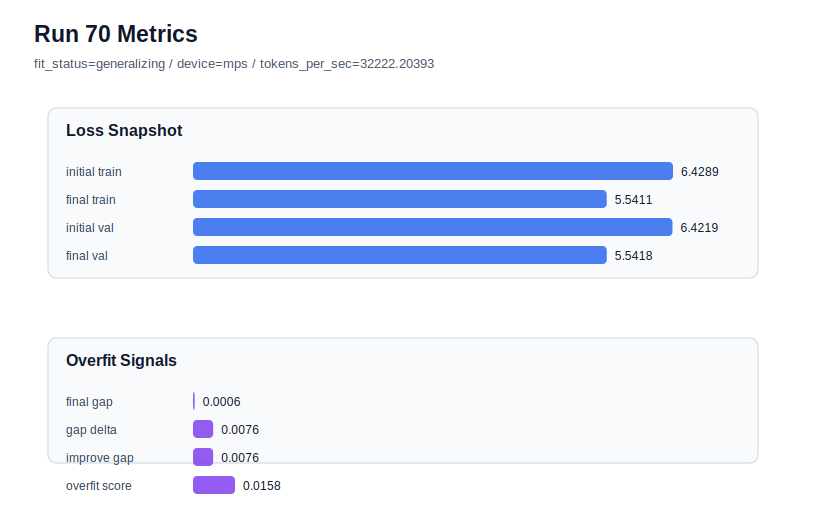

# run 070 실험 보고서

## 이번 가설

seed202의 silu + ffn_mult=3 기준선에서 FFN dropout 위치를 none에서 after_activation으로 바꾸면, run066의 매우 낮은 validation loss는 유지하면서 작은 overfit_score 신호를 더 낮출 수 있다. run069(seed151)는 after_activation이 best를 넘지는 못했지만 overfit_score=0.0과 거의 같은 validation을 유지했으므로, 이번에는 seed202 matched baseline에서 regularization 위치 효과를 재검증한다.

## 왜 이 가설을 세웠는가

현재 best는 run068(seed151, ffn_dropout_position=none, final_val_loss=5.542543, overfit_score=0.0)이고, 최신 run069(seed151, after_activation)는 final_val_loss=5.542766으로 best보다 0.000223 높지만 gap=-0.018269, overfit_score=0.0을 유지했다. seed202 기준선 run066은 ffn_mult=3 none 조건에서 final_val_loss=5.541162로 순수 validation loss는 가장 낮지만 gap=-0.000325, overfit_score=0.013247로 아주 작은 overfit-aware penalty가 붙었다. 따라서 seed202에서 dropout 위치만 after_activation으로 바꾸면, validation 이득을 유지하면서 gap/overfit_score를 안정화하는지 판단할 수 있다.

## 가설 작성 주체

llm_plan:docs/train/next_plan.json

## 바꾼 변수

```json
{
  "seed": 202,
  "ffn_dropout_position": "after_activation"
}
```

## 고정한 변수

vocab_size, context_length, stride, batch_size, learning_rate, weight_decay, grad_clip, emb_dim, n_heads, n_layers, drop_rate, qkv_bias, ffn_mult, norm_first, norm_eps, activation_name, attention_impl, tie_embeddings, init_std, max_steps

## 기대 결과

성공 기준은 seed202 matched baseline run066과 비교해 final_val_loss가 5.544 이하를 유지하고, final_generalization_gap이 0.01 이하이며, overfit_score가 run066의 0.013247보다 같거나 낮아지는 것이다. final_val_loss가 5.548 이상으로 악화되면 after_activation은 seed202에서는 regularization 이득보다 underfit 비용이 큰 것으로 판단한다.

## 실험 설정

```json
{
  "run_id": 70,
  "hypothesis": "seed202의 silu + ffn_mult=3 기준선에서 FFN dropout 위치를 none에서 after_activation으로 바꾸면, run066의 매우 낮은 validation loss는 유지하면서 작은 overfit_score 신호를 더 낮출 수 있다. run069(seed151)는 after_activation이 best를 넘지는 못했지만 overfit_score=0.0과 거의 같은 validation을 유지했으므로, 이번에는 seed202 matched baseline에서 regularization 위치 효과를 재검증한다.",
  "seed": 202,
  "vocab_size": 600,
  "min_frequency": 2,
  "context_length": 48,
  "stride": 24,
  "batch_size": 8,
  "max_steps": 90,
  "eval_batches": 4,
  "train_ratio": 0.9,
  "learning_rate": 0.0003,
  "weight_decay": 0.01,
  "grad_clip": 1.0,
  "emb_dim": 128,
  "n_heads": 4,
  "n_layers": 2,
  "drop_rate": 0.12,
  "qkv_bias": false,
  "ffn_mult": 3,
  "norm_first": false,
  "norm_eps": 1e-05,
  "activation_name": "silu",
  "ffn_dropout_position": "after_activation",
  "attention_impl": "sdpa",
  "tie_embeddings": true,
  "init_std": 0.02
}
```

## 실행 환경

```json
{
  "timestamp": "2026-06-03T00:50:40+00:00",
  "hostname": "woonyong-MacBookPro.local",
  "platform": "macOS-26.3.1-arm64-arm-64bit-Mach-O",
  "machine": "arm64",
  "python": "3.13.13",
  "torch": "2.12.0",
  "cpu_count": 10,
  "memory_gb": 24.0,
  "cuda_available": false,
  "cuda_device_count": 0,
  "mps_available": true,
  "resolved_device": "mps",
  "profile": "mps_balanced"
}
```

- corpus: `src/learning/the-verdict.txt`
- artifact_dir: `docs/train/runs/run_070_artifacts`

## 실제 결과

| 지표 | 값 |
| --- | --- |
| initial_train_loss | 6.428861737251282 |
| initial_val_loss | 6.421913464864095 |
| final_train_loss | 5.541140675544739 |
| final_val_loss | 5.541762669881185 |
| final_generalization_gap | 0.0006219943364458302 |
| generalization_gap_delta | 0.0075702667236328125 |
| train_val_improvement_gap | 0.0075702667236328125 |
| overfit_score | 0.015762527783711455 |
| fit_status | generalizing |
| parameter_count | 413184 |
| tokens_per_sec | 32222.20393019231 |
| elapsed_sec | 1.066593708936125 |
| device | mps |

## 시각 지표




- 대시보드: `../dashboard.md`
- 지표 요약 CSV: `../metrics_summary.csv`

## 과적합 판단

일반화 개선 신호. final gap=0.0006, overfit_score=0.0158. seed 반복으로 재현성을 확인할 만하다.

## 결론

현재 best 후보: run 68 / val=5.542542775472005 / status=generalizing

## 다음 실험 제안

- 성공 시: seed202에서도 after_activation이 validation을 유지하고 overfit_score를 낮추면 seed134에서 같은 조건을 반복해 ffn_dropout_position=after_activation의 3-seed 평균을 none과 비교한다.
- 과적합 시: after_activation이 seed202에서 validation을 크게 악화시키거나 overfit_score를 높이면 dropout 위치 후보를 보류하고 ffn_dropout_position=none을 기본으로 유지한다. 다음에는 activation_name=mish 또는 learning_rate=0.000275를 ffn_mult=3 baseline 위에서 단일축으로 확인한다.
