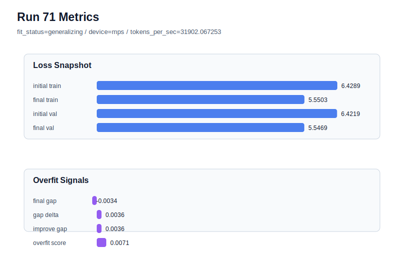

# run 071 실험 보고서

## 이번 가설

seed202의 silu + ffn_mult=3 기준선(run066)에서 learning_rate를 0.0003에서 0.000275로 아주 작게 낮추면, 낮은 validation loss는 유지하면서 train-only 개선 폭과 overfit_score를 줄일 수 있다. after_activation dropout은 run069와 run070에서 best를 넘지 못했고 seed202에서는 overfit_score가 오히려 커졌으므로, 이번에는 dropout 위치가 아니라 optimizer step size를 단일축으로 조정한다.

## 왜 이 가설을 세웠는가

run066은 seed202, silu, ffn_mult=3, ffn_dropout_position=none에서 final_val_loss=5.541162로 raw validation이 가장 낮았지만 final_generalization_gap=-0.000325, overfit_score=0.013247로 아주 작은 overfit-aware penalty가 있었다. run070은 같은 seed202에서 ffn_dropout_position=after_activation을 시도했지만 final_val_loss=5.541763으로 악화되고 gap=0.000622, overfit_score=0.015763으로 penalty도 커졌다. 따라서 dropout 위치 후보는 보류하고, run066 설정을 유지한 채 learning_rate만 0.000275로 낮추면 최종 train loss가 과도하게 앞서는 현상을 줄이면서 validation을 안정화할 수 있는지 확인할 수 있다.

## 가설 작성 주체

llm_plan:docs/train/next_plan.json

## 바꾼 변수

```json
{
  "learning_rate": 0.000275
}
```

## 고정한 변수

seed, vocab_size, context_length, stride, batch_size, weight_decay, grad_clip, emb_dim, n_heads, n_layers, drop_rate, qkv_bias, ffn_mult, norm_first, norm_eps, activation_name, ffn_dropout_position, attention_impl, tie_embeddings, init_std, max_steps

## 기대 결과

성공 기준은 run066 대비 final_val_loss가 5.543 이하로 유지되고, final_generalization_gap이 0.0 이하 또는 거의 0에 머물며, overfit_score가 0.013247보다 낮아지는 것이다. final_val_loss가 5.546 이상으로 올라가면 learning_rate 하향이 optimization 부족을 만든 것으로 판단한다.

## 실험 설정

```json
{
  "run_id": 71,
  "hypothesis": "seed202의 silu + ffn_mult=3 기준선(run066)에서 learning_rate를 0.0003에서 0.000275로 아주 작게 낮추면, 낮은 validation loss는 유지하면서 train-only 개선 폭과 overfit_score를 줄일 수 있다. after_activation dropout은 run069와 run070에서 best를 넘지 못했고 seed202에서는 overfit_score가 오히려 커졌으므로, 이번에는 dropout 위치가 아니라 optimizer step size를 단일축으로 조정한다.",
  "seed": 202,
  "vocab_size": 600,
  "min_frequency": 2,
  "context_length": 48,
  "stride": 24,
  "batch_size": 8,
  "max_steps": 90,
  "eval_batches": 4,
  "train_ratio": 0.9,
  "learning_rate": 0.000275,
  "weight_decay": 0.01,
  "grad_clip": 1.0,
  "emb_dim": 128,
  "n_heads": 4,
  "n_layers": 2,
  "drop_rate": 0.12,
  "qkv_bias": false,
  "ffn_mult": 3,
  "norm_first": false,
  "norm_eps": 1e-05,
  "activation_name": "silu",
  "ffn_dropout_position": "none",
  "attention_impl": "sdpa",
  "tie_embeddings": true,
  "init_std": 0.02
}
```

## 실행 환경

```json
{
  "timestamp": "2026-06-03T00:55:41+00:00",
  "hostname": "woonyong-MacBookPro.local",
  "platform": "macOS-26.3.1-arm64-arm-64bit-Mach-O",
  "machine": "arm64",
  "python": "3.13.13",
  "torch": "2.12.0",
  "cpu_count": 10,
  "memory_gb": 24.0,
  "cuda_available": false,
  "cuda_device_count": 0,
  "mps_available": true,
  "resolved_device": "mps",
  "profile": "mps_balanced"
}
```

- corpus: `src/learning/the-verdict.txt`
- artifact_dir: `docs/train/runs/run_071_artifacts`

## 실제 결과

| 지표 | 값 |
| --- | --- |
| initial_train_loss | 6.428861737251282 |
| initial_val_loss | 6.421913464864095 |
| final_train_loss | 5.550296306610107 |
| final_val_loss | 5.546916961669922 |
| final_generalization_gap | -0.003379344940185547 |
| generalization_gap_delta | 0.0035689274470014354 |
| train_val_improvement_gap | 0.0035689274470014354 |
| overfit_score | 0.007137854894002871 |
| fit_status | generalizing |
| parameter_count | 413184 |
| tokens_per_sec | 31902.067252590616 |
| elapsed_sec | 1.0772969578392804 |
| device | mps |

## 시각 지표




- 대시보드: `../dashboard.md`
- 지표 요약 CSV: `../metrics_summary.csv`

## 과적합 판단

일반화 개선 신호. final gap=-0.0034, overfit_score=0.0071. seed 반복으로 재현성을 확인할 만하다.

## 결론

현재 best 후보: run 68 / val=5.542542775472005 / status=generalizing

## 다음 실험 제안

- 성공 시: learning_rate=0.000275가 seed202에서 overfit_score를 줄이고 validation을 유지하면 seed151 또는 seed134에서 같은 learning_rate를 반복해 현재 best run068의 안정성을 평균으로 검증한다.
- 과적합 시: learning_rate 하향에도 gap이나 overfit_score가 커지면 optimizer 조정보다는 seed202 자체의 저손실/근접 gap 특성으로 보고, ffn_dropout_position=none과 learning_rate=0.0003을 기본으로 유지한다. 다음에는 activation_name=mish를 ffn_mult=3 기준에서 단일축으로 확인한다.
