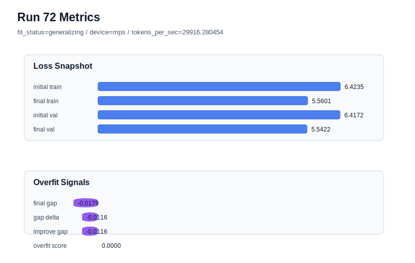

# run 072 실험 보고서

## 이번 가설

현재 overfit-aware best인 run068의 silu + ffn_mult=3 기준에서 activation_name만 mish로 바꾸면, 구조 순서와 parameter_count를 유지하면서 SiLU보다 더 부드러운 non-monotonic activation이 validation loss를 낮추거나 generalization gap 안정성을 유지할 수 있다. 최근 after_activation dropout과 learning_rate 하향은 best를 넘지 못했으므로, 이번에는 regularization/optimizer가 아니라 FFN 함수 교체 축으로 돌아간다.

## 왜 이 가설을 세웠는가

run068은 seed151, activation_name=silu, ffn_mult=3, ffn_dropout_position=none, learning_rate=0.0003에서 final_val_loss=5.542543, final_generalization_gap=-0.018508, overfit_score=0.0으로 현재 best다. run069는 같은 seed151에서 dropout 위치만 after_activation으로 바꿨지만 final_val_loss=5.542766으로 미세하게 악화됐다. run070은 seed202에서 after_activation이 overfit_score를 더 키웠고, run071은 learning_rate=0.000275가 overfit_score를 낮추는 대신 validation을 5.546917까지 악화시켰다. 따라서 현재 evidence는 best 설정의 optimizer/dropout을 건드리기보다, parameter_count와 Transformer 순서를 유지한 채 activation 함수만 비교하는 것이 더 해석 가능하다고 말한다.

## 가설 작성 주체

llm_plan:docs/train/next_plan.json

## 바꾼 변수

```json
{
  "activation_name": "mish"
}
```

## 고정한 변수

seed, vocab_size, context_length, stride, batch_size, learning_rate, weight_decay, grad_clip, emb_dim, n_heads, n_layers, drop_rate, qkv_bias, ffn_mult, norm_first, norm_eps, ffn_dropout_position, attention_impl, tie_embeddings, init_std, max_steps

## 기대 결과

성공 기준은 run068 대비 final_val_loss가 5.543 이하로 유지되거나 더 낮아지고, final_generalization_gap이 0.02 이하이며, overfit_score가 0.03 이하로 유지되는 것이다. final_val_loss가 5.55 이상으로 올라가면 mish는 현재 작은 corpus와 90-step 조건에서 optimization 비용 또는 activation mismatch가 큰 것으로 판단한다.

## 실험 설정

```json
{
  "run_id": 72,
  "hypothesis": "현재 overfit-aware best인 run068의 silu + ffn_mult=3 기준에서 activation_name만 mish로 바꾸면, 구조 순서와 parameter_count를 유지하면서 SiLU보다 더 부드러운 non-monotonic activation이 validation loss를 낮추거나 generalization gap 안정성을 유지할 수 있다. 최근 after_activation dropout과 learning_rate 하향은 best를 넘지 못했으므로, 이번에는 regularization/optimizer가 아니라 FFN 함수 교체 축으로 돌아간다.",
  "seed": 151,
  "vocab_size": 600,
  "min_frequency": 2,
  "context_length": 48,
  "stride": 24,
  "batch_size": 8,
  "max_steps": 90,
  "eval_batches": 4,
  "train_ratio": 0.9,
  "learning_rate": 0.0003,
  "weight_decay": 0.01,
  "grad_clip": 1.0,
  "emb_dim": 128,
  "n_heads": 4,
  "n_layers": 2,
  "drop_rate": 0.12,
  "qkv_bias": false,
  "ffn_mult": 3,
  "norm_first": false,
  "norm_eps": 1e-05,
  "activation_name": "mish",
  "ffn_dropout_position": "none",
  "attention_impl": "sdpa",
  "tie_embeddings": true,
  "init_std": 0.02
}
```

## 실행 환경

```json
{
  "timestamp": "2026-06-03T01:00:43+00:00",
  "hostname": "woonyong-MacBookPro.local",
  "platform": "macOS-26.3.1-arm64-arm-64bit-Mach-O",
  "machine": "arm64",
  "python": "3.13.13",
  "torch": "2.12.0",
  "cpu_count": 10,
  "memory_gb": 24.0,
  "cuda_available": false,
  "cuda_device_count": 0,
  "mps_available": true,
  "resolved_device": "mps",
  "profile": "mps_balanced"
}
```

- corpus: `src/learning/the-verdict.txt`
- artifact_dir: `docs/train/runs/run_072_artifacts`

## 실제 결과

| 지표 | 값 |
| --- | --- |
| initial_train_loss | 6.423532009124756 |
| initial_val_loss | 6.4171522458394366 |
| final_train_loss | 5.560092568397522 |
| final_val_loss | 5.542157967885335 |
| final_generalization_gap | -0.017934600512186982 |
| generalization_gap_delta | -0.011554837226867676 |
| train_val_improvement_gap | -0.011554837226867676 |
| overfit_score | 0.0 |
| fit_status | generalizing |
| parameter_count | 413184 |
| tokens_per_sec | 29916.280453633142 |
| elapsed_sec | 1.1488059170078486 |
| device | mps |

## 시각 지표




- 대시보드: `../dashboard.md`
- 지표 요약 CSV: `../metrics_summary.csv`

## 과적합 판단

일반화 개선 신호. final gap=-0.0179, overfit_score=0.0000. seed 반복으로 재현성을 확인할 만하다.

## 결론

현재 best 후보: run 72 / val=5.542157967885335 / status=generalizing

## 다음 실험 제안

- 성공 시: mish가 seed151에서 run068과 동등하거나 더 좋은 validation을 보이면 seed202에서 같은 설정을 반복해 silu ffn_mult=3 기준 run066과 비교한다. 두 seed가 통과하면 seed134 stress test로 3-seed 평균을 완성한다.
- 과적합 시: mish에서 validation이 악화되거나 overfit_score가 커지면 activation_name=silu를 기본으로 유지한다. 다음에는 quick_gelu 또는 gelu_exact 재확인을 ffn_mult=3 기준에서 단일축으로 진행해 activation 계열의 순위를 좁힌다.
