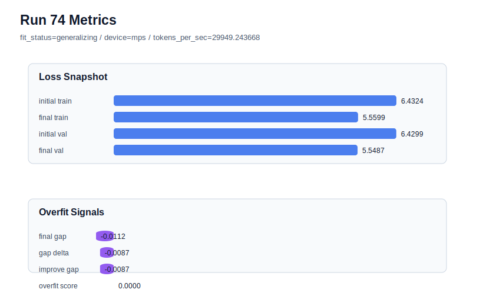

# run 074 실험 보고서

## 이번 가설

mish + ffn_mult=3 후보를 seed134 stress seed에서 반복하면, mish가 seed151/202에서만 좋은 우연인지 아니면 세 seed 평균에서도 silu를 대체할 수 있는 activation 후보인지 판단할 수 있다. 구조 순서, FFN 폭, optimizer, dropout 위치, context/stride는 그대로 유지하고 seed만 134로 바꿔 3-seed 검증을 완성한다.

## 왜 이 가설을 세웠는가

run072(seed151)는 mish가 silu 기준 run068보다 final_val_loss를 5.542543에서 5.542158로 낮추고 overfit_score=0.0을 유지해 새 best가 되었다. run073(seed202)는 mish가 final_val_loss=5.541102로 silu 기준 run066의 5.541162와 거의 같거나 미세하게 낮았지만 overfit_score=0.01528로 작은 penalty가 남았다. 이제 seed134를 확인해야 평균 판단이 가능하다. seed134에서 silu + ffn_mult=3 기준 run067은 final_val_loss=5.548691, gap=-0.011531, overfit_score=0.0이었고, silu + ffn_mult=4 기준 run064는 final_val_loss=5.546693이었다. mish가 이 범위를 유지하거나 개선하면 activation 후보로 강해진다.

## 가설 작성 주체

llm_plan:docs/train/next_plan.json

## 바꾼 변수

```json
{
  "seed": 134
}
```

## 고정한 변수

vocab_size, context_length, stride, batch_size, learning_rate, weight_decay, grad_clip, emb_dim, n_heads, n_layers, drop_rate, qkv_bias, ffn_mult, norm_first, norm_eps, activation_name, ffn_dropout_position, attention_impl, tie_embeddings, init_std, max_steps

## 기대 결과

성공 기준은 seed134 silu ffn_mult=3 기준 run067의 final_val_loss=5.548691과 같거나 낮고, final_generalization_gap이 0.02 이하이며, overfit_score가 0.03 이하로 유지되는 것이다. final_val_loss가 5.5467 이하로 내려가면 mish는 seed134에서도 ffn_mult=4 silu 기준까지 이기는 강한 후보가 된다. final_val_loss가 5.555 이상이면 mish의 개선은 seed151/202에 치우친 것으로 판단한다.

## 실험 설정

```json
{
  "run_id": 74,
  "hypothesis": "mish + ffn_mult=3 후보를 seed134 stress seed에서 반복하면, mish가 seed151/202에서만 좋은 우연인지 아니면 세 seed 평균에서도 silu를 대체할 수 있는 activation 후보인지 판단할 수 있다. 구조 순서, FFN 폭, optimizer, dropout 위치, context/stride는 그대로 유지하고 seed만 134로 바꿔 3-seed 검증을 완성한다.",
  "seed": 134,
  "vocab_size": 600,
  "min_frequency": 2,
  "context_length": 48,
  "stride": 24,
  "batch_size": 8,
  "max_steps": 90,
  "eval_batches": 4,
  "train_ratio": 0.9,
  "learning_rate": 0.0003,
  "weight_decay": 0.01,
  "grad_clip": 1.0,
  "emb_dim": 128,
  "n_heads": 4,
  "n_layers": 2,
  "drop_rate": 0.12,
  "qkv_bias": false,
  "ffn_mult": 3,
  "norm_first": false,
  "norm_eps": 1e-05,
  "activation_name": "mish",
  "ffn_dropout_position": "none",
  "attention_impl": "sdpa",
  "tie_embeddings": true,
  "init_std": 0.02
}
```

## 실행 환경

```json
{
  "timestamp": "2026-06-03T01:10:37+00:00",
  "hostname": "woonyong-MacBookPro.local",
  "platform": "macOS-26.3.1-arm64-arm-64bit-Mach-O",
  "machine": "arm64",
  "python": "3.13.13",
  "torch": "2.12.0",
  "cpu_count": 10,
  "memory_gb": 24.0,
  "cuda_available": false,
  "cuda_device_count": 0,
  "mps_available": true,
  "resolved_device": "mps",
  "profile": "mps_balanced"
}
```

- corpus: `src/learning/the-verdict.txt`
- artifact_dir: `docs/train/runs/run_074_artifacts`

## 실제 결과

| 지표 | 값 |
| --- | --- |
| initial_train_loss | 6.432416319847107 |
| initial_val_loss | 6.429851214090983 |
| final_train_loss | 5.5599130392074585 |
| final_val_loss | 5.548671881357829 |
| final_generalization_gap | -0.011241157849629424 |
| generalization_gap_delta | -0.00867605209350586 |
| train_val_improvement_gap | -0.00867605209350586 |
| overfit_score | 0.0 |
| fit_status | generalizing |
| parameter_count | 413184 |
| tokens_per_sec | 29949.24366753738 |
| elapsed_sec | 1.1475414999295026 |
| device | mps |

## 시각 지표




- 대시보드: `../dashboard.md`
- 지표 요약 CSV: `../metrics_summary.csv`

## 과적합 판단

일반화 개선 신호. final gap=-0.0112, overfit_score=0.0000. seed 반복으로 재현성을 확인할 만하다.

## 결론

현재 best 후보: run 72 / val=5.542157967885335 / status=generalizing

## 다음 실험 제안

- 성공 시: seed134에서도 mish가 통과하면 mish + ffn_mult=3의 3-seed 평균을 silu + ffn_mult=3, silu + ffn_mult=4 평균과 비교하고, 다음에는 best 계열에서 quick_gelu 또는 squared_relu 같은 activation ablation을 하나씩 확인한다.
- 과적합 시: seed134에서 mish가 validation을 크게 악화시키거나 overfit_score를 키우면 mish를 seed151/202 유망 후보로 보류하고 activation_name=silu를 기본값으로 유지한다. 다음에는 quick_gelu 또는 gelu_exact를 ffn_mult=3 기준에서 단일축으로 확인한다.
