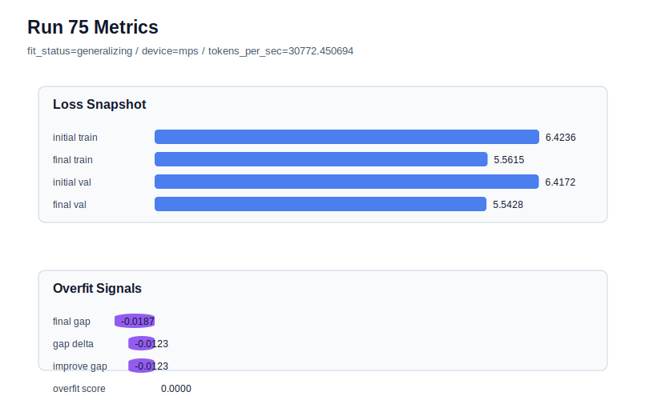

# run 075 실험 보고서

## 이번 가설

mish + ffn_mult=3과 silu + ffn_mult=3이 세 seed에서 거의 같은 low-loss/low-overfit 영역을 형성했으므로, 같은 작은 FFN 후보에서 activation_name만 quick_gelu로 바꾸면 GELU 근사의 단순한 곡선이 mish/silu와 동등한 validation loss를 유지하면서 더 빠르거나 더 안정적인 대안이 될 수 있다. 우선 현재 best인 run072와 같은 seed151 조건에서 matched activation ablation을 시작한다.

## 왜 이 가설을 세웠는가

run072(mish, seed151)는 final_val_loss=5.542158, gap=-0.017935, overfit_score=0.0으로 현재 best다. 같은 seed151의 silu 기준 run068도 final_val_loss=5.542543, gap=-0.018508, overfit_score=0.0으로 매우 근접했고, mish의 seed134/202 반복(run073/run074)도 silu와 거의 같은 평균 영역에 머물렀다. 따라서 다음 연구 축은 regularization이나 capacity를 다시 건드리기보다, ffn_mult=3, context_length=48, stride=24, max_steps=90의 안정 조건 위에서 남은 activation 후보를 순차 비교하는 것이다. quick_gelu는 과거 짧은 40-step 계열에서 유망했지만 seed/context/stride 조건이 달라 현재 best 계열에서는 아직 직접 비교되지 않았다.

## 가설 작성 주체

llm_plan:docs/train/next_plan.json

## 바꾼 변수

```json
{
  "activation_name": "quick_gelu"
}
```

## 고정한 변수

vocab_size, context_length, stride, batch_size, learning_rate, weight_decay, grad_clip, emb_dim, n_heads, n_layers, drop_rate, qkv_bias, ffn_mult, norm_first, norm_eps, ffn_dropout_position, attention_impl, tie_embeddings, init_std, max_steps, seed

## 기대 결과

성공 기준은 seed151 matched baseline run072의 final_val_loss=5.542158과 run068의 5.542543에 근접한 5.543 이하를 유지하고, final_generalization_gap이 0.02 이하이며 overfit_score가 0.03 이하로 유지되는 것이다. tokens_per_sec가 mish보다 높으면 quick_gelu는 속도까지 포함한 후보가 된다. final_val_loss가 5.548 이상이면 quick_gelu는 현재 90-step 작은 FFN 후보에서 mish/silu보다 뒤처지는 것으로 판단한다.

## 실험 설정

```json
{
  "run_id": 75,
  "hypothesis": "mish + ffn_mult=3과 silu + ffn_mult=3이 세 seed에서 거의 같은 low-loss/low-overfit 영역을 형성했으므로, 같은 작은 FFN 후보에서 activation_name만 quick_gelu로 바꾸면 GELU 근사의 단순한 곡선이 mish/silu와 동등한 validation loss를 유지하면서 더 빠르거나 더 안정적인 대안이 될 수 있다. 우선 현재 best인 run072와 같은 seed151 조건에서 matched activation ablation을 시작한다.",
  "seed": 151,
  "vocab_size": 600,
  "min_frequency": 2,
  "context_length": 48,
  "stride": 24,
  "batch_size": 8,
  "max_steps": 90,
  "eval_batches": 4,
  "train_ratio": 0.9,
  "learning_rate": 0.0003,
  "weight_decay": 0.01,
  "grad_clip": 1.0,
  "emb_dim": 128,
  "n_heads": 4,
  "n_layers": 2,
  "drop_rate": 0.12,
  "qkv_bias": false,
  "ffn_mult": 3,
  "norm_first": false,
  "norm_eps": 1e-05,
  "activation_name": "quick_gelu",
  "ffn_dropout_position": "none",
  "attention_impl": "sdpa",
  "tie_embeddings": true,
  "init_std": 0.02
}
```

## 실행 환경

```json
{
  "timestamp": "2026-06-03T01:20:51+00:00",
  "hostname": "woonyong-MacBookPro.local",
  "platform": "macOS-26.3.1-arm64-arm-64bit-Mach-O",
  "machine": "arm64",
  "python": "3.13.13",
  "torch": "2.12.0",
  "cpu_count": 10,
  "memory_gb": 24.0,
  "cuda_available": false,
  "cuda_device_count": 0,
  "mps_available": true,
  "resolved_device": "mps",
  "profile": "mps_balanced"
}
```

- corpus: `src/learning/the-verdict.txt`
- artifact_dir: `docs/train/runs/run_075_artifacts`

## 실제 결과

| 지표 | 값 |
| --- | --- |
| initial_train_loss | 6.42362368106842 |
| initial_val_loss | 6.417164325714111 |
| final_train_loss | 5.5615493059158325 |
| final_val_loss | 5.542804876963298 |
| final_generalization_gap | -0.018744428952534697 |
| generalization_gap_delta | -0.012285073598225615 |
| train_val_improvement_gap | -0.012285073598225615 |
| overfit_score | 0.0 |
| fit_status | generalizing |
| parameter_count | 413184 |
| tokens_per_sec | 30772.450694364386 |
| elapsed_sec | 1.116843125084415 |
| device | mps |

## 시각 지표




- 대시보드: `../dashboard.md`
- 지표 요약 CSV: `../metrics_summary.csv`

## 과적합 판단

일반화 개선 신호. final gap=-0.0187, overfit_score=0.0000. seed 반복으로 재현성을 확인할 만하다.

## 결론

현재 best 후보: run 72 / val=5.542157967885335 / status=generalizing

## 다음 실험 제안

- 성공 시: quick_gelu가 seed151에서 mish/silu와 동등하거나 더 좋으면 seed202에서 같은 설정을 반복해 run066/run073과 matched 비교한다. 두 seed가 통과하면 seed134 stress test까지 실행해 quick_gelu의 3-seed 평균과 처리량을 mish/silu 평균과 비교한다.
- 과적합 시: quick_gelu에서 gap이나 overfit_score가 커지면 quick_gelu를 이전 40-step 계열 전용 후보로 보류하고, 현재 best 계열에서는 mish/silu를 유지한다. 다음에는 squared_relu 또는 gelu_exact를 activation 단일축으로 확인해 함수 계열 순위를 좁힌다.
