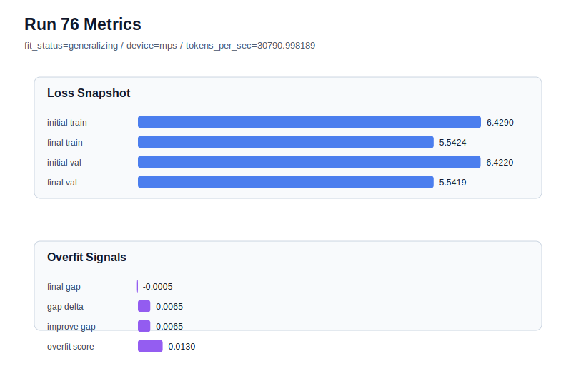

# run 076 실험 보고서

## 이번 가설

run075에서 quick_gelu + ffn_mult=3은 seed151에서 mish/silu best 계열과 거의 같은 validation loss를 보이면서 overfit_score=0.0과 더 높은 tokens_per_sec를 기록했다. 같은 설정을 seed202에서 반복하면 quick_gelu가 단일 seed의 near-miss인지, 아니면 mish/silu와 3-seed 평균 비교에 올릴 만한 activation 후보인지 판단할 수 있다.

## 왜 이 가설을 세웠는가

최신 run075는 final_val_loss=5.542805, final_generalization_gap=-0.018744, overfit_score=0.0, tokens_per_sec=30772.45로 안정적이었다. seed151 matched 기준인 run072(mish)는 final_val_loss=5.542158, run068(silu)는 5.542543이라 quick_gelu가 아주 근소하게 뒤졌지만 gap은 더 음수이고 속도도 mish보다 높았다. seed202는 같은 작은 FFN 후보에서 raw validation이 가장 낮게 나오는 동시에 작은 overfit penalty가 생기는 seed다. seed202 matched 비교 기준은 run066(silu, val=5.541162, overfit_score=0.013247)과 run073(mish, val=5.541102, overfit_score=0.015280)이므로, quick_gelu가 이 범위에 머물면 activation 후보로 계속 검증할 가치가 있다.

## 가설 작성 주체

llm_plan:docs/train/next_plan.json

## 바꾼 변수

```json
{
  "seed": 202
}
```

## 고정한 변수

vocab_size, context_length, stride, batch_size, learning_rate, weight_decay, grad_clip, emb_dim, n_heads, n_layers, drop_rate, qkv_bias, ffn_mult, norm_first, norm_eps, activation_name, ffn_dropout_position, attention_impl, tie_embeddings, init_std, max_steps

## 기대 결과

성공 기준은 seed202 matched baselines인 run066/run073과 크게 멀어지지 않는 final_val_loss 5.544 이하, final_generalization_gap 0.02 이하, overfit_score 0.03 이하를 유지하는 것이다. tokens_per_sec가 mish seed202보다 높으면 quick_gelu는 속도 포함 후보로 남긴다. final_val_loss가 5.548 이상이거나 overfit_score가 0.05 이상이면 quick_gelu는 seed151에서는 안정적이지만 seed202 일반화가 부족한 것으로 본다.

## 실험 설정

```json
{
  "run_id": 76,
  "hypothesis": "run075에서 quick_gelu + ffn_mult=3은 seed151에서 mish/silu best 계열과 거의 같은 validation loss를 보이면서 overfit_score=0.0과 더 높은 tokens_per_sec를 기록했다. 같은 설정을 seed202에서 반복하면 quick_gelu가 단일 seed의 near-miss인지, 아니면 mish/silu와 3-seed 평균 비교에 올릴 만한 activation 후보인지 판단할 수 있다.",
  "seed": 202,
  "vocab_size": 600,
  "min_frequency": 2,
  "context_length": 48,
  "stride": 24,
  "batch_size": 8,
  "max_steps": 90,
  "eval_batches": 4,
  "train_ratio": 0.9,
  "learning_rate": 0.0003,
  "weight_decay": 0.01,
  "grad_clip": 1.0,
  "emb_dim": 128,
  "n_heads": 4,
  "n_layers": 2,
  "drop_rate": 0.12,
  "qkv_bias": false,
  "ffn_mult": 3,
  "norm_first": false,
  "norm_eps": 1e-05,
  "activation_name": "quick_gelu",
  "ffn_dropout_position": "none",
  "attention_impl": "sdpa",
  "tie_embeddings": true,
  "init_std": 0.02
}
```

## 실행 환경

```json
{
  "timestamp": "2026-06-03T01:25:44+00:00",
  "hostname": "woonyong-MacBookPro.local",
  "platform": "macOS-26.3.1-arm64-arm-64bit-Mach-O",
  "machine": "arm64",
  "python": "3.13.13",
  "torch": "2.12.0",
  "cpu_count": 10,
  "memory_gb": 24.0,
  "cuda_available": false,
  "cuda_device_count": 0,
  "mps_available": true,
  "resolved_device": "mps",
  "profile": "mps_balanced"
}
```

- corpus: `src/learning/the-verdict.txt`
- artifact_dir: `docs/train/runs/run_076_artifacts`

## 실제 결과

| 지표 | 값 |
| --- | --- |
| initial_train_loss | 6.428972125053406 |
| initial_val_loss | 6.421993891398112 |
| final_train_loss | 5.542428970336914 |
| final_val_loss | 5.541934013366699 |
| final_generalization_gap | -0.0004949569702148438 |
| generalization_gap_delta | 0.006483276685078643 |
| train_val_improvement_gap | 0.006483276685078643 |
| overfit_score | 0.012966553370157285 |
| fit_status | generalizing |
| parameter_count | 413184 |
| tokens_per_sec | 30790.998189340124 |
| elapsed_sec | 1.1161703751422465 |
| device | mps |

## 시각 지표




- 대시보드: `../dashboard.md`
- 지표 요약 CSV: `../metrics_summary.csv`

## 과적합 판단

일반화 개선 신호. final gap=-0.0005, overfit_score=0.0130. seed 반복으로 재현성을 확인할 만하다.

## 결론

현재 best 후보: run 72 / val=5.542157967885335 / status=generalizing

## 다음 실험 제안

- 성공 시: quick_gelu가 seed202에서도 통과하면 seed134 stress seed로 반복해 quick_gelu + ffn_mult=3의 3-seed 평균을 완성한다. 세 seed 평균에서 mish/silu와 거의 같고 처리량이 높으면 quick_gelu를 효율 activation 후보로 보류한다.
- 과적합 시: seed202에서 quick_gelu의 gap이나 overfit_score가 커지면 quick_gelu를 현재 best 계열의 기본 후보에서 제외하고 mish/silu를 유지한다. 다음에는 squared_relu 또는 gelu_exact를 ffn_mult=3 기준에서 activation 단일축으로 확인한다.
