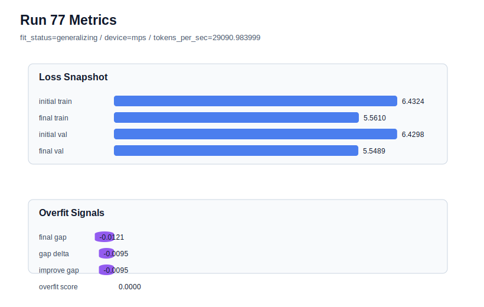

# run 077 실험 보고서

## 이번 가설

quick_gelu + ffn_mult=3이 seed151과 seed202에서 모두 low-risk generalizing으로 통과했으므로, 같은 설정을 seed134 stress seed에서 반복하면 quick_gelu가 mish/silu와 3-seed 평균 비교에 올릴 수 있는 효율 activation 후보인지 확정할 수 있다.

## 왜 이 가설을 세웠는가

run075(seed151)는 final_val_loss=5.542805, gap=-0.018744, overfit_score=0.0으로 mish run072와 silu run068에 매우 근접했고, run076(seed202)는 final_val_loss=5.541934, gap=-0.000495, overfit_score=0.012967로 seed202 matched baselines인 silu run066(val=5.541162, overfit_score=0.013247)과 mish run073(val=5.541102, overfit_score=0.015280)의 같은 저손실 영역에 들어왔다. 남은 seed134는 이전 여러 실험에서 validation과 overfit 신호가 흔들렸던 stress seed이며, mish run074와 silu run067이 모두 약 5.54867대에 머물렀다. 따라서 seed134에서 quick_gelu가 이 범위를 유지하면 quick_gelu의 3-seed 평균과 처리량을 activation 후보 비교에 포함할 수 있다.

## 가설 작성 주체

llm_plan:docs/train/next_plan.json

## 바꾼 변수

```json
{
  "seed": 134
}
```

## 고정한 변수

vocab_size, context_length, stride, batch_size, learning_rate, weight_decay, grad_clip, emb_dim, n_heads, n_layers, drop_rate, qkv_bias, ffn_mult, norm_first, norm_eps, activation_name, ffn_dropout_position, attention_impl, tie_embeddings, init_std, max_steps

## 기대 결과

성공 기준은 seed134 matched baselines인 silu run067(final_val_loss=5.548691, overfit_score=0.0)과 mish run074(final_val_loss=5.548672, overfit_score=0.0)에 근접하거나 더 낮은 final_val_loss 5.549 이하를 유지하고, final_generalization_gap이 0.02 이하이며 overfit_score가 0.03 이하로 유지되는 것이다. final_val_loss가 5.5467 이하이면 seed134에서도 ffn_mult=4 silu 기준까지 이기는 강한 후보가 된다. 5.555 이상이거나 overfit_score가 0.05 이상이면 quick_gelu는 seed134 stress 조건에서 약한 것으로 본다.

## 실험 설정

```json
{
  "run_id": 77,
  "hypothesis": "quick_gelu + ffn_mult=3이 seed151과 seed202에서 모두 low-risk generalizing으로 통과했으므로, 같은 설정을 seed134 stress seed에서 반복하면 quick_gelu가 mish/silu와 3-seed 평균 비교에 올릴 수 있는 효율 activation 후보인지 확정할 수 있다.",
  "seed": 134,
  "vocab_size": 600,
  "min_frequency": 2,
  "context_length": 48,
  "stride": 24,
  "batch_size": 8,
  "max_steps": 90,
  "eval_batches": 4,
  "train_ratio": 0.9,
  "learning_rate": 0.0003,
  "weight_decay": 0.01,
  "grad_clip": 1.0,
  "emb_dim": 128,
  "n_heads": 4,
  "n_layers": 2,
  "drop_rate": 0.12,
  "qkv_bias": false,
  "ffn_mult": 3,
  "norm_first": false,
  "norm_eps": 1e-05,
  "activation_name": "quick_gelu",
  "ffn_dropout_position": "none",
  "attention_impl": "sdpa",
  "tie_embeddings": true,
  "init_std": 0.02
}
```

## 실행 환경

```json
{
  "timestamp": "2026-06-03T01:30:33+00:00",
  "hostname": "woonyong-MacBookPro.local",
  "platform": "macOS-26.3.1-arm64-arm-64bit-Mach-O",
  "machine": "arm64",
  "python": "3.13.13",
  "torch": "2.12.0",
  "cpu_count": 10,
  "memory_gb": 24.0,
  "cuda_available": false,
  "cuda_device_count": 0,
  "mps_available": true,
  "resolved_device": "mps",
  "profile": "mps_balanced"
}
```

- corpus: `src/learning/the-verdict.txt`
- artifact_dir: `docs/train/runs/run_077_artifacts`

## 실제 결과

| 지표 | 값 |
| --- | --- |
| initial_train_loss | 6.432389974594116 |
| initial_val_loss | 6.429779847462972 |
| final_train_loss | 5.56102192401886 |
| final_val_loss | 5.548875331878662 |
| final_generalization_gap | -0.012146592140197754 |
| generalization_gap_delta | -0.009536465009053252 |
| train_val_improvement_gap | -0.009536465009053252 |
| overfit_score | 0.0 |
| fit_status | generalizing |
| parameter_count | 413184 |
| tokens_per_sec | 29090.98399877628 |
| elapsed_sec | 1.1813969579525292 |
| device | mps |

## 시각 지표




- 대시보드: `../dashboard.md`
- 지표 요약 CSV: `../metrics_summary.csv`

## 과적합 판단

일반화 개선 신호. final gap=-0.0121, overfit_score=0.0000. seed 반복으로 재현성을 확인할 만하다.

## 결론

현재 best 후보: run 72 / val=5.542157967885335 / status=generalizing

## 다음 실험 제안

- 성공 시: quick_gelu가 seed134에서도 통과하면 quick_gelu, mish, silu의 ffn_mult=3 3-seed 평균 final_val_loss, overfit_score, tokens_per_sec를 비교한다. 평균 validation이 동등하고 처리량이 높으면 quick_gelu를 효율 activation 후보로 기록하고, 다음에는 squared_relu 또는 gelu_exact를 같은 기준에서 단일축으로 확인한다.
- 과적합 시: quick_gelu가 seed134에서 validation을 크게 잃거나 overfit_score를 키우면 quick_gelu를 seed151/202 near-peer 후보로만 보류하고 mish/silu를 기본 activation 후보로 유지한다. 다음에는 squared_relu 또는 gelu_exact를 ffn_mult=3 기준에서 activation 단일축으로 확인한다.
