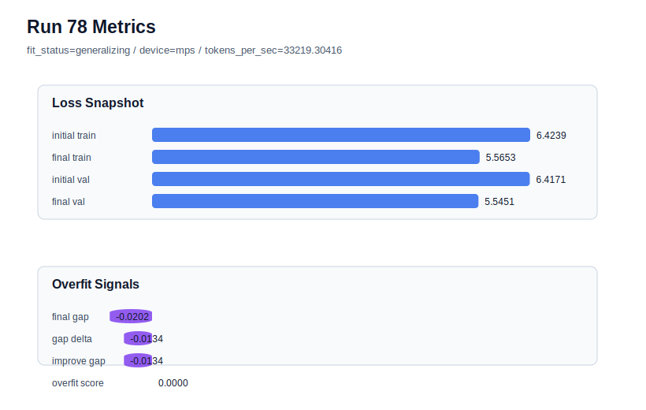

# run 078 실험 보고서

## 이번 가설

mish, silu, quick_gelu는 ffn_mult=3 안정 세팅에서 모두 low-risk이지만 세 seed 평균 차이가 매우 작고 현재 best를 크게 넘지는 못했다. 같은 구조와 학습 조건에서 activation_name만 squared_relu로 바꾸면 ReLU 계열의 단순한 sparse positive activation과 제곱 비선형성이 작은 FFN 폭에서 더 강한 feature selectivity를 만들어 validation loss를 낮출 수 있는지 확인할 수 있다.

## 왜 이 가설을 세웠는가

최근 run072-077은 context_length=48, stride=24, max_steps=90, ffn_mult=3, drop_rate=0.12 조건에서 activation 선택만 남은 안정 plateau를 보여준다. mish 3-seed 평균은 약 5.54398, silu 3-seed 평균은 약 5.54413, quick_gelu 3-seed 평균은 약 5.54454로 모두 비슷하며, best는 run072(mish, seed151, val=5.542158, overfit_score=0.0)다. quick_gelu는 세 seed 모두 통과했지만 평균상 mish/silu를 넘지 못했으므로, 다음에는 GELU/SiLU/Mish의 부드러운 activation 계열을 벗어나 squared_relu를 seed151 matched baseline에서 먼저 확인하는 것이 정보량이 크다. seed151은 run068/run072/run075에서 activation 간 차이를 민감하게 보여준 matched comparison seed다.

## 가설 작성 주체

llm_plan:docs/train/next_plan.json

## 바꾼 변수

```json
{
  "activation_name": "squared_relu"
}
```

## 고정한 변수

vocab_size, context_length, stride, batch_size, learning_rate, weight_decay, grad_clip, emb_dim, n_heads, n_layers, drop_rate, qkv_bias, ffn_mult, norm_first, norm_eps, ffn_dropout_position, attention_impl, tie_embeddings, init_std, max_steps, seed

## 기대 결과

성공 기준은 seed151 matched baselines인 run072(mish, final_val_loss=5.542158), run068(silu, 5.542543), run075(quick_gelu, 5.542805)에 근접한 final_val_loss 5.543 이하를 유지하고, final_generalization_gap이 0.02 이하이며 overfit_score가 0.03 이하로 유지되는 것이다. final_val_loss가 5.548 이상이면 squared_relu는 현재 작은 FFN 후보에서 표현력 또는 optimization mismatch가 큰 것으로 본다. overfit_score가 커지면 ReLU 계열의 sharper activation이 train 쪽으로 치우친 신호로 해석한다.

## 실험 설정

```json
{
  "run_id": 78,
  "hypothesis": "mish, silu, quick_gelu는 ffn_mult=3 안정 세팅에서 모두 low-risk이지만 세 seed 평균 차이가 매우 작고 현재 best를 크게 넘지는 못했다. 같은 구조와 학습 조건에서 activation_name만 squared_relu로 바꾸면 ReLU 계열의 단순한 sparse positive activation과 제곱 비선형성이 작은 FFN 폭에서 더 강한 feature selectivity를 만들어 validation loss를 낮출 수 있는지 확인할 수 있다.",
  "seed": 151,
  "vocab_size": 600,
  "min_frequency": 2,
  "context_length": 48,
  "stride": 24,
  "batch_size": 8,
  "max_steps": 90,
  "eval_batches": 4,
  "train_ratio": 0.9,
  "learning_rate": 0.0003,
  "weight_decay": 0.01,
  "grad_clip": 1.0,
  "emb_dim": 128,
  "n_heads": 4,
  "n_layers": 2,
  "drop_rate": 0.12,
  "qkv_bias": false,
  "ffn_mult": 3,
  "norm_first": false,
  "norm_eps": 1e-05,
  "activation_name": "squared_relu",
  "ffn_dropout_position": "none",
  "attention_impl": "sdpa",
  "tie_embeddings": true,
  "init_std": 0.02
}
```

## 실행 환경

```json
{
  "timestamp": "2026-06-03T01:35:55+00:00",
  "hostname": "woonyong-MacBookPro.local",
  "platform": "macOS-26.3.1-arm64-arm-64bit-Mach-O",
  "machine": "arm64",
  "python": "3.13.13",
  "torch": "2.12.0",
  "cpu_count": 10,
  "memory_gb": 24.0,
  "cuda_available": false,
  "cuda_device_count": 0,
  "mps_available": true,
  "resolved_device": "mps",
  "profile": "mps_balanced"
}
```

- corpus: `src/learning/the-verdict.txt`
- artifact_dir: `docs/train/runs/run_078_artifacts`

## 실제 결과

| 지표 | 값 |
| --- | --- |
| initial_train_loss | 6.423903703689575 |
| initial_val_loss | 6.417129834493001 |
| final_train_loss | 5.565274953842163 |
| final_val_loss | 5.545124371846517 |
| final_generalization_gap | -0.020150581995646455 |
| generalization_gap_delta | -0.013376712799072266 |
| train_val_improvement_gap | -0.013376712799072266 |
| overfit_score | 0.0 |
| fit_status | generalizing |
| parameter_count | 413184 |
| tokens_per_sec | 33219.30416003031 |
| elapsed_sec | 1.0345791662111878 |
| device | mps |

## 시각 지표




- 대시보드: `../dashboard.md`
- 지표 요약 CSV: `../metrics_summary.csv`

## 과적합 판단

일반화 개선 신호. final gap=-0.0202, overfit_score=0.0000. seed 반복으로 재현성을 확인할 만하다.

## 결론

현재 best 후보: run 72 / val=5.542157967885335 / status=generalizing

## 다음 실험 제안

- 성공 시: squared_relu가 seed151에서 5.543 이하와 low-risk를 유지하면 seed202에서 반복해 run066/run073/run076의 저손실 seed와 비교한다. 두 seed가 통과하면 seed134 stress test까지 수행해 squared_relu의 3-seed 평균을 mish/silu/quick_gelu와 비교한다.
- 과적합 시: squared_relu가 validation을 크게 잃거나 overfit_score를 키우면 ReLU 계열은 현재 안정 세팅에서 보류하고, 다음에는 gelu_exact + ffn_mult=3을 seed151에서 확인해 GELU 기준선이 작은 FFN 폭에서 얼마나 따라오는지 측정한다.
