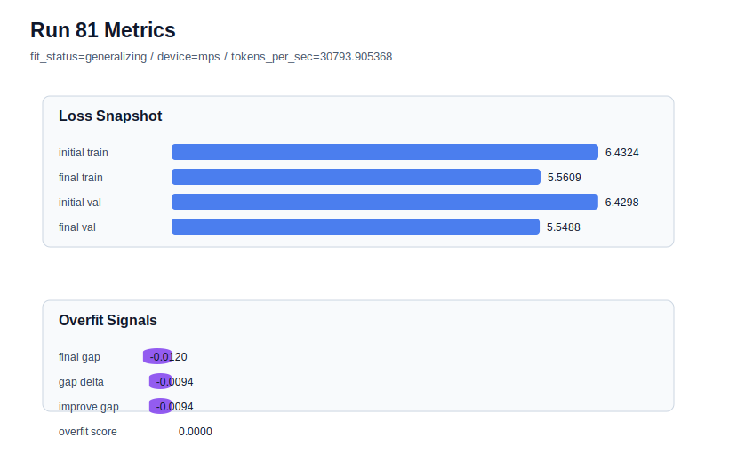

# run 081 실험 보고서

## 이번 가설

gelu_exact + ffn_mult=3은 seed151과 seed202에서 모두 low-risk로 통과했으므로, 같은 설정을 seed134 stress seed에서 반복하면 gelu_exact가 mish/silu/quick_gelu와 3-seed 평균 비교에 들어갈 수 있는 activation 후보인지 확정할 수 있다.

## 왜 이 가설을 세웠는가

최근 run079(seed151)는 gelu_exact + ffn_mult=3에서 final_val_loss=5.542699, gap=-0.018719, overfit_score=0.0을 기록했고, run080(seed202)는 final_val_loss=5.541787, gap=-0.000421, overfit_score=0.013100으로 seed202 matched activation baselines와 같은 저손실 영역에 들어왔다. 남은 seed134는 현재 작은 FFN 후보에서 activation 후보의 stress 비교를 완성하는 축이다. seed134 matched baselines는 silu run067 val=5.548691, mish run074 val=5.548672, quick_gelu run077 val=5.548875로 매우 좁게 모여 있다. 따라서 seed만 134로 바꾸면 gelu_exact의 평균 품질과 stress-seed 안정성을 직접 판단할 수 있다.

## 가설 작성 주체

llm_plan:docs/train/next_plan.json

## 바꾼 변수

```json
{
  "seed": 134
}
```

## 고정한 변수

vocab_size, context_length, stride, batch_size, learning_rate, weight_decay, grad_clip, emb_dim, n_heads, n_layers, drop_rate, qkv_bias, ffn_mult, norm_first, norm_eps, activation_name, ffn_dropout_position, attention_impl, tie_embeddings, init_std, max_steps

## 기대 결과

성공 기준은 seed134 matched baselines인 run067/run074/run077과 같은 final_val_loss 5.549 이하를 유지하고, final_generalization_gap이 0.02 이하이며 overfit_score가 0.03 이하로 유지되는 것이다. final_val_loss가 5.5469 이하이면 gelu_exact는 seed134에서 ffn_mult=4 gelu_exact run062까지 이기는 강한 후보가 된다. final_val_loss가 5.555 이상이거나 overfit_score가 0.05 이상이면 gelu_exact는 stress seed에서 약한 것으로 본다.

## 실험 설정

```json
{
  "run_id": 81,
  "hypothesis": "gelu_exact + ffn_mult=3은 seed151과 seed202에서 모두 low-risk로 통과했으므로, 같은 설정을 seed134 stress seed에서 반복하면 gelu_exact가 mish/silu/quick_gelu와 3-seed 평균 비교에 들어갈 수 있는 activation 후보인지 확정할 수 있다.",
  "seed": 134,
  "vocab_size": 600,
  "min_frequency": 2,
  "context_length": 48,
  "stride": 24,
  "batch_size": 8,
  "max_steps": 90,
  "eval_batches": 4,
  "train_ratio": 0.9,
  "learning_rate": 0.0003,
  "weight_decay": 0.01,
  "grad_clip": 1.0,
  "emb_dim": 128,
  "n_heads": 4,
  "n_layers": 2,
  "drop_rate": 0.12,
  "qkv_bias": false,
  "ffn_mult": 3,
  "norm_first": false,
  "norm_eps": 1e-05,
  "activation_name": "gelu_exact",
  "ffn_dropout_position": "none",
  "attention_impl": "sdpa",
  "tie_embeddings": true,
  "init_std": 0.02
}
```

## 실행 환경

```json
{
  "timestamp": "2026-06-03T01:52:14+00:00",
  "hostname": "woonyong-MacBookPro.local",
  "platform": "macOS-26.3.1-arm64-arm-64bit-Mach-O",
  "machine": "arm64",
  "python": "3.13.13",
  "torch": "2.12.0",
  "cpu_count": 10,
  "memory_gb": 24.0,
  "cuda_available": false,
  "cuda_device_count": 0,
  "mps_available": true,
  "resolved_device": "mps",
  "profile": "mps_balanced"
}
```

- corpus: `src/learning/the-verdict.txt`
- artifact_dir: `docs/train/runs/run_081_artifacts`

## 실제 결과

| 지표 | 값 |
| --- | --- |
| initial_train_loss | 6.43239951133728 |
| initial_val_loss | 6.429793039957683 |
| final_train_loss | 5.560893654823303 |
| final_val_loss | 5.548844178517659 |
| final_generalization_gap | -0.012049476305644014 |
| generalization_gap_delta | -0.009443004926046328 |
| train_val_improvement_gap | -0.009443004926046328 |
| overfit_score | 0.0 |
| fit_status | generalizing |
| parameter_count | 413184 |
| tokens_per_sec | 30793.905367821415 |
| elapsed_sec | 1.1160650001838803 |
| device | mps |

## 시각 지표




- 대시보드: `../dashboard.md`
- 지표 요약 CSV: `../metrics_summary.csv`

## 과적합 판단

일반화 개선 신호. final gap=-0.0120, overfit_score=0.0000. seed 반복으로 재현성을 확인할 만하다.

## 결론

현재 best 후보: run 72 / val=5.542157967885335 / status=generalizing

## 다음 실험 제안

- 성공 시: gelu_exact가 seed134에서도 5.549 이하와 low-risk를 유지하면 gelu_exact, mish, silu, quick_gelu의 ffn_mult=3 3-seed 평균 final_val_loss, overfit_score, tokens_per_sec를 정리한다. 평균 품질이 동등하면 처리량과 overfit_score 평균을 기준으로 기본 activation을 고르고, 이후에는 activation 탐색을 닫고 regularization 또는 optimization 단일축으로 이동한다.
- 과적합 시: gelu_exact가 seed134에서 validation을 크게 잃거나 overfit_score를 키우면 gelu_exact는 seed151/202 near-peer 후보로 보류하고 기본 activation 후보를 mish/silu/quick_gelu로 좁힌다. 다음에는 activation 탐색보다 seed202의 작은 positive gap을 낮추는 weight_decay 또는 dropout 위치 단일축을 검토한다.
