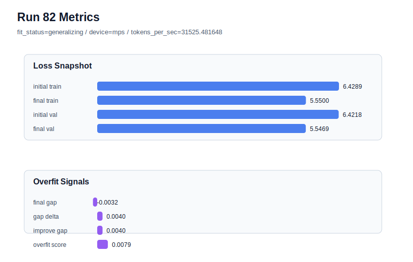

# run 082 실험 보고서

## 이번 가설

activation sweep 결과 mish가 3-seed 평균 final_val_loss에서 가장 앞서고 current best도 run072(mish, seed151)이므로, activation 탐색은 닫고 mish 후보의 seed202 작은 overfit penalty를 줄이는 optimization 단일축을 확인한다. run073의 mish + seed202 + max_steps=90에서 max_steps만 85로 줄이면 낮은 validation loss를 대부분 유지하면서 train 쪽 과진행과 overfit_score를 낮출 수 있다.

## 왜 이 가설을 세웠는가

ffn_mult=3, context_length=48, stride=24, drop_rate=0.12 조건에서 3-seed activation 평균은 mish mean_val=5.543977, silu mean_val=5.544132, gelu_exact mean_val=5.544444, quick_gelu mean_val=5.544538로 매우 좁지만 mish가 근소하게 가장 좋다. seed202 matched runs는 모두 낮은 raw validation과 작은 penalty를 보인다: mish run073 val=5.541102, gap=0.000343, overfit_score=0.015280; silu run066 val=5.541162, overfit_score=0.013247; quick_gelu run076 val=5.541934, overfit_score=0.012967; gelu_exact run080 val=5.541787, overfit_score=0.013100. 이전 run070의 after_activation dropout은 seed202에서 validation과 overfit_score를 모두 악화했고, run071의 learning_rate 하향은 overfit_score를 낮췄지만 validation을 5.546917까지 잃었다. 따라서 이번에는 regularization 강도를 늘리기보다 max_steps를 90에서 85로 아주 작게 줄여 optimization 길이만 조절하는 것이 가장 해석 가능하다.

## 가설 작성 주체

llm_plan:docs/train/next_plan.json

## 바꾼 변수

```json
{
  "max_steps": 85
}
```

## 고정한 변수

vocab_size, context_length, stride, batch_size, learning_rate, weight_decay, grad_clip, emb_dim, n_heads, n_layers, drop_rate, qkv_bias, ffn_mult, norm_first, norm_eps, activation_name, ffn_dropout_position, attention_impl, tie_embeddings, init_std, seed

## 기대 결과

성공 기준은 run073 대비 final_val_loss가 5.543 이하에 머물고, final_generalization_gap이 0.0 이하 또는 overfit_score가 run073의 0.015280보다 낮아지는 것이다. final_val_loss가 5.544 이상으로 악화되면 85 steps는 under-training 비용이 큰 것으로 본다. overfit_score가 그대로이거나 커지면 seed202 penalty는 학습 길이보다 activation/seed 특성에 가깝다고 본다.

## 실험 설정

```json
{
  "run_id": 82,
  "hypothesis": "activation sweep 결과 mish가 3-seed 평균 final_val_loss에서 가장 앞서고 current best도 run072(mish, seed151)이므로, activation 탐색은 닫고 mish 후보의 seed202 작은 overfit penalty를 줄이는 optimization 단일축을 확인한다. run073의 mish + seed202 + max_steps=90에서 max_steps만 85로 줄이면 낮은 validation loss를 대부분 유지하면서 train 쪽 과진행과 overfit_score를 낮출 수 있다.",
  "seed": 202,
  "vocab_size": 600,
  "min_frequency": 2,
  "context_length": 48,
  "stride": 24,
  "batch_size": 8,
  "max_steps": 85,
  "eval_batches": 4,
  "train_ratio": 0.9,
  "learning_rate": 0.0003,
  "weight_decay": 0.01,
  "grad_clip": 1.0,
  "emb_dim": 128,
  "n_heads": 4,
  "n_layers": 2,
  "drop_rate": 0.12,
  "qkv_bias": false,
  "ffn_mult": 3,
  "norm_first": false,
  "norm_eps": 1e-05,
  "activation_name": "mish",
  "ffn_dropout_position": "none",
  "attention_impl": "sdpa",
  "tie_embeddings": true,
  "init_std": 0.02
}
```

## 실행 환경

```json
{
  "timestamp": "2026-06-03T01:58:58+00:00",
  "hostname": "woonyong-MacBookPro.local",
  "platform": "macOS-26.3.1-arm64-arm-64bit-Mach-O",
  "machine": "arm64",
  "python": "3.13.13",
  "torch": "2.12.0",
  "cpu_count": 10,
  "memory_gb": 24.0,
  "cuda_available": false,
  "cuda_device_count": 0,
  "mps_available": true,
  "resolved_device": "mps",
  "profile": "mps_balanced"
}
```

- corpus: `src/learning/the-verdict.txt`
- artifact_dir: `docs/train/runs/run_082_artifacts`

## 실제 결과

| 지표 | 값 |
| --- | --- |
| initial_train_loss | 6.428932785987854 |
| initial_val_loss | 6.421806971232097 |
| final_train_loss | 5.550032615661621 |
| final_val_loss | 5.546870072682698 |
| final_generalization_gap | -0.003162542978922822 |
| generalization_gap_delta | 0.003963271776834532 |
| train_val_improvement_gap | 0.003963271776834532 |
| overfit_score | 0.007926543553669063 |
| fit_status | generalizing |
| parameter_count | 413184 |
| tokens_per_sec | 31525.4816479677 |
| elapsed_sec | 1.0292626251466572 |
| device | mps |

## 시각 지표




- 대시보드: `../dashboard.md`
- 지표 요약 CSV: `../metrics_summary.csv`

## 과적합 판단

일반화 개선 신호. final gap=-0.0032, overfit_score=0.0079. seed 반복으로 재현성을 확인할 만하다.

## 결론

현재 best 후보: run 72 / val=5.542157967885335 / status=generalizing

## 다음 실험 제안

- 성공 시: max_steps=85가 seed202에서 validation을 유지하면서 overfit_score를 낮추면 같은 mish + ffn_mult=3 설정을 seed151에서 반복해 current best run072와 비교한다. seed151도 통과하면 seed134까지 확인해 max_steps=85가 3-seed 평균에서 90-step 후보를 대체할 수 있는지 판단한다.
- 과적합 시: max_steps=85에서도 overfit_score가 줄지 않거나 validation이 악화되면 max_steps=90을 유지하고, 다음에는 mish seed202에서 weight_decay=0.015처럼 더 작은 regularization 단일축을 확인한다. weight_decay=0.02는 과거 high-overfit 구간에서 효과가 약했으므로 바로 크게 올리지는 않는다.
