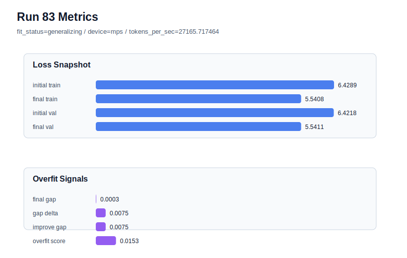

# run 083 실험 보고서

## 이번 가설

run082 showed that shortening mish + seed202 from 90 to 85 steps reduces overfit_score but loses too much validation performance, so the next safer test is to restore max_steps=90 and apply only a gentle weight_decay increase from 0.01 to 0.015. If the small seed202 penalty in run073 is due to train-side over-progress rather than activation choice, this should keep the low final_val_loss near 5.541 while reducing overfit_score without the under-training cost seen in run082.

## 왜 이 가설을 세웠는가

The activation sweep is effectively closed: mish has the best 3-seed mean final_val_loss among mish, silu, gelu_exact, and quick_gelu, and current best remains run072 with mish seed151. The matched seed202 mish baseline run073 had excellent final_val_loss=5.541102 but a small positive gap and overfit_score=0.015280. Attempts to reduce this penalty by after_activation dropout (run070), lower learning_rate (run071), and shorter max_steps=85 (run082) all worsened validation loss; run082 in particular improved overfit_score to 0.007927 but final_val_loss fell to 5.546870. A smaller weight_decay step is therefore the most conservative remaining regularization axis: it preserves architecture, activation, context/stride, learning rate, and 90-step optimization while testing whether mild optimizer regularization can reduce the seed202 penalty.

## 가설 작성 주체

llm_plan:docs/train/next_plan.json

## 바꾼 변수

```json
{
  "max_steps": 90,
  "weight_decay": 0.015
}
```

## 고정한 변수

vocab_size, context_length, stride, batch_size, learning_rate, grad_clip, emb_dim, n_heads, n_layers, drop_rate, qkv_bias, ffn_mult, norm_first, norm_eps, activation_name, ffn_dropout_position, attention_impl, tie_embeddings, init_std, seed

## 기대 결과

Success means final_val_loss remains close to run073, ideally at or below 5.543, while overfit_score drops below 0.015280 and final_generalization_gap is near zero or negative. If final_val_loss rises toward run082 or run071 levels above 5.545, the seed202 penalty is not worth regularizing further and the loop should prefer the current mish 3-seed plateau.

## 실험 설정

```json
{
  "run_id": 83,
  "hypothesis": "run082 showed that shortening mish + seed202 from 90 to 85 steps reduces overfit_score but loses too much validation performance, so the next safer test is to restore max_steps=90 and apply only a gentle weight_decay increase from 0.01 to 0.015. If the small seed202 penalty in run073 is due to train-side over-progress rather than activation choice, this should keep the low final_val_loss near 5.541 while reducing overfit_score without the under-training cost seen in run082.",
  "seed": 202,
  "vocab_size": 600,
  "min_frequency": 2,
  "context_length": 48,
  "stride": 24,
  "batch_size": 8,
  "max_steps": 90,
  "eval_batches": 4,
  "train_ratio": 0.9,
  "learning_rate": 0.0003,
  "weight_decay": 0.015,
  "grad_clip": 1.0,
  "emb_dim": 128,
  "n_heads": 4,
  "n_layers": 2,
  "drop_rate": 0.12,
  "qkv_bias": false,
  "ffn_mult": 3,
  "norm_first": false,
  "norm_eps": 1e-05,
  "activation_name": "mish",
  "ffn_dropout_position": "none",
  "attention_impl": "sdpa",
  "tie_embeddings": true,
  "init_std": 0.02
}
```

## 실행 환경

```json
{
  "timestamp": "2026-06-03T02:02:52+00:00",
  "hostname": "woonyong-MacBookPro.local",
  "platform": "macOS-26.3.1-arm64-arm-64bit-Mach-O",
  "machine": "arm64",
  "python": "3.13.13",
  "torch": "2.12.0",
  "cpu_count": 10,
  "memory_gb": 24.0,
  "cuda_available": false,
  "cuda_device_count": 0,
  "mps_available": true,
  "resolved_device": "mps",
  "profile": "mps_balanced"
}
```

- corpus: `src/learning/the-verdict.txt`
- artifact_dir: `docs/train/runs/run_083_artifacts`

## 실제 결과

| 지표 | 값 |
| --- | --- |
| initial_train_loss | 6.428932785987854 |
| initial_val_loss | 6.421806971232097 |
| final_train_loss | 5.540782451629639 |
| final_val_loss | 5.541118780771892 |
| final_generalization_gap | 0.0003363291422529002 |
| generalization_gap_delta | 0.007462143898010254 |
| train_val_improvement_gap | 0.007462143898010254 |
| overfit_score | 0.015260616938273408 |
| fit_status | generalizing |
| parameter_count | 413184 |
| tokens_per_sec | 27165.717464007736 |
| elapsed_sec | 1.2651239580009133 |
| device | mps |

## 시각 지표




- 대시보드: `../dashboard.md`
- 지표 요약 CSV: `../metrics_summary.csv`

## 과적합 판단

일반화 개선 신호. final gap=0.0003, overfit_score=0.0153. seed 반복으로 재현성을 확인할 만하다.

## 결론

현재 best 후보: run 72 / val=5.542157967885335 / status=generalizing

## 다음 실험 제안

- 성공 시: Repeat the same mish + weight_decay=0.015 setting on seed151 to compare directly against current best run072; if seed151 remains competitive, complete seed134 for a 3-seed average.
- 과적합 시: If weight_decay=0.015 does not reduce the seed202 penalty or worsens validation, stop tuning seed202 regularization and pivot to seed variance confirmation around the current best mish setting, or test a very small capacity/initialization axis such as init_std only if the dashboard still shows low-risk runs.
