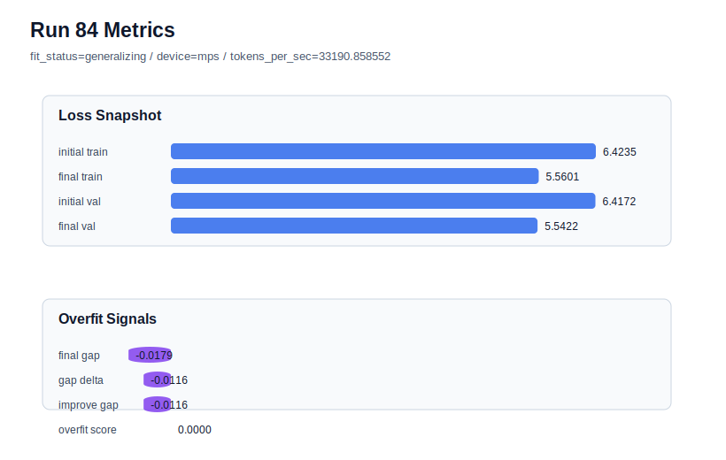

# run 084 실험 보고서

## 이번 가설

The seed202 regularization branch should be closed unless weight_decay=0.015 also improves the current best seed151 mish run. Run083 showed that weight_decay=0.015 preserved seed202 validation but did not meaningfully reduce its overfit-aware penalty versus run073, so applying the same mild weight decay to seed151 tests whether it is a real activation-setting improvement or just neutral noise. If seed151 keeps overfit_score at 0.0 and lowers final_val_loss below run072, weight_decay=0.015 can remain in the mish candidate; otherwise the loop should return to weight_decay=0.01 and treat the remaining differences as seed variance.

## 왜 이 가설을 세웠는가

Current best is run072: mish, seed151, ffn_mult=3, max_steps=90, weight_decay=0.01, final_val_loss=5.542158, final_generalization_gap=-0.017935, overfit_score=0.0. The matched seed202 baseline run073 had lower raw validation, final_val_loss=5.541102, but a small positive gap and overfit_score=0.015280. Attempts to reduce that seed202 penalty by shorter max_steps=85 lost too much validation in run082, while weight_decay=0.015 in run083 produced nearly identical validation and overfit_score to run073. Since seed151 already has no overfit penalty, the only useful reason to keep weight_decay=0.015 is if it improves or preserves the current best validation without harming the gap. This is a safe low-cost confirmation on the same MPS-balanced 413184-parameter setting.

## 가설 작성 주체

llm_plan:docs/train/next_plan.json

## 바꾼 변수

```json
{
  "seed": 151,
  "weight_decay": 0.015
}
```

## 고정한 변수

vocab_size, context_length, stride, batch_size, learning_rate, grad_clip, emb_dim, n_heads, n_layers, drop_rate, qkv_bias, ffn_mult, norm_first, norm_eps, activation_name, ffn_dropout_position, attention_impl, tie_embeddings, init_std, max_steps

## 기대 결과

Success means final_val_loss is at or below run072's 5.542158 while final_generalization_gap stays negative and overfit_score remains 0.0. A neutral result near 5.5427 with overfit_score=0.0 means weight_decay=0.015 is harmless but not useful. If final_val_loss rises above 5.544 or overfit_score becomes positive, the regularization branch should be closed and mish weight_decay=0.01 should remain the default.

## 실험 설정

```json
{
  "run_id": 84,
  "hypothesis": "The seed202 regularization branch should be closed unless weight_decay=0.015 also improves the current best seed151 mish run. Run083 showed that weight_decay=0.015 preserved seed202 validation but did not meaningfully reduce its overfit-aware penalty versus run073, so applying the same mild weight decay to seed151 tests whether it is a real activation-setting improvement or just neutral noise. If seed151 keeps overfit_score at 0.0 and lowers final_val_loss below run072, weight_decay=0.015 can remain in the mish candidate; otherwise the loop should return to weight_decay=0.01 and treat the remaining differences as seed variance.",
  "seed": 151,
  "vocab_size": 600,
  "min_frequency": 2,
  "context_length": 48,
  "stride": 24,
  "batch_size": 8,
  "max_steps": 90,
  "eval_batches": 4,
  "train_ratio": 0.9,
  "learning_rate": 0.0003,
  "weight_decay": 0.015,
  "grad_clip": 1.0,
  "emb_dim": 128,
  "n_heads": 4,
  "n_layers": 2,
  "drop_rate": 0.12,
  "qkv_bias": false,
  "ffn_mult": 3,
  "norm_first": false,
  "norm_eps": 1e-05,
  "activation_name": "mish",
  "ffn_dropout_position": "none",
  "attention_impl": "sdpa",
  "tie_embeddings": true,
  "init_std": 0.02
}
```

## 실행 환경

```json
{
  "timestamp": "2026-06-03T02:07:53+00:00",
  "hostname": "woonyong-MacBookPro.local",
  "platform": "macOS-26.3.1-arm64-arm-64bit-Mach-O",
  "machine": "arm64",
  "python": "3.13.13",
  "torch": "2.12.0",
  "cpu_count": 10,
  "memory_gb": 24.0,
  "cuda_available": false,
  "cuda_device_count": 0,
  "mps_available": true,
  "resolved_device": "mps",
  "profile": "mps_balanced"
}
```

- corpus: `src/learning/the-verdict.txt`
- artifact_dir: `docs/train/runs/run_084_artifacts`

## 실제 결과

| 지표 | 값 |
| --- | --- |
| initial_train_loss | 6.423532009124756 |
| initial_val_loss | 6.4171522458394366 |
| final_train_loss | 5.560110807418823 |
| final_val_loss | 5.542174339294434 |
| final_generalization_gap | -0.01793646812438965 |
| generalization_gap_delta | -0.011556704839070342 |
| train_val_improvement_gap | -0.011556704839070342 |
| overfit_score | 0.0 |
| fit_status | generalizing |
| parameter_count | 413184 |
| tokens_per_sec | 33190.85855237598 |
| elapsed_sec | 1.0354658330325037 |
| device | mps |

## 시각 지표




- 대시보드: `../dashboard.md`
- 지표 요약 CSV: `../metrics_summary.csv`

## 과적합 판단

일반화 개선 신호. final gap=-0.0179, overfit_score=0.0000. seed 반복으로 재현성을 확인할 만하다.

## 결론

현재 best 후보: run 72 / val=5.542157967885335 / status=generalizing

## 다음 실험 제안

- 성공 시: If seed151 improves with weight_decay=0.015, repeat the same setting on seed134 to complete a 3-seed comparison against mish weight_decay=0.01 before changing the default.
- 과적합 시: If seed151 does not improve, stop tuning weight_decay for this mish plateau and pivot to seed-variance-aware selection or a very small initialization/optimization axis only if the dashboard remains low risk.
