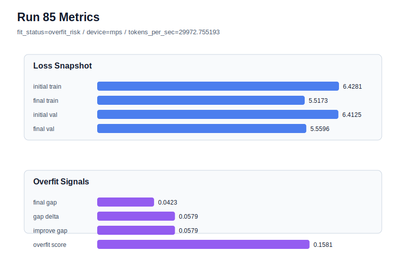

# run 085 실험 보고서

## 이번 가설

After closing the weight_decay=0.015 regularization branch, the next most informative question is seed variance around the current best mish configuration. Keeping the run072 default candidate unchanged and changing only seed to 303 will show whether the mish + ffn_mult=3 + weight_decay=0.01 plateau remains low-risk outside the already-tested seeds 151, 202, and 134.

## 왜 이 가설을 세웠는가

The current best is run072 with mish, seed151, context_length=48, stride=24, ffn_mult=3, max_steps=90, weight_decay=0.01, final_val_loss=5.542158, final_generalization_gap=-0.017935, and overfit_score=0.0. The same mish setting already covered seed202 in run073 and seed134 in run074, giving a narrow but visible seed pattern: seed202 has the lowest raw validation but a small positive-gap penalty, while seed151 and seed134 have negative gaps and zero overfit_score. Attempts to improve the seed202 penalty through max_steps=85, weight_decay=0.015, and seed151 weight_decay confirmation did not beat run072. Therefore more regularization is low-value; a fresh seed is the cleanest way to determine whether the plateau is robust or whether current best selection is mostly seed variance.

## 가설 작성 주체

llm_plan:docs/train/next_plan.json

## 바꾼 변수

```json
{
  "seed": 303
}
```

## 고정한 변수

vocab_size, context_length, stride, batch_size, learning_rate, weight_decay, grad_clip, emb_dim, n_heads, n_layers, drop_rate, qkv_bias, ffn_mult, norm_first, norm_eps, activation_name, ffn_dropout_position, attention_impl, tie_embeddings, init_std, max_steps

## 기대 결과

If the plateau is robust, final_val_loss should land in the existing mish 3-seed band around 5.541 to 5.549, fit_status should remain generalizing, and overfit_score should stay below 0.03. A result near or below run072 with overfit_score=0.0 would strengthen the case for mish as the default. A result above 5.552 or with a larger positive gap would indicate seed variance dominates the current tiny activation and regularization differences.

## 실험 설정

```json
{
  "run_id": 85,
  "hypothesis": "After closing the weight_decay=0.015 regularization branch, the next most informative question is seed variance around the current best mish configuration. Keeping the run072 default candidate unchanged and changing only seed to 303 will show whether the mish + ffn_mult=3 + weight_decay=0.01 plateau remains low-risk outside the already-tested seeds 151, 202, and 134.",
  "seed": 303,
  "vocab_size": 600,
  "min_frequency": 2,
  "context_length": 48,
  "stride": 24,
  "batch_size": 8,
  "max_steps": 90,
  "eval_batches": 4,
  "train_ratio": 0.9,
  "learning_rate": 0.0003,
  "weight_decay": 0.01,
  "grad_clip": 1.0,
  "emb_dim": 128,
  "n_heads": 4,
  "n_layers": 2,
  "drop_rate": 0.12,
  "qkv_bias": false,
  "ffn_mult": 3,
  "norm_first": false,
  "norm_eps": 1e-05,
  "activation_name": "mish",
  "ffn_dropout_position": "none",
  "attention_impl": "sdpa",
  "tie_embeddings": true,
  "init_std": 0.02
}
```

## 실행 환경

```json
{
  "timestamp": "2026-06-03T02:12:46+00:00",
  "hostname": "woonyong-MacBookPro.local",
  "platform": "macOS-26.3.1-arm64-arm-64bit-Mach-O",
  "machine": "arm64",
  "python": "3.13.13",
  "torch": "2.12.0",
  "cpu_count": 10,
  "memory_gb": 24.0,
  "cuda_available": false,
  "cuda_device_count": 0,
  "mps_available": true,
  "resolved_device": "mps",
  "profile": "mps_balanced"
}
```

- corpus: `src/learning/the-verdict.txt`
- artifact_dir: `docs/train/runs/run_085_artifacts`

## 실제 결과

| 지표 | 값 |
| --- | --- |
| initial_train_loss | 6.428057551383972 |
| initial_val_loss | 6.412506103515625 |
| final_train_loss | 5.5172765254974365 |
| final_val_loss | 5.559609095255534 |
| final_generalization_gap | 0.04233256975809763 |
| generalization_gap_delta | 0.057884017626444795 |
| train_val_improvement_gap | 0.057884017626444795 |
| overfit_score | 0.15810060501098722 |
| fit_status | overfit_risk |
| parameter_count | 413184 |
| tokens_per_sec | 29972.755193218578 |
| elapsed_sec | 1.146641334053129 |
| device | mps |

## 시각 지표




- 대시보드: `../dashboard.md`
- 지표 요약 CSV: `../metrics_summary.csv`

## 과적합 판단

과적합 위험. final gap=0.0423, overfit_score=0.1581. 다음 실험은 regularization 강화가 우선이다.

## 결론

현재 best 후보: run 72 / val=5.542157967885335 / status=generalizing

## 다음 실험 제안

- 성공 시: If seed303 is low-risk and near the existing mish band, keep mish weight_decay=0.01 as the default and consider one more fresh seed only if the goal is confidence intervals rather than new best hunting.
- 과적합 시: If seed303 shows a high positive gap or worse validation, stop local hyperparameter tweaks and summarize the plateau as seed-sensitive; the next useful direction would be broader data/window evaluation rather than more regularization.
