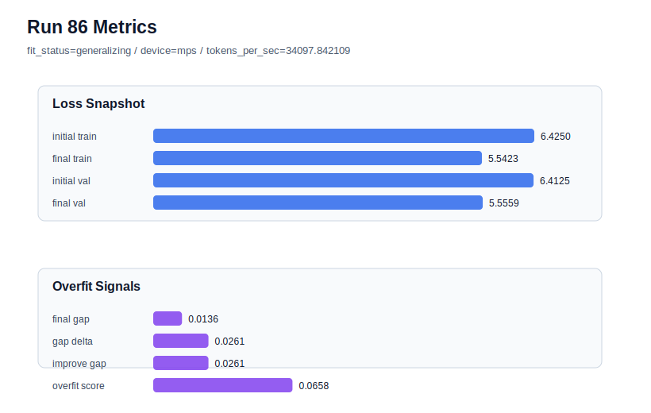

# run 086 실험 보고서

## 이번 가설

Run085 showed that the current best mish configuration is seed-sensitive: seed303 drove train loss down to 5.517277 while validation stayed at 5.559609, producing a high positive gap and overfit_score=0.158101. Keeping the same seed303 and model settings but reducing stride from 24 to 16 will test whether denser overlapping training windows can reduce the train/validation mismatch without changing the Transformer architecture or activation. If the problem is window coverage sensitivity rather than model capacity alone, stride=16 should reduce the gap and overfit_score while keeping validation in a usable range.

## 왜 이 가설을 세웠는가

Earlier runs established context_length=48 with stride=24 as a strong data-window stabilizer: moving from default stride to stride=24 made runs 056-058 low-risk, while context_length=64 and stride=32 failed in run059. The recent activation and regularization plateau from runs 072-084 showed tiny differences among mish, gelu_exact, silu, quick_gelu, weight_decay, and step-count tweaks. Run085 is different: changing only seed to 303 created an overfit_risk result with final_generalization_gap=0.042333 and train_val_improvement_gap=0.057884. Rather than another weight_decay or activation tweak, the next highest-information safe step is to keep seed303 fixed and adjust only stride to see if a denser windowing condition stabilizes the bad seed.

## 가설 작성 주체

llm_plan:docs/train/next_plan.json

## 바꾼 변수

```json
{
  "stride": 16
}
```

## 고정한 변수

vocab_size, context_length, batch_size, learning_rate, weight_decay, grad_clip, emb_dim, n_heads, n_layers, drop_rate, qkv_bias, ffn_mult, norm_first, norm_eps, activation_name, ffn_dropout_position, attention_impl, tie_embeddings, init_std, max_steps, seed

## 기대 결과

Success means final_generalization_gap falls well below run085's 0.042333, overfit_score drops below 0.08, and final_val_loss stays below about 5.56. A strong success would restore low-risk generalizing with final_val_loss inside the prior mish band near 5.541-5.549. If stride=16 worsens validation or keeps overfit_score high, denser overlap is not the right fix and the seed303 issue should be treated as broader split/seed sensitivity.

## 실험 설정

```json
{
  "run_id": 86,
  "hypothesis": "Run085 showed that the current best mish configuration is seed-sensitive: seed303 drove train loss down to 5.517277 while validation stayed at 5.559609, producing a high positive gap and overfit_score=0.158101. Keeping the same seed303 and model settings but reducing stride from 24 to 16 will test whether denser overlapping training windows can reduce the train/validation mismatch without changing the Transformer architecture or activation. If the problem is window coverage sensitivity rather than model capacity alone, stride=16 should reduce the gap and overfit_score while keeping validation in a usable range.",
  "seed": 303,
  "vocab_size": 600,
  "min_frequency": 2,
  "context_length": 48,
  "stride": 16,
  "batch_size": 8,
  "max_steps": 90,
  "eval_batches": 4,
  "train_ratio": 0.9,
  "learning_rate": 0.0003,
  "weight_decay": 0.01,
  "grad_clip": 1.0,
  "emb_dim": 128,
  "n_heads": 4,
  "n_layers": 2,
  "drop_rate": 0.12,
  "qkv_bias": false,
  "ffn_mult": 3,
  "norm_first": false,
  "norm_eps": 1e-05,
  "activation_name": "mish",
  "ffn_dropout_position": "none",
  "attention_impl": "sdpa",
  "tie_embeddings": true,
  "init_std": 0.02
}
```

## 실행 환경

```json
{
  "timestamp": "2026-06-03T02:18:50+00:00",
  "hostname": "woonyong-MacBookPro.local",
  "platform": "macOS-26.3.1-arm64-arm-64bit-Mach-O",
  "machine": "arm64",
  "python": "3.13.13",
  "torch": "2.12.0",
  "cpu_count": 10,
  "memory_gb": 24.0,
  "cuda_available": false,
  "cuda_device_count": 0,
  "mps_available": true,
  "resolved_device": "mps",
  "profile": "mps_balanced"
}
```

- corpus: `src/learning/the-verdict.txt`
- artifact_dir: `docs/train/runs/run_086_artifacts`

## 실제 결과

| 지표 | 값 |
| --- | --- |
| initial_train_loss | 6.42500913143158 |
| initial_val_loss | 6.412506103515625 |
| final_train_loss | 5.542324781417847 |
| final_val_loss | 5.5559156735738116 |
| final_generalization_gap | 0.013590892155964873 |
| generalization_gap_delta | 0.026093920071919463 |
| train_val_improvement_gap | 0.026093920071919463 |
| overfit_score | 0.0657787322998038 |
| fit_status | generalizing |
| parameter_count | 413184 |
| tokens_per_sec | 34097.84210916383 |
| elapsed_sec | 1.0135538750328124 |
| device | mps |

## 시각 지표




- 대시보드: `../dashboard.md`
- 지표 요약 CSV: `../metrics_summary.csv`

## 과적합 판단

일반화 개선 신호. final gap=0.0136, overfit_score=0.0658. seed 반복으로 재현성을 확인할 만하다.

## 결론

현재 best 후보: run 72 / val=5.542157967885335 / status=generalizing

## 다음 실험 제안

- 성공 시: If stride=16 stabilizes seed303, repeat stride=16 on one known-good seed such as 151 to verify it does not degrade the current best band before considering it as a robustness default.
- 과적합 시: If stride=16 does not reduce the seed303 gap, stop local hyperparameter polishing and move to broader seed/window evaluation, such as comparing multiple fresh seeds or documenting that current best is seed-sensitive under this corpus split.
