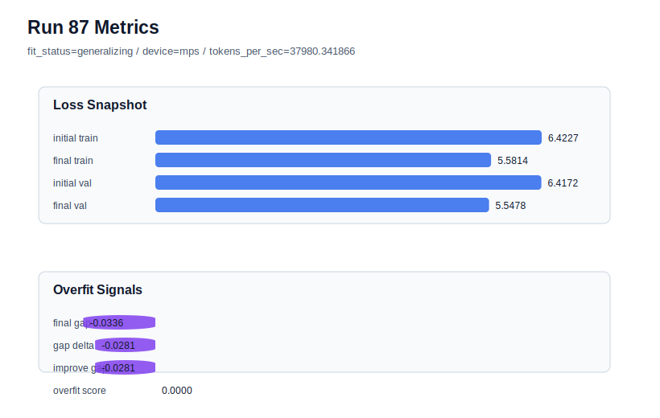

# run 087 실험 보고서

## 이번 가설

Run086 showed that stride=16 can rescue the bad seed303 case by reducing the final gap from 0.042333 to 0.013591 and the overfit_score from 0.158101 to 0.065779, but its final_val_loss remained far above the current best. The next question is whether stride=16 is a generally useful robustness default or only a rescue knob for seed303. Repeating stride=16 on the known-good best seed151, while keeping the mish ffn_mult=3 model and optimizer fixed, will test whether denser windows preserve the run072 best band or trade away validation quality.

## 왜 이 가설을 세웠는가

The current best remains run072 with mish, seed151, context_length=48, stride=24, final_val_loss=5.542158, final_generalization_gap=-0.017935, overfit_score=0.0, and parameter_count=413184. Recent activation, step-count, and weight_decay experiments produced only tiny gains or regressions, while run085 exposed substantial seed/window sensitivity. Run086 improved the seed303 overfit signals without changing architecture, suggesting stride is the highest-information axis. Before adopting stride=16, it must be checked against the strongest matched seed151 baseline because a robustness default that degrades the best band is not worth taking.

## 가설 작성 주체

llm_plan:docs/train/next_plan.json

## 바꾼 변수

```json
{
  "stride": 16
}
```

## 고정한 변수

seed=151 matched to run072, vocab_size, context_length, batch_size, learning_rate, weight_decay, grad_clip, emb_dim, n_heads, n_layers, drop_rate, qkv_bias, ffn_mult, norm_first, norm_eps, activation_name, ffn_dropout_position, attention_impl, tie_embeddings, init_std, max_steps

## 기대 결과

If stride=16 is a real robustness default, seed151 should stay in the current best band with final_val_loss near 5.542-5.544, overfit_score near 0.0, and fit_status=generalizing. If final_val_loss rises above about 5.545 while overfit_score remains low, stride=16 should be treated as a seed303 rescue setting rather than the default. If gap or overfit_score rises, denser overlap is harmful for known-good seeds.

## 실험 설정

```json
{
  "run_id": 87,
  "hypothesis": "Run086 showed that stride=16 can rescue the bad seed303 case by reducing the final gap from 0.042333 to 0.013591 and the overfit_score from 0.158101 to 0.065779, but its final_val_loss remained far above the current best. The next question is whether stride=16 is a generally useful robustness default or only a rescue knob for seed303. Repeating stride=16 on the known-good best seed151, while keeping the mish ffn_mult=3 model and optimizer fixed, will test whether denser windows preserve the run072 best band or trade away validation quality.",
  "seed": 151,
  "vocab_size": 600,
  "min_frequency": 2,
  "context_length": 48,
  "stride": 16,
  "batch_size": 8,
  "max_steps": 90,
  "eval_batches": 4,
  "train_ratio": 0.9,
  "learning_rate": 0.0003,
  "weight_decay": 0.01,
  "grad_clip": 1.0,
  "emb_dim": 128,
  "n_heads": 4,
  "n_layers": 2,
  "drop_rate": 0.12,
  "qkv_bias": false,
  "ffn_mult": 3,
  "norm_first": false,
  "norm_eps": 1e-05,
  "activation_name": "mish",
  "ffn_dropout_position": "none",
  "attention_impl": "sdpa",
  "tie_embeddings": true,
  "init_std": 0.02
}
```

## 실행 환경

```json
{
  "timestamp": "2026-06-03T02:24:40+00:00",
  "hostname": "woonyong-MacBookPro.local",
  "platform": "macOS-26.3.1-arm64-arm-64bit-Mach-O",
  "machine": "arm64",
  "python": "3.13.13",
  "torch": "2.12.0",
  "cpu_count": 10,
  "memory_gb": 24.0,
  "cuda_available": false,
  "cuda_device_count": 0,
  "mps_available": true,
  "resolved_device": "mps",
  "profile": "mps_balanced"
}
```

- corpus: `src/learning/the-verdict.txt`
- artifact_dir: `docs/train/runs/run_087_artifacts`

## 실제 결과

| 지표 | 값 |
| --- | --- |
| initial_train_loss | 6.422667026519775 |
| initial_val_loss | 6.4171522458394366 |
| final_train_loss | 5.581377625465393 |
| final_val_loss | 5.547791798909505 |
| final_generalization_gap | -0.033585826555888154 |
| generalization_gap_delta | -0.028071045875549316 |
| train_val_improvement_gap | -0.028071045875549316 |
| overfit_score | 0.0 |
| fit_status | generalizing |
| parameter_count | 413184 |
| tokens_per_sec | 37980.34186639419 |
| elapsed_sec | 0.9099444160237908 |
| device | mps |

## 시각 지표




- 대시보드: `../dashboard.md`
- 지표 요약 CSV: `../metrics_summary.csv`

## 과적합 판단

일반화 개선 신호. final gap=-0.0336, overfit_score=0.0000. seed 반복으로 재현성을 확인할 만하다.

## 결론

현재 best 후보: run 72 / val=5.542157967885335 / status=generalizing

## 다음 실험 제안

- 성공 시: If seed151 with stride=16 stays at or below the run072 band, repeat stride=16 on seed202 or seed134 to estimate whether it improves average robustness across the existing mish seeds.
- 과적합 시: If stride=16 creates a positive gap or worse overfit_score on seed151, return to stride=24 as the default and document stride=16 as a targeted rescue for seed303 only.
