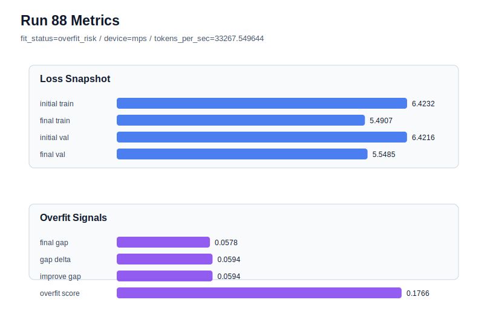

# run 088 실험 보고서

## 이번 가설

Run087 showed that stride=16 is not a good general default: on the known-good seed151 it kept overfit_score at 0.0 but raised final_val_loss to 5.547792, well above the run072 best band. Therefore the loop should return to the run072 mish + ffn_mult=3 + stride=24 default and measure fresh seed variance directly. Running a new seed404 with the unchanged default will test whether run085 seed303 was an isolated bad seed/window draw or whether the current best plateau is broadly seed-sensitive.

## 왜 이 가설을 세웠는가

The current best remains run072 with seed151, final_val_loss=5.542158, final_generalization_gap=-0.017935, overfit_score=0.0, parameter_count=413184, and MPS throughput around 29916 tokens/sec. The matched mish defaults across seed202 and seed134 were still low-risk, but seed303 at stride=24 became overfit_risk with final_val_loss=5.559609 and overfit_score=0.158101. Stride=16 rescued the seed303 gap in run086 but did not restore best-band validation, and run087 showed it also hurts a known-good seed. More activation, weight_decay, or step-count polishing has already produced tiny changes, so the highest-information safe next step is a fresh default seed rather than another hyperparameter tweak.

## 가설 작성 주체

llm_plan:docs/train/next_plan.json

## 바꾼 변수

```json
{
  "seed": 404
}
```

## 고정한 변수

vocab_size, context_length=48, stride=24, batch_size, learning_rate, weight_decay, grad_clip, emb_dim, n_heads, n_layers, drop_rate, qkv_bias, ffn_mult, norm_first, norm_eps, activation_name, ffn_dropout_position, attention_impl, tie_embeddings, init_std, max_steps

## 기대 결과

If seed303 was an outlier, seed404 should land near the established mish band with final_val_loss below about 5.55, fit_status=generalizing, and overfit_score below 0.03. If seed404 again rises above 5.552 or develops a positive gap above 0.03, then seed variance is a core limitation of the current split/window setup and the next direction should be broader seed/window evaluation rather than local tuning.

## 실험 설정

```json
{
  "run_id": 88,
  "hypothesis": "Run087 showed that stride=16 is not a good general default: on the known-good seed151 it kept overfit_score at 0.0 but raised final_val_loss to 5.547792, well above the run072 best band. Therefore the loop should return to the run072 mish + ffn_mult=3 + stride=24 default and measure fresh seed variance directly. Running a new seed404 with the unchanged default will test whether run085 seed303 was an isolated bad seed/window draw or whether the current best plateau is broadly seed-sensitive.",
  "seed": 404,
  "vocab_size": 600,
  "min_frequency": 2,
  "context_length": 48,
  "stride": 24,
  "batch_size": 8,
  "max_steps": 90,
  "eval_batches": 4,
  "train_ratio": 0.9,
  "learning_rate": 0.0003,
  "weight_decay": 0.01,
  "grad_clip": 1.0,
  "emb_dim": 128,
  "n_heads": 4,
  "n_layers": 2,
  "drop_rate": 0.12,
  "qkv_bias": false,
  "ffn_mult": 3,
  "norm_first": false,
  "norm_eps": 1e-05,
  "activation_name": "mish",
  "ffn_dropout_position": "none",
  "attention_impl": "sdpa",
  "tie_embeddings": true,
  "init_std": 0.02
}
```

## 실행 환경

```json
{
  "timestamp": "2026-06-03T02:28:52+00:00",
  "hostname": "woonyong-MacBookPro.local",
  "platform": "macOS-26.3.1-arm64-arm-64bit-Mach-O",
  "machine": "arm64",
  "python": "3.13.13",
  "torch": "2.12.0",
  "cpu_count": 10,
  "memory_gb": 24.0,
  "cuda_available": false,
  "cuda_device_count": 0,
  "mps_available": true,
  "resolved_device": "mps",
  "profile": "mps_balanced"
}
```

- corpus: `src/learning/the-verdict.txt`
- artifact_dir: `docs/train/runs/run_088_artifacts`

## 실제 결과

| 지표 | 값 |
| --- | --- |
| initial_train_loss | 6.423228621482849 |
| initial_val_loss | 6.4216156005859375 |
| final_train_loss | 5.490696907043457 |
| final_val_loss | 5.548481464385986 |
| final_generalization_gap | 0.0577845573425293 |
| generalization_gap_delta | 0.05939757823944092 |
| train_val_improvement_gap | 0.05939757823944092 |
| overfit_score | 0.17657971382141113 |
| fit_status | overfit_risk |
| parameter_count | 413184 |
| tokens_per_sec | 33267.54964367947 |
| elapsed_sec | 1.033078792039305 |
| device | mps |

## 시각 지표




- 대시보드: `../dashboard.md`
- 지표 요약 CSV: `../metrics_summary.csv`

## 과적합 판단

과적합 위험. final gap=0.0578, overfit_score=0.1766. 다음 실험은 regularization 강화가 우선이다.

## 결론

현재 best 후보: run 72 / val=5.542157967885335 / status=generalizing

## 다음 실험 제안

- 성공 시: If seed404 is low-risk and near the existing mish band, keep stride=24 as the default and run one more fresh seed only to estimate confidence intervals, not to chase a single-run best.
- 과적합 시: If seed404 repeats the seed303 overfit pattern, stop activation and regularization polishing and compare data-window conditions across multiple fresh seeds, starting with whether stride=16 consistently reduces gap while accepting its validation cost.
