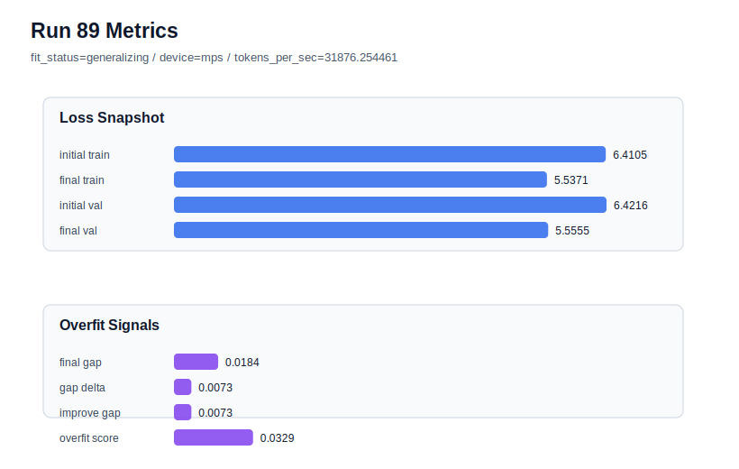

# run 089 실험 보고서

## 이번 가설

Run088 confirmed that the current mish + ffn_mult=3 default is broadly seed-sensitive: fresh seed404 at stride=24 drove train loss down to 5.490697 while validation stayed at 5.548481, producing final_generalization_gap=0.057785 and overfit_score=0.176580. Run086 showed that reducing stride from 24 to 16 rescued a similar bad fresh seed303 gap, while run087 showed stride=16 is not a good global default for seed151. Keeping seed404 fixed and changing only stride to 16 will test whether stride=16 is a targeted rescue window for overfitting fresh seeds rather than a default setting.

## 왜 이 가설을 세웠는가

The dashboard now has two fresh-seed overfit cases at the default stride=24: seed303 in run085 and seed404 in run088. Both lowered train loss aggressively while validation lagged. For seed303, the matched stride=16 run086 reduced overfit_score from 0.158101 to 0.065779 and brought fit_status back to generalizing, but validation stayed worse than best. For known-good seed151, run087 showed stride=16 kept overfit_score=0.0 but raised final_val_loss above the best band, so it should not replace stride=24 globally. The highest-information next step is therefore a matched seed404 stride rescue test, not more activation, regularization, or optimizer polishing.

## 가설 작성 주체

llm_plan:docs/train/next_plan.json

## 바꾼 변수

```json
{
  "stride": 16
}
```

## 고정한 변수

seed=404 matched to run088, vocab_size, context_length, batch_size, learning_rate, weight_decay, grad_clip, emb_dim, n_heads, n_layers, drop_rate, qkv_bias, ffn_mult, norm_first, norm_eps, activation_name, ffn_dropout_position, attention_impl, tie_embeddings, init_std, max_steps

## 기대 결과

Success means stride=16 reduces seed404 final_generalization_gap well below run088's 0.057785 and overfit_score below about 0.08, ideally restoring fit_status=generalizing while keeping final_val_loss no worse than about 5.56. If validation rises substantially or overfit_score remains high, stride=16 is not a reliable rescue and the loop should move to broader seed/window or data split evaluation.

## 실험 설정

```json
{
  "run_id": 89,
  "hypothesis": "Run088 confirmed that the current mish + ffn_mult=3 default is broadly seed-sensitive: fresh seed404 at stride=24 drove train loss down to 5.490697 while validation stayed at 5.548481, producing final_generalization_gap=0.057785 and overfit_score=0.176580. Run086 showed that reducing stride from 24 to 16 rescued a similar bad fresh seed303 gap, while run087 showed stride=16 is not a good global default for seed151. Keeping seed404 fixed and changing only stride to 16 will test whether stride=16 is a targeted rescue window for overfitting fresh seeds rather than a default setting.",
  "seed": 404,
  "vocab_size": 600,
  "min_frequency": 2,
  "context_length": 48,
  "stride": 16,
  "batch_size": 8,
  "max_steps": 90,
  "eval_batches": 4,
  "train_ratio": 0.9,
  "learning_rate": 0.0003,
  "weight_decay": 0.01,
  "grad_clip": 1.0,
  "emb_dim": 128,
  "n_heads": 4,
  "n_layers": 2,
  "drop_rate": 0.12,
  "qkv_bias": false,
  "ffn_mult": 3,
  "norm_first": false,
  "norm_eps": 1e-05,
  "activation_name": "mish",
  "ffn_dropout_position": "none",
  "attention_impl": "sdpa",
  "tie_embeddings": true,
  "init_std": 0.02
}
```

## 실행 환경

```json
{
  "timestamp": "2026-06-03T02:33:35+00:00",
  "hostname": "woonyong-MacBookPro.local",
  "platform": "macOS-26.3.1-arm64-arm-64bit-Mach-O",
  "machine": "arm64",
  "python": "3.13.13",
  "torch": "2.12.0",
  "cpu_count": 10,
  "memory_gb": 24.0,
  "cuda_available": false,
  "cuda_device_count": 0,
  "mps_available": true,
  "resolved_device": "mps",
  "profile": "mps_balanced"
}
```

- corpus: `src/learning/the-verdict.txt`
- artifact_dir: `docs/train/runs/run_089_artifacts`

## 실제 결과

| 지표 | 값 |
| --- | --- |
| initial_train_loss | 6.410478234291077 |
| initial_val_loss | 6.4216156005859375 |
| final_train_loss | 5.537066102027893 |
| final_val_loss | 5.555461088816325 |
| final_generalization_gap | 0.0183949867884321 |
| generalization_gap_delta | 0.00725762049357126 |
| train_val_improvement_gap | 0.00725762049357126 |
| overfit_score | 0.03291022777557462 |
| fit_status | generalizing |
| parameter_count | 413184 |
| tokens_per_sec | 31876.25446128651 |
| elapsed_sec | 1.0841926250141114 |
| device | mps |

## 시각 지표




- 대시보드: `../dashboard.md`
- 지표 요약 CSV: `../metrics_summary.csv`

## 과적합 판단

일반화 개선 신호. final gap=0.0184, overfit_score=0.0329. seed 반복으로 재현성을 확인할 만하다.

## 결론

현재 best 후보: run 72 / val=5.542157967885335 / status=generalizing

## 다음 실험 제안

- 성공 시: If stride=16 also rescues seed404's gap, document stride=16 as an overfit-seed rescue setting and compare one more fresh overfitting seed or a smaller max_steps/window condition to find a better validation/robustness tradeoff.
- 과적합 시: If stride=16 fails on seed404, stop local stride polishing and test a different robustness axis such as shorter max_steps on the fresh overfit seeds, while keeping the architecture fixed.
