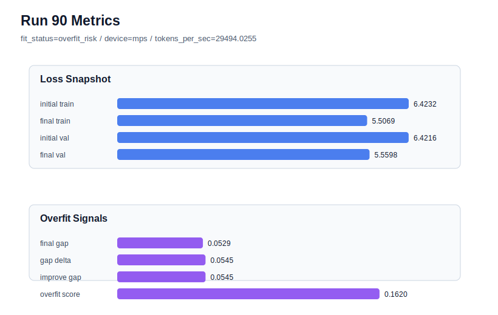

# run 090 실험 보고서

## 이번 가설

Run089 confirmed that stride=16 is a reliable rescue knob for fresh overfit seeds, but it pays for lower overfit with worse validation: seed404 moved from run088 final_val_loss=5.548481 and overfit_score=0.176580 to run089 final_val_loss=5.555461 and overfit_score=0.032910. A shorter training horizon at the original stride=24 may keep more of run088's validation advantage while avoiding the severe train-side over-progress. Keeping seed404 fixed, restoring stride=24, and reducing max_steps from 90 to 80 will test whether early stopping is a better validation/robustness tradeoff than denser windows.

## 왜 이 가설을 세웠는가

The current best run072 remains seed151, stride=24, max_steps=90, final_val_loss=5.542158, gap=-0.017935, overfit_score=0.0. Fresh seeds 303 and 404 both overfit at stride=24/max_steps=90, while stride=16 rescued their gaps but produced validation around 5.556. The run088 seed404 failure is especially diagnostic because train_loss fell to 5.490697 while validation stayed at 5.548481. That looks like optimization over-progress rather than insufficient model capacity. Since previous activation and weight_decay tweaks are exhausted, the next small safe optimization test is to stop earlier at 80 steps with the original data window.

## 가설 작성 주체

llm_plan:docs/train/next_plan.json

## 바꾼 변수

```json
{
  "max_steps": 80,
  "stride": 24
}
```

## 고정한 변수

seed=404 matched to runs 088 and 089, vocab_size, context_length, batch_size, learning_rate, weight_decay, grad_clip, emb_dim, n_heads, n_layers, drop_rate, qkv_bias, ffn_mult, norm_first, norm_eps, activation_name, ffn_dropout_position, attention_impl, tie_embeddings, init_std

## 기대 결과

A useful tradeoff would keep final_val_loss closer to run088 than run089, ideally below 5.552, while reducing final_generalization_gap far below 0.057785 and overfit_score below about 0.08. If max_steps=80 still overfits, then stopping at 80 is insufficient. If validation worsens toward stride16 levels without much overfit benefit, then the loop should test either max_steps=70 or a learning_rate reduction only if it can preserve validation better.

## 실험 설정

```json
{
  "run_id": 90,
  "hypothesis": "Run089 confirmed that stride=16 is a reliable rescue knob for fresh overfit seeds, but it pays for lower overfit with worse validation: seed404 moved from run088 final_val_loss=5.548481 and overfit_score=0.176580 to run089 final_val_loss=5.555461 and overfit_score=0.032910. A shorter training horizon at the original stride=24 may keep more of run088's validation advantage while avoiding the severe train-side over-progress. Keeping seed404 fixed, restoring stride=24, and reducing max_steps from 90 to 80 will test whether early stopping is a better validation/robustness tradeoff than denser windows.",
  "seed": 404,
  "vocab_size": 600,
  "min_frequency": 2,
  "context_length": 48,
  "stride": 24,
  "batch_size": 8,
  "max_steps": 80,
  "eval_batches": 4,
  "train_ratio": 0.9,
  "learning_rate": 0.0003,
  "weight_decay": 0.01,
  "grad_clip": 1.0,
  "emb_dim": 128,
  "n_heads": 4,
  "n_layers": 2,
  "drop_rate": 0.12,
  "qkv_bias": false,
  "ffn_mult": 3,
  "norm_first": false,
  "norm_eps": 1e-05,
  "activation_name": "mish",
  "ffn_dropout_position": "none",
  "attention_impl": "sdpa",
  "tie_embeddings": true,
  "init_std": 0.02
}
```

## 실행 환경

```json
{
  "timestamp": "2026-06-03T02:39:26+00:00",
  "hostname": "woonyong-MacBookPro.local",
  "platform": "macOS-26.3.1-arm64-arm-64bit-Mach-O",
  "machine": "arm64",
  "python": "3.13.13",
  "torch": "2.12.0",
  "cpu_count": 10,
  "memory_gb": 24.0,
  "cuda_available": false,
  "cuda_device_count": 0,
  "mps_available": true,
  "resolved_device": "mps",
  "profile": "mps_balanced"
}
```

- corpus: `src/learning/the-verdict.txt`
- artifact_dir: `docs/train/runs/run_090_artifacts`

## 실제 결과

| 지표 | 값 |
| --- | --- |
| initial_train_loss | 6.423228621482849 |
| initial_val_loss | 6.4216156005859375 |
| final_train_loss | 5.5069133043289185 |
| final_val_loss | 5.559826691945394 |
| final_generalization_gap | 0.05291338761647513 |
| generalization_gap_delta | 0.05452640851338675 |
| train_val_improvement_gap | 0.05452640851338675 |
| overfit_score | 0.16196620464324862 |
| fit_status | overfit_risk |
| parameter_count | 413184 |
| tokens_per_sec | 29494.025499896034 |
| elapsed_sec | 1.0350570830050856 |
| device | mps |

## 시각 지표




- 대시보드: `../dashboard.md`
- 지표 요약 CSV: `../metrics_summary.csv`

## 과적합 판단

과적합 위험. final gap=0.0529, overfit_score=0.1620. 다음 실험은 regularization 강화가 우선이다.

## 결론

현재 best 후보: run 72 / val=5.542157967885335 / status=generalizing

## 다음 실험 제안

- 성공 시: If max_steps=80 gives lower validation than stride16 while keeping overfit_score low, repeat the same shorter horizon on seed303 to verify it is a general fresh-seed rescue setting.
- 과적합 시: If max_steps=80 keeps overfit_score high, try a stronger early-stop point such as max_steps=70 on the same seed404 before changing architecture or activation.
