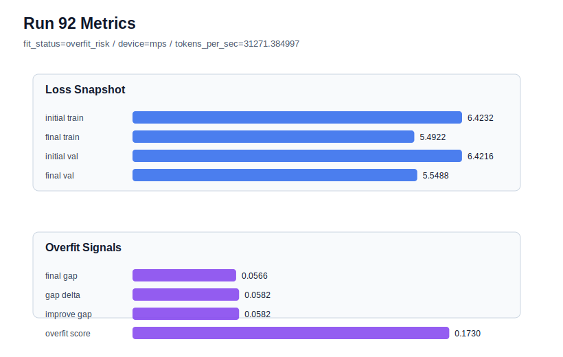

# run 092 실험 보고서

## 이번 가설

For the seed404 mish baseline that keeps overfitting at stride 24, a mild drop_rate increase from 0.12 to 0.14 will reduce train-side over-progress and overfit_score more effectively than the failed learning-rate and early-stop probes, while preserving validation better than the stride16 rescue.

## 왜 이 가설을 세웠는가

The recent seed404 sequence isolates the tradeoff. Run088 at the default stride24 reached final_val_loss 5.548481 but overfit_score 0.176580. Run089 with stride16 lowered overfit_score to 0.032910 but worsened final_val_loss to 5.555461, making it a costly rescue rather than a default. Run090 max_steps80 and run091 learning_rate 0.000275 both stayed overfit_risk with worse validation than run088. A small dropout increase keeps the same data geometry, optimizer, capacity, and 90-step budget while testing whether regularization can close the gap without the stride16 validation penalty.

## 가설 작성 주체

llm_plan:docs/train/next_plan.json

## 바꾼 변수

```json
{
  "drop_rate": 0.14
}
```

## 고정한 변수

vocab_size, context_length, stride, batch_size, learning_rate, weight_decay, grad_clip, emb_dim, n_heads, n_layers, qkv_bias, ffn_mult, norm_first, norm_eps, activation_name, ffn_dropout_position, attention_impl, tie_embeddings, init_std, max_steps, seed

## 기대 결과

A useful result would keep final_val_loss below the stride16 rescue band, ideally <= 5.552, while reducing overfit_score meaningfully below run088 and run091, preferably below 0.10. If validation rises toward 5.556+ or overfit_score remains above about 0.15, mild dropout is not enough for seed404.

## 실험 설정

```json
{
  "run_id": 92,
  "hypothesis": "For the seed404 mish baseline that keeps overfitting at stride 24, a mild drop_rate increase from 0.12 to 0.14 will reduce train-side over-progress and overfit_score more effectively than the failed learning-rate and early-stop probes, while preserving validation better than the stride16 rescue.",
  "seed": 404,
  "vocab_size": 600,
  "min_frequency": 2,
  "context_length": 48,
  "stride": 24,
  "batch_size": 8,
  "max_steps": 90,
  "eval_batches": 4,
  "train_ratio": 0.9,
  "learning_rate": 0.0003,
  "weight_decay": 0.01,
  "grad_clip": 1.0,
  "emb_dim": 128,
  "n_heads": 4,
  "n_layers": 2,
  "drop_rate": 0.14,
  "qkv_bias": false,
  "ffn_mult": 3,
  "norm_first": false,
  "norm_eps": 1e-05,
  "activation_name": "mish",
  "ffn_dropout_position": "none",
  "attention_impl": "sdpa",
  "tie_embeddings": true,
  "init_std": 0.02
}
```

## 실행 환경

```json
{
  "timestamp": "2026-06-03T02:48:45+00:00",
  "hostname": "woonyong-MacBookPro.local",
  "platform": "macOS-26.3.1-arm64-arm-64bit-Mach-O",
  "machine": "arm64",
  "python": "3.13.13",
  "torch": "2.12.0",
  "cpu_count": 10,
  "memory_gb": 24.0,
  "cuda_available": false,
  "cuda_device_count": 0,
  "mps_available": true,
  "resolved_device": "mps",
  "profile": "mps_balanced"
}
```

- corpus: `src/learning/the-verdict.txt`
- artifact_dir: `docs/train/runs/run_092_artifacts`

## 실제 결과

| 지표 | 값 |
| --- | --- |
| initial_train_loss | 6.423228621482849 |
| initial_val_loss | 6.4216156005859375 |
| final_train_loss | 5.492234706878662 |
| final_val_loss | 5.548829714457194 |
| final_generalization_gap | 0.0565950075785322 |
| generalization_gap_delta | 0.05820802847544382 |
| train_val_improvement_gap | 0.05820802847544382 |
| overfit_score | 0.17301106452941983 |
| fit_status | overfit_risk |
| parameter_count | 413184 |
| tokens_per_sec | 31271.3849969762 |
| elapsed_sec | 1.099023916060105 |
| device | mps |

## 시각 지표




- 대시보드: `../dashboard.md`
- 지표 요약 CSV: `../metrics_summary.csv`

## 과적합 판단

과적합 위험. final gap=0.0566, overfit_score=0.1730. 다음 실험은 regularization 강화가 우선이다.

## 결론

현재 best 후보: run 72 / val=5.542157967885335 / status=generalizing

## 다음 실험 제안

- 성공 시: Repeat drop_rate 0.14 on seed303 with the same mish stride24 default to test whether mild dropout generalizes across the two overfit-prone fresh seeds.
- 과적합 시: Treat mild dropout as insufficient and compare the confirmed stride16 rescue against a slightly stronger regularization setting such as drop_rate 0.16 on seed404, while watching for validation-loss drift.
