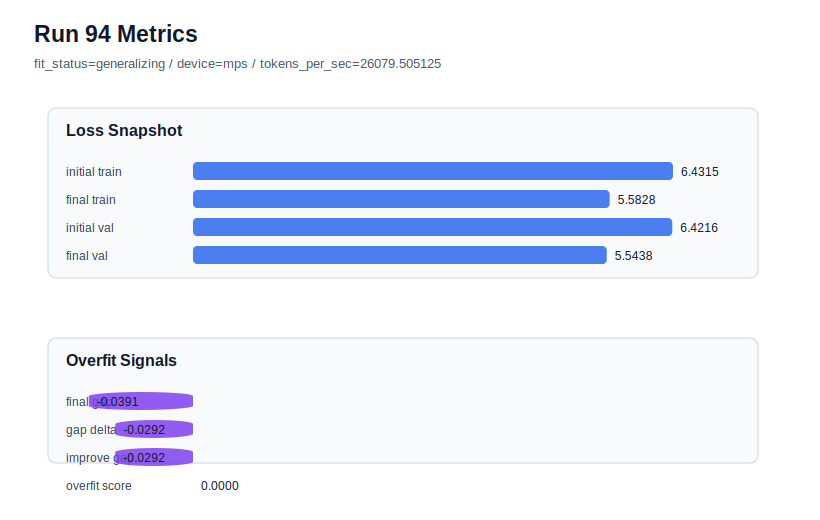

# run 094 실험 보고서

## 이번 가설

For the seed404 mish baseline, reducing stride from 24 to 20 will add moderate window overlap that lowers the overfit gap more than the default stride24 run, while avoiding the larger validation-loss penalty observed at stride16.

## 왜 이 가설을 세웠는가

The seed404 branch has isolated stride/windowing as the only axis that clearly rescues overfit. Run088 with stride24 had good validation loss at 5.548481 but a high overfit_score of 0.176580. Run089 with stride16 reduced overfit_score to 0.032910 and changed fit_status to generalizing, but validation worsened to 5.555461. Attempts to preserve stride24 through max_steps80, learning_rate 0.000275, drop_rate 0.14, and drop_rate 0.16 all remained overfit_risk with overfit_score around 0.16-0.17. Testing stride20 restores the default regularization and probes whether an intermediate amount of overlap gives a better validation/generalization tradeoff than either endpoint.

## 가설 작성 주체

llm_plan:docs/train/next_plan.json

## 바꾼 변수

```json
{
  "stride": 20
}
```

## 고정한 변수

vocab_size, context_length, batch_size, learning_rate, weight_decay, grad_clip, emb_dim, n_heads, n_layers, drop_rate, qkv_bias, ffn_mult, norm_first, norm_eps, activation_name, ffn_dropout_position, attention_impl, tie_embeddings, init_std, max_steps, seed

## 기대 결과

Success means final_val_loss stays closer to the default stride24 band than the stride16 rescue, ideally <= 5.552, while overfit_score drops clearly below the stride24/dropout branch and preferably below 0.10. If overfit_score stays above 0.15, stride20 is not enough; if final_val_loss drifts toward 5.555+, it behaves too much like stride16.

## 실험 설정

```json
{
  "run_id": 94,
  "hypothesis": "For the seed404 mish baseline, reducing stride from 24 to 20 will add moderate window overlap that lowers the overfit gap more than the default stride24 run, while avoiding the larger validation-loss penalty observed at stride16.",
  "seed": 404,
  "vocab_size": 600,
  "min_frequency": 2,
  "context_length": 48,
  "stride": 20,
  "batch_size": 8,
  "max_steps": 90,
  "eval_batches": 4,
  "train_ratio": 0.9,
  "learning_rate": 0.0003,
  "weight_decay": 0.01,
  "grad_clip": 1.0,
  "emb_dim": 128,
  "n_heads": 4,
  "n_layers": 2,
  "drop_rate": 0.12,
  "qkv_bias": false,
  "ffn_mult": 3,
  "norm_first": false,
  "norm_eps": 1e-05,
  "activation_name": "mish",
  "ffn_dropout_position": "none",
  "attention_impl": "sdpa",
  "tie_embeddings": true,
  "init_std": 0.02
}
```

## 실행 환경

```json
{
  "timestamp": "2026-06-03T02:58:31+00:00",
  "hostname": "woonyong-MacBookPro.local",
  "platform": "macOS-26.3.1-arm64-arm-64bit-Mach-O",
  "machine": "arm64",
  "python": "3.13.13",
  "torch": "2.12.0",
  "cpu_count": 10,
  "memory_gb": 24.0,
  "cuda_available": false,
  "cuda_device_count": 0,
  "mps_available": true,
  "resolved_device": "mps",
  "profile": "mps_balanced"
}
```

- corpus: `src/learning/the-verdict.txt`
- artifact_dir: `docs/train/runs/run_094_artifacts`

## 실제 결과

| 지표 | 값 |
| --- | --- |
| initial_train_loss | 6.431511640548706 |
| initial_val_loss | 6.4216156005859375 |
| final_train_loss | 5.582841873168945 |
| final_val_loss | 5.543789545694987 |
| final_generalization_gap | -0.03905232747395804 |
| generalization_gap_delta | -0.029156287511189483 |
| train_val_improvement_gap | -0.029156287511189483 |
| overfit_score | 0.0 |
| fit_status | generalizing |
| parameter_count | 413184 |
| tokens_per_sec | 26079.505124947904 |
| elapsed_sec | 1.3178164169657975 |
| device | mps |

## 시각 지표




- 대시보드: `../dashboard.md`
- 지표 요약 CSV: `../metrics_summary.csv`

## 과적합 판단

일반화 개선 신호. final gap=-0.0391, overfit_score=0.0000. seed 반복으로 재현성을 확인할 만하다.

## 결론

현재 best 후보: run 72 / val=5.542157967885335 / status=generalizing

## 다음 실험 제안

- 성공 시: Repeat stride20 on seed303 to check whether the intermediate-overlap rescue generalizes across both known overfit-prone fresh seeds; then test seed151 only if the rescue is robust.
- 과적합 시: If stride20 fails, close the intermediate stride branch and keep stride16 as the targeted rescue, or test a slightly denser stride18 only if validation remains substantially better than stride16.
