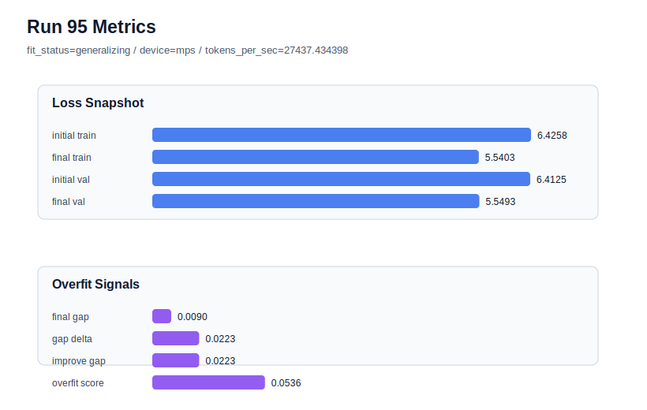

# run 095 실험 보고서

## 이번 가설

The stride20 intermediate-overlap setting that rescued seed404 will also rescue the earlier seed303 overfit case, lowering overfit_score versus stride24 while avoiding the validation-loss penalty seen at stride16.

## 왜 이 가설을 세웠는가

Run094 showed a strong seed404 result: stride20 changed the branch from repeated overfit_risk to generalizing with final_val_loss 5.543790, final_generalization_gap -0.039052, and overfit_score 0.0. The earlier seed303 branch has the same pattern to test against: run085 at stride24 overfit with final_val_loss 5.559609 and overfit_score 0.158101, while run086 at stride16 reduced the gap but still landed at final_val_loss 5.555916 and overfit_score 0.065779. Repeating stride20 on seed303 directly tests whether intermediate window overlap is a robust rescue knob across both known overfit-prone fresh seeds rather than a seed404-specific accident.

## 가설 작성 주체

llm_plan:docs/train/next_plan.json

## 바꾼 변수

```json
{
  "seed": 303
}
```

## 고정한 변수

vocab_size, context_length, stride, batch_size, learning_rate, weight_decay, grad_clip, emb_dim, n_heads, n_layers, drop_rate, qkv_bias, ffn_mult, norm_first, norm_eps, activation_name, ffn_dropout_position, attention_impl, tie_embeddings, init_std, max_steps

## 기대 결과

Success means seed303 at stride20 improves on both seed303 comparison points: final_val_loss below the stride16 rescue band, ideally <= 5.552, and overfit_score below run086's 0.065779 or at least far below run085's 0.158101. If validation stays around 5.556+ or overfit_score remains above 0.10, stride20 is less robust than the seed404 result suggested.

## 실험 설정

```json
{
  "run_id": 95,
  "hypothesis": "The stride20 intermediate-overlap setting that rescued seed404 will also rescue the earlier seed303 overfit case, lowering overfit_score versus stride24 while avoiding the validation-loss penalty seen at stride16.",
  "seed": 303,
  "vocab_size": 600,
  "min_frequency": 2,
  "context_length": 48,
  "stride": 20,
  "batch_size": 8,
  "max_steps": 90,
  "eval_batches": 4,
  "train_ratio": 0.9,
  "learning_rate": 0.0003,
  "weight_decay": 0.01,
  "grad_clip": 1.0,
  "emb_dim": 128,
  "n_heads": 4,
  "n_layers": 2,
  "drop_rate": 0.12,
  "qkv_bias": false,
  "ffn_mult": 3,
  "norm_first": false,
  "norm_eps": 1e-05,
  "activation_name": "mish",
  "ffn_dropout_position": "none",
  "attention_impl": "sdpa",
  "tie_embeddings": true,
  "init_std": 0.02
}
```

## 실행 환경

```json
{
  "timestamp": "2026-06-03T03:03:36+00:00",
  "hostname": "woonyong-MacBookPro.local",
  "platform": "macOS-26.3.1-arm64-arm-64bit-Mach-O",
  "machine": "arm64",
  "python": "3.13.13",
  "torch": "2.12.0",
  "cpu_count": 10,
  "memory_gb": 24.0,
  "cuda_available": false,
  "cuda_device_count": 0,
  "mps_available": true,
  "resolved_device": "mps",
  "profile": "mps_balanced"
}
```

- corpus: `src/learning/the-verdict.txt`
- artifact_dir: `docs/train/runs/run_095_artifacts`

## 실제 결과

| 지표 | 값 |
| --- | --- |
| initial_train_loss | 6.4257858991622925 |
| initial_val_loss | 6.412506103515625 |
| final_train_loss | 5.540337562561035 |
| final_val_loss | 5.549335797627767 |
| final_generalization_gap | 0.008998235066731475 |
| generalization_gap_delta | 0.022278030713398955 |
| train_val_improvement_gap | 0.022278030713398955 |
| overfit_score | 0.053554296493529385 |
| fit_status | generalizing |
| parameter_count | 413184 |
| tokens_per_sec | 27437.434398063626 |
| elapsed_sec | 1.2525952500291169 |
| device | mps |

## 시각 지표




- 대시보드: `../dashboard.md`
- 지표 요약 CSV: `../metrics_summary.csv`

## 과적합 판단

일반화 개선 신호. final gap=0.0090, overfit_score=0.0536. seed 반복으로 재현성을 확인할 만하다.

## 결론

현재 best 후보: run 72 / val=5.542157967885335 / status=generalizing

## 다음 실험 제안

- 성공 시: Test stride20 on the known-good seed151 to ensure it does not trade away the run072 best-band validation when used beyond overfit-prone seeds.
- 과적합 시: If seed303 is not rescued, treat stride20 as seed404-specific and keep stride16 as the more reliable targeted rescue; optionally test stride18 only if validation remains clearly better than stride16.
