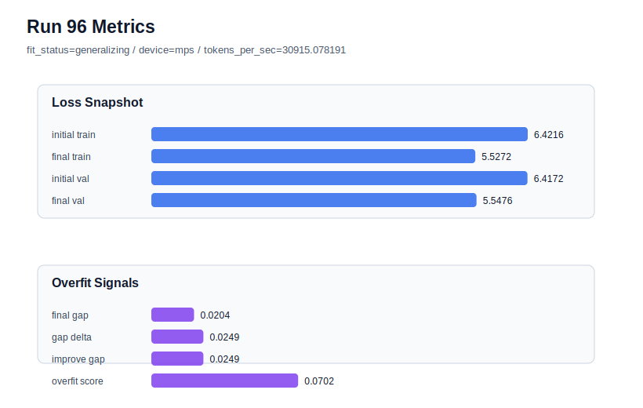

# run 096 실험 보고서

## 이번 가설

The stride20 intermediate-overlap setting that rescued seed404 and seed303 will preserve the known-good seed151 validation band, showing it can be considered a robust default candidate rather than only an overfit rescue knob.

## 왜 이 가설을 세웠는가

Run094 changed seed404 from repeated stride24 overfit_risk to generalizing with final_val_loss 5.543790 and overfit_score 0.0, and run095 repeated the stride20 rescue on seed303 with final_val_loss 5.549336 and overfit_score 0.053554, beating the seed303 stride16 validation band. The remaining risk is that stride20 may help overfit-prone seeds by adding overlap while slightly hurting the best seed151 baseline: run072 at stride24 remains best with final_val_loss 5.542158 and overfit_score 0.0, while run087 at stride16 stayed generalizing but rose to final_val_loss 5.547792. Testing stride20 on seed151 directly separates robust-default evidence from rescue-only evidence.

## 가설 작성 주체

llm_plan:docs/train/next_plan.json

## 바꾼 변수

```json
{
  "stride": 20,
  "seed": 151
}
```

## 고정한 변수

vocab_size, context_length, batch_size, learning_rate, weight_decay, grad_clip, emb_dim, n_heads, n_layers, drop_rate, qkv_bias, ffn_mult, norm_first, norm_eps, activation_name, ffn_dropout_position, attention_impl, tie_embeddings, init_std, max_steps

## 기대 결과

Success means seed151 at stride20 stays in the run072 best band: final_val_loss ideally <= 5.544 with final_generalization_gap near or below zero and overfit_score near 0.0. If validation rises toward the stride16 seed151 result around 5.5478, stride20 should be treated as a rescue setting rather than a replacement default.

## 실험 설정

```json
{
  "run_id": 96,
  "hypothesis": "The stride20 intermediate-overlap setting that rescued seed404 and seed303 will preserve the known-good seed151 validation band, showing it can be considered a robust default candidate rather than only an overfit rescue knob.",
  "seed": 151,
  "vocab_size": 600,
  "min_frequency": 2,
  "context_length": 48,
  "stride": 20,
  "batch_size": 8,
  "max_steps": 90,
  "eval_batches": 4,
  "train_ratio": 0.9,
  "learning_rate": 0.0003,
  "weight_decay": 0.01,
  "grad_clip": 1.0,
  "emb_dim": 128,
  "n_heads": 4,
  "n_layers": 2,
  "drop_rate": 0.12,
  "qkv_bias": false,
  "ffn_mult": 3,
  "norm_first": false,
  "norm_eps": 1e-05,
  "activation_name": "mish",
  "ffn_dropout_position": "none",
  "attention_impl": "sdpa",
  "tie_embeddings": true,
  "init_std": 0.02
}
```

## 실행 환경

```json
{
  "timestamp": "2026-06-03T03:10:42+00:00",
  "hostname": "woonyong-MacBookPro.local",
  "platform": "macOS-26.3.1-arm64-arm-64bit-Mach-O",
  "machine": "arm64",
  "python": "3.13.13",
  "torch": "2.12.0",
  "cpu_count": 10,
  "memory_gb": 24.0,
  "cuda_available": false,
  "cuda_device_count": 0,
  "mps_available": true,
  "resolved_device": "mps",
  "profile": "mps_balanced"
}
```

- corpus: `src/learning/the-verdict.txt`
- artifact_dir: `docs/train/runs/run_096_artifacts`

## 실제 결과

| 지표 | 값 |
| --- | --- |
| initial_train_loss | 6.421632766723633 |
| initial_val_loss | 6.4171522458394366 |
| final_train_loss | 5.527196884155273 |
| final_val_loss | 5.547611077626546 |
| final_generalization_gap | 0.02041419347127249 |
| generalization_gap_delta | 0.02489471435546875 |
| train_val_improvement_gap | 0.02489471435546875 |
| overfit_score | 0.07020362218220999 |
| fit_status | generalizing |
| parameter_count | 413184 |
| tokens_per_sec | 30915.078190852942 |
| elapsed_sec | 1.111690541030839 |
| device | mps |

## 시각 지표




- 대시보드: `../dashboard.md`
- 지표 요약 CSV: `../metrics_summary.csv`

## 과적합 판단

일반화 개선 신호. final gap=0.0204, overfit_score=0.0702. seed 반복으로 재현성을 확인할 만하다.

## 결론

현재 best 후보: run 72 / val=5.542157967885335 / status=generalizing

## 다음 실험 제안

- 성공 시: Test stride20 on another historically strong seed such as seed202, then compare the seed151/202/303/404 stride20 mean against the stride24 and stride16 branches before promoting stride20 as the next default.
- 과적합 시: Keep stride24 as the default for known-good seeds and reserve stride20 for overfit-prone seeds; if seed151 degrades but does not overfit, consider a narrower stride18 rescue probe only on bad seeds.
