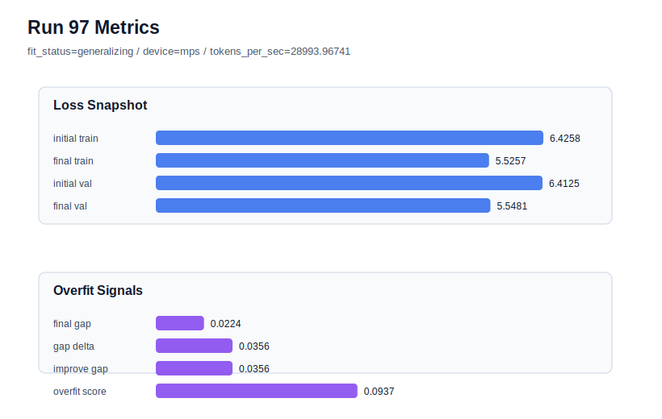

# run 097 실험 보고서

## 이번 가설

For the overfit-prone seed303 mish configuration, reducing stride from 20 to 18 will add a little more overlap that lowers the remaining positive generalization gap and overfit_score while preserving most of stride20's validation advantage over the stride16 rescue.

## 왜 이 가설을 세웠는가

The recent context/stride branch now separates default and rescue behavior. Seed303 at stride24 overfit in run085 with final_val_loss 5.559609 and overfit_score 0.158101. Stride16 rescued the gap in run086 but still landed at final_val_loss 5.555916. Stride20 improved the tradeoff in run095 with final_val_loss 5.549336 and overfit_score 0.053554, but it still had a positive gap. Run096 then showed stride20 is not a global default because seed151 rose to final_val_loss 5.547611 versus the run072 best 5.542158. Therefore the next safe, hardware-light test is a rescue-only stride18 probe on seed303: denser than stride20 to target the remaining gap, but less dense than stride16 to avoid the validation penalty.

## 가설 작성 주체

llm_plan:docs/train/next_plan.json

## 바꾼 변수

```json
{
  "seed": 303,
  "stride": 18
}
```

## 고정한 변수

vocab_size, context_length, batch_size, learning_rate, weight_decay, grad_clip, emb_dim, n_heads, n_layers, drop_rate, qkv_bias, ffn_mult, norm_first, norm_eps, activation_name, ffn_dropout_position, attention_impl, tie_embeddings, init_std, max_steps

## 기대 결과

A useful rescue would keep final_val_loss below the stride16 seed303 result and close to the stride20 result, ideally <= 5.552, while lowering overfit_score below run095's 0.053554 or at least keeping it clearly below run085's 0.158101. If validation drifts toward 5.556 or the gap stays near the stride20 level, stride18 adds cost without improving the rescue.

## 실험 설정

```json
{
  "run_id": 97,
  "hypothesis": "For the overfit-prone seed303 mish configuration, reducing stride from 20 to 18 will add a little more overlap that lowers the remaining positive generalization gap and overfit_score while preserving most of stride20's validation advantage over the stride16 rescue.",
  "seed": 303,
  "vocab_size": 600,
  "min_frequency": 2,
  "context_length": 48,
  "stride": 18,
  "batch_size": 8,
  "max_steps": 90,
  "eval_batches": 4,
  "train_ratio": 0.9,
  "learning_rate": 0.0003,
  "weight_decay": 0.01,
  "grad_clip": 1.0,
  "emb_dim": 128,
  "n_heads": 4,
  "n_layers": 2,
  "drop_rate": 0.12,
  "qkv_bias": false,
  "ffn_mult": 3,
  "norm_first": false,
  "norm_eps": 1e-05,
  "activation_name": "mish",
  "ffn_dropout_position": "none",
  "attention_impl": "sdpa",
  "tie_embeddings": true,
  "init_std": 0.02
}
```

## 실행 환경

```json
{
  "timestamp": "2026-06-03T03:13:38+00:00",
  "hostname": "woonyong-MacBookPro.local",
  "platform": "macOS-26.3.1-arm64-arm-64bit-Mach-O",
  "machine": "arm64",
  "python": "3.13.13",
  "torch": "2.12.0",
  "cpu_count": 10,
  "memory_gb": 24.0,
  "cuda_available": false,
  "cuda_device_count": 0,
  "mps_available": true,
  "resolved_device": "mps",
  "profile": "mps_balanced"
}
```

- corpus: `src/learning/the-verdict.txt`
- artifact_dir: `docs/train/runs/run_097_artifacts`

## 실제 결과

| 지표 | 값 |
| --- | --- |
| initial_train_loss | 6.425765156745911 |
| initial_val_loss | 6.412506103515625 |
| final_train_loss | 5.525697708129883 |
| final_val_loss | 5.548077901204427 |
| final_generalization_gap | 0.022380193074543975 |
| generalization_gap_delta | 0.03563924630482962 |
| train_val_improvement_gap | 0.03563924630482962 |
| overfit_score | 0.09365868568420321 |
| fit_status | generalizing |
| parameter_count | 413184 |
| tokens_per_sec | 28993.96741014553 |
| elapsed_sec | 1.1870055419858545 |
| device | mps |

## 시각 지표




- 대시보드: `../dashboard.md`
- 지표 요약 CSV: `../metrics_summary.csv`

## 과적합 판단

일반화 개선 신호. final gap=0.0224, overfit_score=0.0937. seed 반복으로 재현성을 확인할 만하다.

## 결론

현재 best 후보: run 72 / val=5.542157967885335 / status=generalizing

## 다음 실험 제안

- 성공 시: Repeat stride18 on seed404 to see whether it preserves the strong run094 validation while confirming that stride18 is a robust targeted rescue setting for overfit-prone seeds.
- 과적합 시: Keep stride20 as the preferred rescue point for seed303 and seed404, and stop denser stride polishing unless a new overfit seed shows a different failure pattern.
