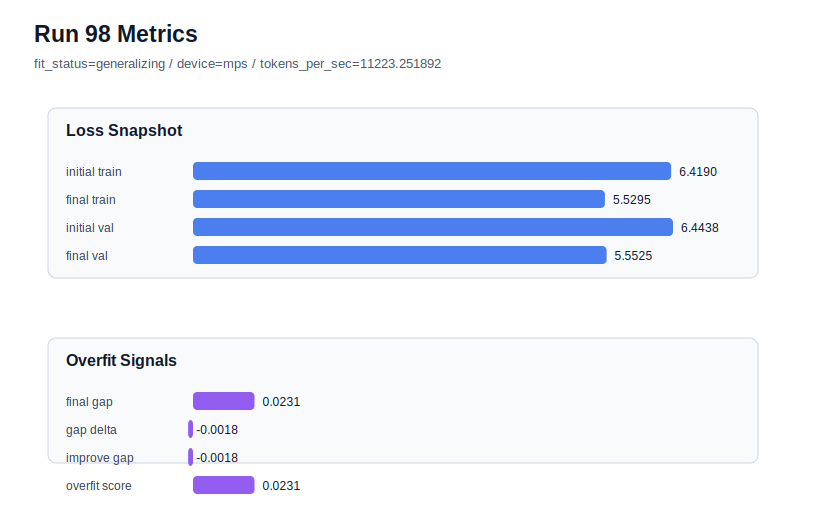

# run 098 실험 보고서

## 이번 가설

A fresh seed505 run with the current mish stride24 default will clarify whether the recent seed303 and seed404 overfit cases are common seed variance or isolated bad draws; if seed505 is low-risk, stride20 should remain a targeted rescue rather than the main default.

## 왜 이 가설을 세웠는가

The latest stride branch reached a clear stopping point. Runs085 and 088 showed that the mish + ffn_mult=3 + stride24 default can overfit badly on fresh seeds303 and 404, but run094 and run095 showed stride20 is an effective targeted rescue for those overfit-prone seeds. Run096 showed stride20 is not a global default because seed151 lost the run072 best band, and run097 showed denser stride18 worsened seed303's overfit signal versus stride20. The highest-information next step is therefore not more stride polishing, but a fresh stride24 seed-variance probe. This keeps the proven run072 configuration intact and asks whether the default remains acceptable on a new seed before spending more loops on rescue variants.

## 가설 작성 주체

llm_plan:docs/train/next_plan.json

## 바꾼 변수

```json
{
  "seed": 505
}
```

## 고정한 변수

vocab_size, context_length, stride, batch_size, learning_rate, weight_decay, grad_clip, emb_dim, n_heads, n_layers, drop_rate, qkv_bias, ffn_mult, norm_first, norm_eps, activation_name, ffn_dropout_position, attention_impl, tie_embeddings, init_std, max_steps

## 기대 결과

If the current default is robust enough, seed505 should finish generalizing with final_val_loss in or near the established mish band, ideally <= 5.548, final_generalization_gap below about 0.03, and overfit_score below 0.10. If it repeats the seed303/404 pattern with gap above 0.04 or overfit_score above 0.15, the loop should treat fresh-seed overfit as a common failure mode and immediately test the targeted stride20 rescue on the same seed.

## 실험 설정

```json
{
  "run_id": 98,
  "hypothesis": "A fresh seed505 run with the current mish stride24 default will clarify whether the recent seed303 and seed404 overfit cases are common seed variance or isolated bad draws; if seed505 is low-risk, stride20 should remain a targeted rescue rather than the main default.",
  "seed": 505,
  "vocab_size": 600,
  "min_frequency": 2,
  "context_length": 48,
  "stride": 24,
  "batch_size": 8,
  "max_steps": 90,
  "eval_batches": 4,
  "train_ratio": 0.9,
  "learning_rate": 0.0003,
  "weight_decay": 0.01,
  "grad_clip": 1.0,
  "emb_dim": 128,
  "n_heads": 4,
  "n_layers": 2,
  "drop_rate": 0.12,
  "qkv_bias": false,
  "ffn_mult": 3,
  "norm_first": false,
  "norm_eps": 1e-05,
  "activation_name": "mish",
  "ffn_dropout_position": "none",
  "attention_impl": "sdpa",
  "tie_embeddings": true,
  "init_std": 0.02
}
```

## 실행 환경

```json
{
  "timestamp": "2026-06-03T03:19:09+00:00",
  "hostname": "woonyong-MacBookPro.local",
  "platform": "macOS-26.3.1-arm64-arm-64bit-Mach-O",
  "machine": "arm64",
  "python": "3.13.13",
  "torch": "2.12.0",
  "cpu_count": 10,
  "memory_gb": 24.0,
  "cuda_available": false,
  "cuda_device_count": 0,
  "mps_available": true,
  "resolved_device": "mps",
  "profile": "mps_balanced"
}
```

- corpus: `src/learning/the-verdict.txt`
- artifact_dir: `docs/train/runs/run_098_artifacts`

## 실제 결과

| 지표 | 값 |
| --- | --- |
| initial_train_loss | 6.418956995010376 |
| initial_val_loss | 6.44384749730428 |
| final_train_loss | 5.52947723865509 |
| final_val_loss | 5.552542209625244 |
| final_generalization_gap | 0.02306497097015381 |
| generalization_gap_delta | -0.0018255313237505177 |
| train_val_improvement_gap | -0.0018255313237505177 |
| overfit_score | 0.02306497097015381 |
| fit_status | generalizing |
| parameter_count | 413184 |
| tokens_per_sec | 11223.251892471817 |
| elapsed_sec | 3.06221408280544 |
| device | mps |

## 시각 지표




- 대시보드: `../dashboard.md`
- 지표 요약 CSV: `../metrics_summary.csv`

## 과적합 판단

일반화 개선 신호. final gap=0.0231, overfit_score=0.0231. seed 반복으로 재현성을 확인할 만하다.

## 결론

현재 best 후보: run 72 / val=5.542157967885335 / status=generalizing

## 다음 실험 제안

- 성공 시: Run one more fresh seed at stride24 only if confidence intervals are still unclear; otherwise consolidate the policy as stride24 default plus stride20 rescue for high-gap seeds.
- 과적합 시: Keep seed505 fixed and test stride20 with the same mish configuration, since stride20 has beaten stride16 and stride18 as the cleanest rescue tradeoff so far.
