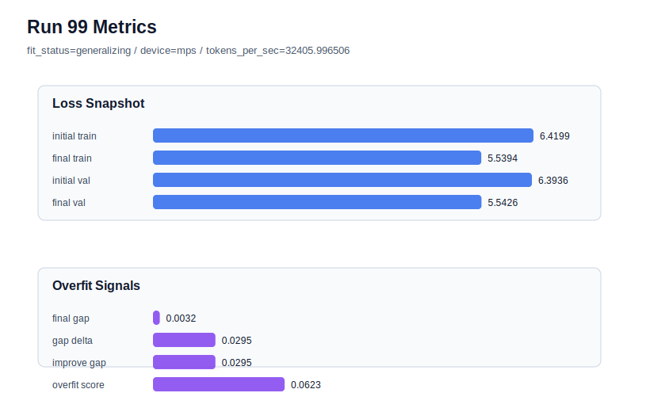

# run 099 실험 보고서

## 이번 가설

A second fresh stride24 default probe with seed606 will show whether seed505's low-risk but higher-validation result is typical variance, while checking whether high-gap failures like seed303 and seed404 are frequent enough to make stride20 rescue a standard follow-up policy.

## 왜 이 가설을 세웠는가

The recent loop has separated three cases: strong default seeds such as run072 seed151, high-gap default failures such as run085 seed303 and run088 seed404, and low-risk but higher-validation variance in run098 seed505. Stride20 rescued the high-gap seeds in runs094 and 095, but run096 showed it should not replace stride24 globally, and run097 showed denser stride18 is worse than stride20 for seed303. Since seed505 did not have a high overfit_score, immediately testing stride20 on it would blur the rescue rule. One more fresh stride24 seed is the safest small experiment to estimate whether the mish default usually generalizes acceptably or whether fresh-seed validation variance itself is the next bottleneck.

## 가설 작성 주체

llm_plan:docs/train/next_plan.json

## 바꾼 변수

```json
{
  "seed": 606
}
```

## 고정한 변수

vocab_size, context_length, stride, batch_size, learning_rate, weight_decay, grad_clip, emb_dim, n_heads, n_layers, drop_rate, qkv_bias, ffn_mult, norm_first, norm_eps, activation_name, ffn_dropout_position, attention_impl, tie_embeddings, init_std, max_steps

## 기대 결과

A stable default result would be generalizing with final_val_loss near the mish plateau, ideally <= 5.550, final_generalization_gap below 0.03, and overfit_score below 0.10. If seed606 has gap above 0.04 or overfit_score above 0.15, the next run should keep seed606 fixed and test stride20 as the confirmed targeted rescue. If it is low-risk but validation remains above 5.552 like seed505, the next direction should shift from overfit rescue to reducing seed-level validation variance.

## 실험 설정

```json
{
  "run_id": 99,
  "hypothesis": "A second fresh stride24 default probe with seed606 will show whether seed505's low-risk but higher-validation result is typical variance, while checking whether high-gap failures like seed303 and seed404 are frequent enough to make stride20 rescue a standard follow-up policy.",
  "seed": 606,
  "vocab_size": 600,
  "min_frequency": 2,
  "context_length": 48,
  "stride": 24,
  "batch_size": 8,
  "max_steps": 90,
  "eval_batches": 4,
  "train_ratio": 0.9,
  "learning_rate": 0.0003,
  "weight_decay": 0.01,
  "grad_clip": 1.0,
  "emb_dim": 128,
  "n_heads": 4,
  "n_layers": 2,
  "drop_rate": 0.12,
  "qkv_bias": false,
  "ffn_mult": 3,
  "norm_first": false,
  "norm_eps": 1e-05,
  "activation_name": "mish",
  "ffn_dropout_position": "none",
  "attention_impl": "sdpa",
  "tie_embeddings": true,
  "init_std": 0.02
}
```

## 실행 환경

```json
{
  "timestamp": "2026-06-03T03:24:15+00:00",
  "hostname": "woonyong-MacBookPro.local",
  "platform": "macOS-26.3.1-arm64-arm-64bit-Mach-O",
  "machine": "arm64",
  "python": "3.13.13",
  "torch": "2.12.0",
  "cpu_count": 10,
  "memory_gb": 24.0,
  "cuda_available": false,
  "cuda_device_count": 0,
  "mps_available": true,
  "resolved_device": "mps",
  "profile": "mps_balanced"
}
```

- corpus: `src/learning/the-verdict.txt`
- artifact_dir: `docs/train/runs/run_099_artifacts`

## 실제 결과

| 지표 | 값 |
| --- | --- |
| initial_train_loss | 6.419930577278137 |
| initial_val_loss | 6.393611749013265 |
| final_train_loss | 5.53938627243042 |
| final_val_loss | 5.542599201202393 |
| final_generalization_gap | 0.0032129287719726562 |
| generalization_gap_delta | 0.029531757036845185 |
| train_val_improvement_gap | 0.029531757036845185 |
| overfit_score | 0.06227644284566303 |
| fit_status | generalizing |
| parameter_count | 413184 |
| tokens_per_sec | 32405.996506073137 |
| elapsed_sec | 1.0605444579850882 |
| device | mps |

## 시각 지표




- 대시보드: `../dashboard.md`
- 지표 요약 CSV: `../metrics_summary.csv`

## 과적합 판단

일반화 개선 신호. final gap=0.0032, overfit_score=0.0623. seed 반복으로 재현성을 확인할 만하다.

## 결론

현재 best 후보: run 72 / val=5.542157967885335 / status=generalizing

## 다음 실험 제안

- 성공 시: Consolidate the current operating policy as stride24 default plus stride20 rescue only for high-gap seeds, then move to a variance-reduction axis such as modest capacity or context/stride comparison only if more fresh seeds remain high-validation.
- 과적합 시: Keep seed606 fixed and test stride20 with the same mish configuration, because stride20 is currently the cleanest high-gap rescue compared with stride16, stride18, early stopping, learning-rate reduction, and dropout increases.
