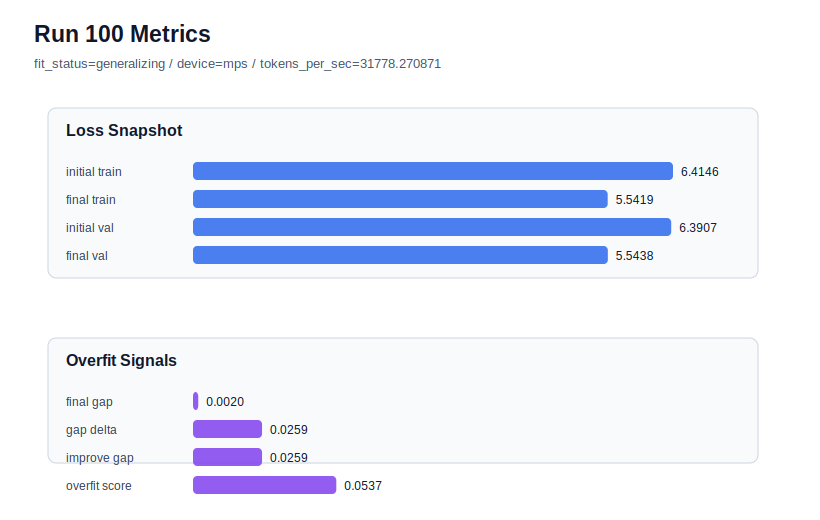

# run 100 실험 보고서

## 이번 가설

For the strong seed606 stride24 default run, lowering init_std from 0.02 to 0.018 will reduce seed-level optimization variance and the remaining overfit_score without changing model architecture, data windowing, or training length.

## 왜 이 가설을 세웠는가

Run099 showed that the current mish + ffn_mult=3 + stride24 default can still land near the best band on a fresh seed: seed606 reached final_val_loss 5.542599 with final_generalization_gap 0.003213. This supports the operating policy of stride24 as default and stride20 as a targeted rescue for high-gap seeds such as seed303 and seed404. The remaining question is not more stride polishing, but whether a tiny initialization-scale change can reduce run-to-run variance and overfit_score while preserving the near-best validation band. Prior max_steps, weight_decay, dropout, learning-rate, and stride variants either failed to improve the best band or were rescue-only. Lowering init_std slightly is a safe, single-axis optimization/initialization probe that keeps parameter_count and runtime unchanged.

## 가설 작성 주체

llm_plan:docs/train/next_plan.json

## 바꾼 변수

```json
{
  "init_std": 0.018
}
```

## 고정한 변수

seed, vocab_size, context_length, stride, batch_size, learning_rate, weight_decay, grad_clip, emb_dim, n_heads, n_layers, drop_rate, qkv_bias, ffn_mult, norm_first, norm_eps, activation_name, ffn_dropout_position, attention_impl, tie_embeddings, max_steps

## 기대 결과

A useful result would keep seed606 in the best band, ideally final_val_loss <= 5.543, while lowering final_generalization_gap toward zero and reducing overfit_score below run099's 0.062276. If validation rises above about 5.546 or overfit_score increases, init_std=0.018 is not a good default-side variance reducer and the loop should keep init_std=0.02.

## 실험 설정

```json
{
  "run_id": 100,
  "hypothesis": "For the strong seed606 stride24 default run, lowering init_std from 0.02 to 0.018 will reduce seed-level optimization variance and the remaining overfit_score without changing model architecture, data windowing, or training length.",
  "seed": 606,
  "vocab_size": 600,
  "min_frequency": 2,
  "context_length": 48,
  "stride": 24,
  "batch_size": 8,
  "max_steps": 90,
  "eval_batches": 4,
  "train_ratio": 0.9,
  "learning_rate": 0.0003,
  "weight_decay": 0.01,
  "grad_clip": 1.0,
  "emb_dim": 128,
  "n_heads": 4,
  "n_layers": 2,
  "drop_rate": 0.12,
  "qkv_bias": false,
  "ffn_mult": 3,
  "norm_first": false,
  "norm_eps": 1e-05,
  "activation_name": "mish",
  "ffn_dropout_position": "none",
  "attention_impl": "sdpa",
  "tie_embeddings": true,
  "init_std": 0.018
}
```

## 실행 환경

```json
{
  "timestamp": "2026-06-03T03:29:32+00:00",
  "hostname": "woonyong-MacBookPro.local",
  "platform": "macOS-26.3.1-arm64-arm-64bit-Mach-O",
  "machine": "arm64",
  "python": "3.13.13",
  "torch": "2.12.0",
  "cpu_count": 10,
  "memory_gb": 24.0,
  "cuda_available": false,
  "cuda_device_count": 0,
  "mps_available": true,
  "resolved_device": "mps",
  "profile": "mps_balanced"
}
```

- corpus: `src/learning/the-verdict.txt`
- artifact_dir: `docs/train/runs/run_100_artifacts`

## 실제 결과

| 지표 | 값 |
| --- | --- |
| initial_train_loss | 6.414625525474548 |
| initial_val_loss | 6.390705744425456 |
| final_train_loss | 5.541860222816467 |
| final_val_loss | 5.5438259442647295 |
| final_generalization_gap | 0.0019657214482622365 |
| generalization_gap_delta | 0.02588550249735455 |
| train_val_improvement_gap | 0.02588550249735455 |
| overfit_score | 0.05373672644297134 |
| fit_status | generalizing |
| parameter_count | 413184 |
| tokens_per_sec | 31778.270870628727 |
| elapsed_sec | 1.0814937080722302 |
| device | mps |

## 시각 지표




- 대시보드: `../dashboard.md`
- 지표 요약 CSV: `../metrics_summary.csv`

## 과적합 판단

일반화 개선 신호. final gap=0.0020, overfit_score=0.0537. seed 반복으로 재현성을 확인할 만하다.

## 결론

현재 best 후보: run 72 / val=5.542157967885335 / status=generalizing

## 다음 실험 제안

- 성공 시: Repeat init_std=0.018 on seed151 or seed202 to test whether the initialization-scale improvement transfers to established best-band seeds before considering it as a new default.
- 과적합 시: Revert to init_std=0.02 and keep the current policy: stride24 default, stride20 only for high-gap rescue. Avoid further initialization tuning unless another fresh seed shows the same near-best but positive overfit_score pattern.
