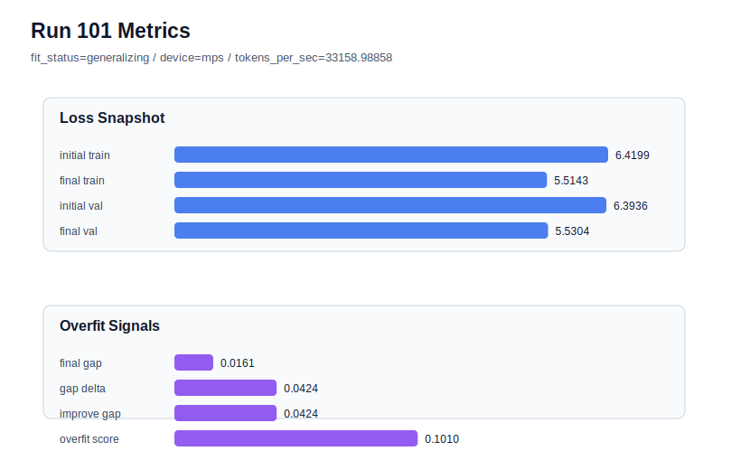

# run 101 실험 보고서

## 이번 가설

For the strong seed606 mish stride24 default run, increasing max_steps from 90 to 100 will give the near-best validation trajectory enough extra optimization to beat run072 while keeping the final gap low.

## 왜 이 가설을 세웠는가

Run099 showed that the current mish + ffn_mult=3 + stride24 default remains a strong default on a fresh seed: seed606 reached final_val_loss 5.542599, only about 0.00044 above the best run072, with final_generalization_gap 0.003213. Run100 lowered init_std to 0.018 and reduced the gap slightly, but worsened validation to 5.543826, so the initialization branch should not be promoted. Since stride20 is now a targeted high-gap rescue rather than a default, and stronger regularization or shorter runs have previously lost validation, the next most direct small test is optimization length: keep the successful seed606/default geometry and train only 10 extra steps. This tests whether the near-best run099 was still mildly optimization-limited or already at the overfit boundary.

## 가설 작성 주체

llm_plan:docs/train/next_plan.json

## 바꾼 변수

```json
{
  "max_steps": 100
}
```

## 고정한 변수

seed, vocab_size, context_length, stride, batch_size, learning_rate, weight_decay, grad_clip, emb_dim, n_heads, n_layers, drop_rate, qkv_bias, ffn_mult, norm_first, norm_eps, activation_name, ffn_dropout_position, attention_impl, tie_embeddings, init_std

## 기대 결과

A useful result would lower final_val_loss below run099's 5.542599 and ideally below run072's 5.542158, while keeping final_generalization_gap below 0.02 and overfit_score below 0.08. If train loss improves but validation rises or overfit_score climbs above 0.10, max_steps=100 is beyond the useful optimization boundary and the default should remain max_steps=90.

## 실험 설정

```json
{
  "run_id": 101,
  "hypothesis": "For the strong seed606 mish stride24 default run, increasing max_steps from 90 to 100 will give the near-best validation trajectory enough extra optimization to beat run072 while keeping the final gap low.",
  "seed": 606,
  "vocab_size": 600,
  "min_frequency": 2,
  "context_length": 48,
  "stride": 24,
  "batch_size": 8,
  "max_steps": 100,
  "eval_batches": 4,
  "train_ratio": 0.9,
  "learning_rate": 0.0003,
  "weight_decay": 0.01,
  "grad_clip": 1.0,
  "emb_dim": 128,
  "n_heads": 4,
  "n_layers": 2,
  "drop_rate": 0.12,
  "qkv_bias": false,
  "ffn_mult": 3,
  "norm_first": false,
  "norm_eps": 1e-05,
  "activation_name": "mish",
  "ffn_dropout_position": "none",
  "attention_impl": "sdpa",
  "tie_embeddings": true,
  "init_std": 0.02
}
```

## 실행 환경

```json
{
  "timestamp": "2026-06-03T03:33:57+00:00",
  "hostname": "woonyong-MacBookPro.local",
  "platform": "macOS-26.3.1-arm64-arm-64bit-Mach-O",
  "machine": "arm64",
  "python": "3.13.13",
  "torch": "2.12.0",
  "cpu_count": 10,
  "memory_gb": 24.0,
  "cuda_available": false,
  "cuda_device_count": 0,
  "mps_available": true,
  "resolved_device": "mps",
  "profile": "mps_balanced"
}
```

- corpus: `src/learning/the-verdict.txt`
- artifact_dir: `docs/train/runs/run_101_artifacts`

## 실제 결과

| 지표 | 값 |
| --- | --- |
| initial_train_loss | 6.419930577278137 |
| initial_val_loss | 6.393611749013265 |
| final_train_loss | 5.514323949813843 |
| final_val_loss | 5.530441125233968 |
| final_generalization_gap | 0.01611717542012503 |
| generalization_gap_delta | 0.04243600368499756 |
| train_val_improvement_gap | 0.04243600368499756 |
| overfit_score | 0.10098918279012015 |
| fit_status | generalizing |
| parameter_count | 413184 |
| tokens_per_sec | 33158.98857968503 |
| elapsed_sec | 1.1522667498793453 |
| device | mps |

## 시각 지표




- 대시보드: `../dashboard.md`
- 지표 요약 CSV: `../metrics_summary.csv`

## 과적합 판단

일반화 개선 신호. final gap=0.0161, overfit_score=0.1010. seed 반복으로 재현성을 확인할 만하다.

## 결론

현재 best 후보: run 72 / val=5.542157967885335 / status=generalizing

## 다음 실험 제안

- 성공 시: Repeat max_steps=100 on seed151 or seed202 to test whether the longer optimization horizon transfers beyond seed606 before considering it as a default.
- 과적합 시: Revert to max_steps=90 and keep the current policy: stride24 default at init_std 0.02, stride20 only for high-gap rescue. Move next to a different variance-reduction axis rather than training longer.
