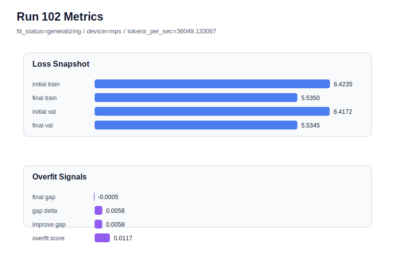

# run 102 실험 보고서

## 이번 가설

Repeating the max_steps=100 horizon on the known best-band seed151 mish stride24 configuration will show whether run101's large validation gain was a transferable optimization effect rather than a seed606-specific lucky trajectory.

## 왜 이 가설을 세웠는가

Run101 lowered raw final_val_loss dramatically to 5.530441 by increasing max_steps from 90 to 100 on seed606, but its overfit_score rose to 0.100989 and the dashboard still treats run072 as the best overfit-aware candidate. Run072 remains the clean reference point: seed151, mish, stride24, max_steps90, final_val_loss 5.542158, final_generalization_gap -0.017935, overfit_score 0.0. Testing seed151 at max_steps100 is the highest-information follow-up because it directly checks whether the extra 10 steps improve the established best seed or merely over-optimize train loss on a favorable seed.

## 가설 작성 주체

llm_plan:docs/train/next_plan.json

## 바꾼 변수

```json
{
  "seed": 151,
  "max_steps": 100
}
```

## 고정한 변수

vocab_size, context_length, stride, batch_size, learning_rate, weight_decay, grad_clip, emb_dim, n_heads, n_layers, drop_rate, qkv_bias, ffn_mult, norm_first, norm_eps, activation_name, ffn_dropout_position, attention_impl, tie_embeddings, init_std

## 기대 결과

A successful transfer result should lower seed151 validation below the run072 baseline of 5.542158, ideally without pushing final_generalization_gap above 0.02 or overfit_score above 0.08. If train loss improves but validation stays flat or overfit_score reaches the medium-risk band around 0.10, max_steps=100 should remain a seed606 observation rather than a default.

## 실험 설정

```json
{
  "run_id": 102,
  "hypothesis": "Repeating the max_steps=100 horizon on the known best-band seed151 mish stride24 configuration will show whether run101's large validation gain was a transferable optimization effect rather than a seed606-specific lucky trajectory.",
  "seed": 151,
  "vocab_size": 600,
  "min_frequency": 2,
  "context_length": 48,
  "stride": 24,
  "batch_size": 8,
  "max_steps": 100,
  "eval_batches": 4,
  "train_ratio": 0.9,
  "learning_rate": 0.0003,
  "weight_decay": 0.01,
  "grad_clip": 1.0,
  "emb_dim": 128,
  "n_heads": 4,
  "n_layers": 2,
  "drop_rate": 0.12,
  "qkv_bias": false,
  "ffn_mult": 3,
  "norm_first": false,
  "norm_eps": 1e-05,
  "activation_name": "mish",
  "ffn_dropout_position": "none",
  "attention_impl": "sdpa",
  "tie_embeddings": true,
  "init_std": 0.02
}
```

## 실행 환경

```json
{
  "timestamp": "2026-06-03T03:39:19+00:00",
  "hostname": "woonyong-MacBookPro.local",
  "platform": "macOS-26.3.1-arm64-arm-64bit-Mach-O",
  "machine": "arm64",
  "python": "3.13.13",
  "torch": "2.12.0",
  "cpu_count": 10,
  "memory_gb": 24.0,
  "cuda_available": false,
  "cuda_device_count": 0,
  "mps_available": true,
  "resolved_device": "mps",
  "profile": "mps_balanced"
}
```

- corpus: `src/learning/the-verdict.txt`
- artifact_dir: `docs/train/runs/run_102_artifacts`

## 실제 결과

| 지표 | 값 |
| --- | --- |
| initial_train_loss | 6.423532009124756 |
| initial_val_loss | 6.4171522458394366 |
| final_train_loss | 5.535039901733398 |
| final_val_loss | 5.534507115681966 |
| final_generalization_gap | -0.0005327860514325877 |
| generalization_gap_delta | 0.005846977233886719 |
| train_val_improvement_gap | 0.005846977233886719 |
| overfit_score | 0.011693954467773438 |
| fit_status | generalizing |
| parameter_count | 413184 |
| tokens_per_sec | 36049.133067089955 |
| elapsed_sec | 1.0598867919761688 |
| device | mps |

## 시각 지표




- 대시보드: `../dashboard.md`
- 지표 요약 CSV: `../metrics_summary.csv`

## 과적합 판단

일반화 개선 신호. final gap=-0.0005, overfit_score=0.0117. seed 반복으로 재현성을 확인할 만하다.

## 결론

현재 best 후보: run 102 / val=5.534507115681966 / status=generalizing

## 다음 실험 제안

- 성공 시: Repeat max_steps=100 on seed202 to estimate whether the longer horizon improves more than one historically strong seed before promoting it as the new stride24 default.
- 과적합 시: Revert the default horizon to max_steps=90 and keep the current policy: mish stride24 at init_std 0.02 as default, stride20 only for high-gap rescue. Move next to a different variance-reduction axis instead of training longer.
