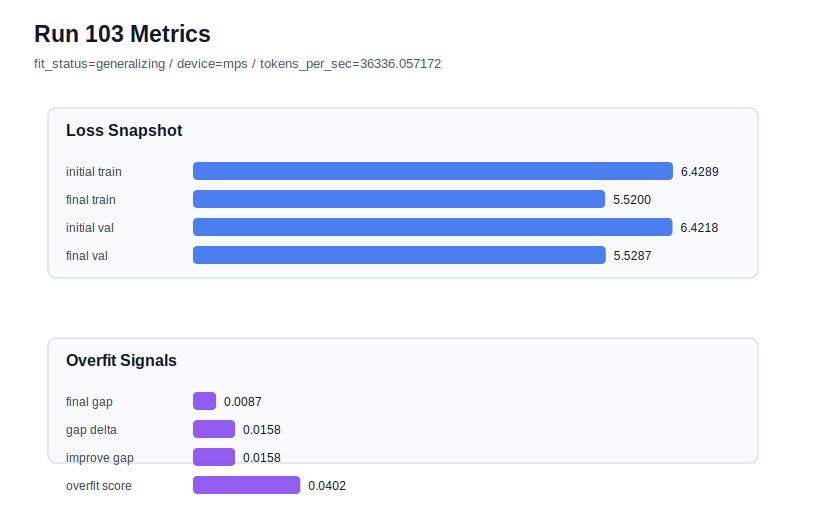

# run 103 실험 보고서

## 이번 가설

Running the current mish stride24 max_steps=100 candidate on seed202 will test whether the longer optimization horizon is robust across another historically strong low-risk seed before making it the new default.

## 왜 이 가설을 세웠는가

Run102 promoted max_steps=100 from a seed606 observation into the current overfit-aware best on seed151, reaching final_val_loss 5.534507 with final_generalization_gap -0.000533 and overfit_score 0.011694. Earlier seed202 evidence was also strong at the mish stride24 baseline: the max_steps90 branch stayed low-risk, and weight_decay/shorter-step attempts did not justify a different regularization or under-training policy. The key question now is whether max_steps=100 improves seed202 without recreating the medium-risk signal seen in run101. A seed202 transfer check is safer and more informative than changing capacity, stride, dropout, or activation while the optimization-horizon hypothesis is still being validated.

## 가설 작성 주체

llm_plan:docs/train/next_plan.json

## 바꾼 변수

```json
{
  "seed": 202,
  "max_steps": 100
}
```

## 고정한 변수

vocab_size, context_length, stride, batch_size, learning_rate, weight_decay, grad_clip, emb_dim, n_heads, n_layers, drop_rate, qkv_bias, ffn_mult, norm_first, norm_eps, activation_name, ffn_dropout_position, attention_impl, tie_embeddings, init_std

## 기대 결과

A successful result should keep fit_status=generalizing, improve or at least match the historical seed202 mish band around final_val_loss 5.541, and keep final_generalization_gap below about 0.02 with overfit_score below 0.08. If validation worsens toward 5.546+ or overfit_score rises into medium-risk territory, max_steps=100 should remain promising but not yet a universal default.

## 실험 설정

```json
{
  "run_id": 103,
  "hypothesis": "Running the current mish stride24 max_steps=100 candidate on seed202 will test whether the longer optimization horizon is robust across another historically strong low-risk seed before making it the new default.",
  "seed": 202,
  "vocab_size": 600,
  "min_frequency": 2,
  "context_length": 48,
  "stride": 24,
  "batch_size": 8,
  "max_steps": 100,
  "eval_batches": 4,
  "train_ratio": 0.9,
  "learning_rate": 0.0003,
  "weight_decay": 0.01,
  "grad_clip": 1.0,
  "emb_dim": 128,
  "n_heads": 4,
  "n_layers": 2,
  "drop_rate": 0.12,
  "qkv_bias": false,
  "ffn_mult": 3,
  "norm_first": false,
  "norm_eps": 1e-05,
  "activation_name": "mish",
  "ffn_dropout_position": "none",
  "attention_impl": "sdpa",
  "tie_embeddings": true,
  "init_std": 0.02
}
```

## 실행 환경

```json
{
  "timestamp": "2026-06-03T03:43:53+00:00",
  "hostname": "woonyong-MacBookPro.local",
  "platform": "macOS-26.3.1-arm64-arm-64bit-Mach-O",
  "machine": "arm64",
  "python": "3.13.13",
  "torch": "2.12.0",
  "cpu_count": 10,
  "memory_gb": 24.0,
  "cuda_available": false,
  "cuda_device_count": 0,
  "mps_available": true,
  "resolved_device": "mps",
  "profile": "mps_balanced"
}
```

- corpus: `src/learning/the-verdict.txt`
- artifact_dir: `docs/train/runs/run_103_artifacts`

## 실제 결과

| 지표 | 값 |
| --- | --- |
| initial_train_loss | 6.428932785987854 |
| initial_val_loss | 6.421806971232097 |
| final_train_loss | 5.520029783248901 |
| final_val_loss | 5.528694152832031 |
| final_generalization_gap | 0.008664369583129883 |
| generalization_gap_delta | 0.015790184338887236 |
| train_val_improvement_gap | 0.015790184338887236 |
| overfit_score | 0.040244738260904356 |
| fit_status | generalizing |
| parameter_count | 413184 |
| tokens_per_sec | 36336.057171870525 |
| elapsed_sec | 1.051517500076443 |
| device | mps |

## 시각 지표




- 대시보드: `../dashboard.md`
- 지표 요약 CSV: `../metrics_summary.csv`

## 과적합 판단

일반화 개선 신호. final gap=0.0087, overfit_score=0.0402. seed 반복으로 재현성을 확인할 만하다.

## 결론

현재 best 후보: run 102 / val=5.534507115681966 / status=generalizing

## 다음 실험 제안

- 성공 시: If seed202 also benefits from max_steps=100, promote mish stride24 max_steps100 as the default candidate and test one fresh seed such as seed707 to measure seed variance under the new horizon.
- 과적합 시: If seed202 overfits or loses validation quality, keep run102 as the best candidate but avoid broad promotion. Compare max_steps95 on seed202 or return to max_steps90 for historically stable seeds while preserving stride20 only as the high-gap rescue.
