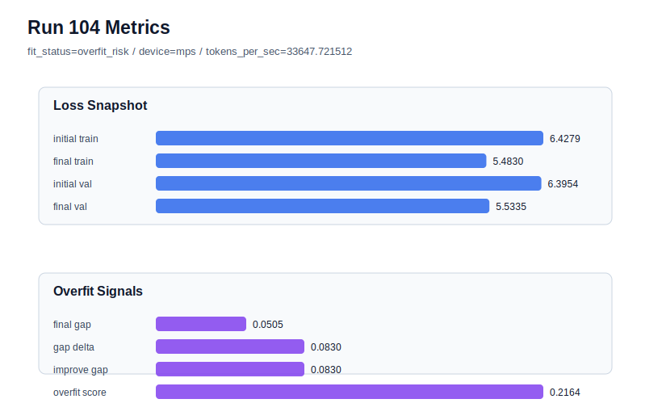

# run 104 실험 보고서

## 이번 가설

Using the promoted mish stride24 max_steps=100 candidate on a fresh seed707 will measure whether the longer-horizon improvement generalizes beyond the already-tested strong seeds or exposes renewed seed variance.

## 왜 이 가설을 세웠는가

Runs101-103 shifted the main hypothesis from activation or stride tuning to optimization horizon. Run101 showed that max_steps=100 can sharply lower raw validation on seed606 but with medium overfit risk. Run102 transferred the same horizon to the known best-band seed151 and became the overfit-aware best with final_val_loss 5.534507, final_generalization_gap -0.000533, and overfit_score 0.011694. Run103 then improved raw validation further on seed202 to 5.528694 while staying low-risk, although the overfit-aware dashboard still prefers run102. Since the earlier weakness of the mish stride24 setup was seed variance, the next safest research step is not another local tuning branch but a fresh seed probe under the new max_steps=100 candidate.

## 가설 작성 주체

llm_plan:docs/train/next_plan.json

## 바꾼 변수

```json
{
  "seed": 707,
  "max_steps": 100
}
```

## 고정한 변수

vocab_size, context_length, stride, batch_size, learning_rate, weight_decay, grad_clip, emb_dim, n_heads, n_layers, drop_rate, qkv_bias, ffn_mult, norm_first, norm_eps, activation_name, ffn_dropout_position, attention_impl, tie_embeddings, init_std

## 기대 결과

A robust default candidate should finish generalizing with final_val_loss in the new 100-step band, ideally below 5.545, final_generalization_gap below 0.03, and overfit_score below 0.10. A particularly strong result would approach run102/run103 without medium-risk overfit. If seed707 repeats the older high-gap seed303/404 behavior, the longer horizon improves strong seeds but still needs a rescue policy for unlucky seeds.

## 실험 설정

```json
{
  "run_id": 104,
  "hypothesis": "Using the promoted mish stride24 max_steps=100 candidate on a fresh seed707 will measure whether the longer-horizon improvement generalizes beyond the already-tested strong seeds or exposes renewed seed variance.",
  "seed": 707,
  "vocab_size": 600,
  "min_frequency": 2,
  "context_length": 48,
  "stride": 24,
  "batch_size": 8,
  "max_steps": 100,
  "eval_batches": 4,
  "train_ratio": 0.9,
  "learning_rate": 0.0003,
  "weight_decay": 0.01,
  "grad_clip": 1.0,
  "emb_dim": 128,
  "n_heads": 4,
  "n_layers": 2,
  "drop_rate": 0.12,
  "qkv_bias": false,
  "ffn_mult": 3,
  "norm_first": false,
  "norm_eps": 1e-05,
  "activation_name": "mish",
  "ffn_dropout_position": "none",
  "attention_impl": "sdpa",
  "tie_embeddings": true,
  "init_std": 0.02
}
```

## 실행 환경

```json
{
  "timestamp": "2026-06-03T03:49:04+00:00",
  "hostname": "woonyong-MacBookPro.local",
  "platform": "macOS-26.3.1-arm64-arm-64bit-Mach-O",
  "machine": "arm64",
  "python": "3.13.13",
  "torch": "2.12.0",
  "cpu_count": 10,
  "memory_gb": 24.0,
  "cuda_available": false,
  "cuda_device_count": 0,
  "mps_available": true,
  "resolved_device": "mps",
  "profile": "mps_balanced"
}
```

- corpus: `src/learning/the-verdict.txt`
- artifact_dir: `docs/train/runs/run_104_artifacts`

## 실제 결과

| 지표 | 값 |
| --- | --- |
| initial_train_loss | 6.427897334098816 |
| initial_val_loss | 6.39542818069458 |
| final_train_loss | 5.482966423034668 |
| final_val_loss | 5.533458232879639 |
| final_generalization_gap | 0.0504918098449707 |
| generalization_gap_delta | 0.08296096324920654 |
| train_val_improvement_gap | 0.08296096324920654 |
| overfit_score | 0.2164137363433838 |
| fit_status | overfit_risk |
| parameter_count | 413184 |
| tokens_per_sec | 33647.721511623946 |
| elapsed_sec | 1.135530082974583 |
| device | mps |

## 시각 지표




- 대시보드: `../dashboard.md`
- 지표 요약 CSV: `../metrics_summary.csv`

## 과적합 판단

과적합 위험. final gap=0.0505, overfit_score=0.2164. 다음 실험은 regularization 강화가 우선이다.

## 결론

현재 best 후보: run 102 / val=5.534507115681966 / status=generalizing

## 다음 실험 제안

- 성공 시: If seed707 is low-risk, keep mish stride24 max_steps100 as the default candidate and run one more fresh seed or summarize the new policy as max_steps100 default plus stride20 rescue only for high-gap failures.
- 과적합 시: If seed707 overfits, keep max_steps100 for strong seeds but immediately test the established stride20 rescue on the same seed707 before changing activation, dropout, capacity, or learning rate.
