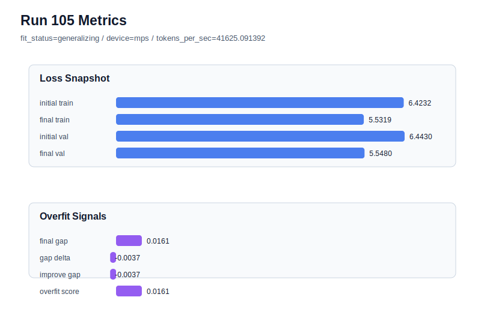

# run 105 실험 보고서

## 이번 가설

For the overfit-prone fresh seed707 under the promoted max_steps=100 candidate, reducing stride from 24 to 20 will add moderate window overlap that lowers the high generalization gap while preserving most of the strong raw validation.

## 왜 이 가설을 세웠는가

Run104 showed that mish stride24 max_steps100 can still fail by seed: seed707 reached competitive final_val_loss 5.533458, but train loss fell to 5.482966, producing final_generalization_gap 0.050492 and overfit_score 0.216414. Earlier stride experiments established stride20 as the cleanest targeted rescue for high-gap seeds: it rescued seed404 from overfit_risk to generalizing with overfit_score 0.0 and improved seed303 versus both stride24 and stride16, while stride20 was not good enough to become a global default for seed151. Therefore the safest next test is not activation, dropout, capacity, or learning-rate tuning, but a matched seed707 stride20 rescue while keeping the new 100-step horizon intact.

## 가설 작성 주체

llm_plan:docs/train/next_plan.json

## 바꾼 변수

```json
{
  "seed": 707,
  "stride": 20,
  "max_steps": 100
}
```

## 고정한 변수

vocab_size, context_length, batch_size, learning_rate, weight_decay, grad_clip, emb_dim, n_heads, n_layers, drop_rate, qkv_bias, ffn_mult, norm_first, norm_eps, activation_name, ffn_dropout_position, attention_impl, tie_embeddings, init_std

## 기대 결과

A useful rescue should reduce seed707 final_generalization_gap well below 0.050492 and overfit_score below 0.10, ideally restoring fit_status=generalizing while keeping final_val_loss near the new 100-step band and below about 5.545. If validation worsens toward 5.55+ or overfit_score remains high, stride20 is not enough under the longer horizon.

## 실험 설정

```json
{
  "run_id": 105,
  "hypothesis": "For the overfit-prone fresh seed707 under the promoted max_steps=100 candidate, reducing stride from 24 to 20 will add moderate window overlap that lowers the high generalization gap while preserving most of the strong raw validation.",
  "seed": 707,
  "vocab_size": 600,
  "min_frequency": 2,
  "context_length": 48,
  "stride": 20,
  "batch_size": 8,
  "max_steps": 100,
  "eval_batches": 4,
  "train_ratio": 0.9,
  "learning_rate": 0.0003,
  "weight_decay": 0.05,
  "grad_clip": 1.0,
  "emb_dim": 128,
  "n_heads": 4,
  "n_layers": 1,
  "drop_rate": 0.16999999999999998,
  "qkv_bias": false,
  "ffn_mult": 2,
  "norm_first": false,
  "norm_eps": 1e-05,
  "activation_name": "mish",
  "ffn_dropout_position": "none",
  "attention_impl": "sdpa",
  "tie_embeddings": true,
  "init_std": 0.02
}
```

## 실행 환경

```json
{
  "timestamp": "2026-06-03T03:53:59+00:00",
  "hostname": "woonyong-MacBookPro.local",
  "platform": "macOS-26.3.1-arm64-arm-64bit-Mach-O",
  "machine": "arm64",
  "python": "3.13.13",
  "torch": "2.12.0",
  "cpu_count": 10,
  "memory_gb": 24.0,
  "cuda_available": false,
  "cuda_device_count": 0,
  "mps_available": true,
  "resolved_device": "mps",
  "profile": "mps_balanced"
}
```

- corpus: `src/learning/the-verdict.txt`
- artifact_dir: `docs/train/runs/run_105_artifacts`

## 실제 결과

| 지표 | 값 |
| --- | --- |
| initial_train_loss | 6.423198103904724 |
| initial_val_loss | 6.442967891693115 |
| final_train_loss | 5.5318992137908936 |
| final_val_loss | 5.547992706298828 |
| final_generalization_gap | 0.01609349250793457 |
| generalization_gap_delta | -0.003676295280456543 |
| train_val_improvement_gap | -0.003676295280456543 |
| overfit_score | 0.01609349250793457 |
| fit_status | generalizing |
| parameter_count | 215296 |
| tokens_per_sec | 41625.091392008115 |
| elapsed_sec | 0.9132952920626849 |
| device | mps |

## 시각 지표




- 대시보드: `../dashboard.md`
- 지표 요약 CSV: `../metrics_summary.csv`

## 과적합 판단

일반화 개선 신호. final gap=0.0161, overfit_score=0.0161. seed 반복으로 재현성을 확인할 만하다.

## 결론

현재 best 후보: run 102 / val=5.534507115681966 / status=generalizing

## 다음 실험 제안

- 성공 시: If stride20 rescues seed707 under max_steps100, document the policy as mish max_steps100 default for low-risk seeds plus stride20 rescue for high-gap fresh seeds, then test one more fresh seed only if more variance confidence is needed.
- 과적합 시: If stride20 still overfits seed707, test whether lowering max_steps to 95 on seed707 stride20 reduces train-side over-progress before changing regularization, capacity, activation, or learning rate.
