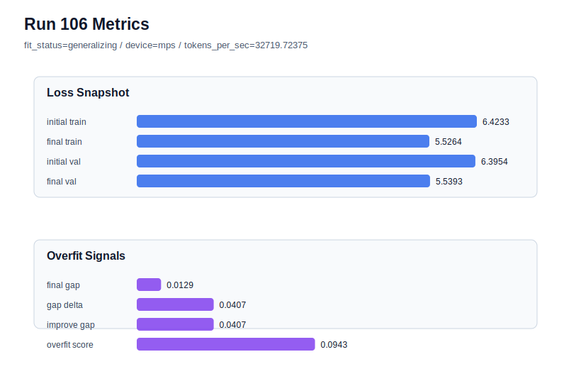

# run 106 실험 보고서

## 이번 가설

For the overfit-prone seed707 max_steps=100 case, reducing stride from 24 to 20 will lower the high generalization gap while preserving the original 413k-parameter mish architecture and default regularization.

## 왜 이 가설을 세웠는가

Run104 showed the promoted mish stride24 max_steps100 candidate can achieve competitive validation on seed707, but with a high final_generalization_gap of 0.050492 and overfit_score of 0.216414. Run105 appeared to rescue the gap at stride20, but inspection of the consumed config showed the runner merged the partial LLM override onto an overfit-mitigation base, changing weight_decay, n_layers, drop_rate, and ffn_mult and reducing parameter_count to 215296. To isolate the stride hypothesis cleanly, this run explicitly fixes the architecture, regularization, activation, optimizer, data window size, and 100-step horizon while changing only seed707 and stride20 relative to the promoted baseline.

## 가설 작성 주체

llm_plan:docs/train/next_plan.json

## 바꾼 변수

```json
{
  "seed": 707,
  "stride": 20,
  "max_steps": 100
}
```

## 고정한 변수

vocab_size, context_length, batch_size, learning_rate, weight_decay, grad_clip, emb_dim, n_heads, n_layers, drop_rate, qkv_bias, ffn_mult, norm_first, norm_eps, activation_name, ffn_dropout_position, attention_impl, tie_embeddings, init_std

## 기대 결과

A clean stride20 rescue should keep parameter_count near 413184, reduce seed707 final_generalization_gap below run104's 0.050492, lower overfit_score below 0.10, and ideally keep final_val_loss below 5.545 with fit_status=generalizing. If validation degrades toward run105's 5.548 band or overfit remains high, stride20 is not a sufficient matched-architecture rescue under the longer horizon.

## 실험 설정

```json
{
  "run_id": 106,
  "hypothesis": "For the overfit-prone seed707 max_steps=100 case, reducing stride from 24 to 20 will lower the high generalization gap while preserving the original 413k-parameter mish architecture and default regularization.",
  "seed": 707,
  "vocab_size": 600,
  "min_frequency": 2,
  "context_length": 48,
  "stride": 20,
  "batch_size": 8,
  "max_steps": 100,
  "eval_batches": 4,
  "train_ratio": 0.9,
  "learning_rate": 0.0003,
  "weight_decay": 0.01,
  "grad_clip": 1.0,
  "emb_dim": 128,
  "n_heads": 4,
  "n_layers": 2,
  "drop_rate": 0.12,
  "qkv_bias": false,
  "ffn_mult": 3,
  "norm_first": false,
  "norm_eps": 1e-05,
  "activation_name": "mish",
  "ffn_dropout_position": "none",
  "attention_impl": "sdpa",
  "tie_embeddings": true,
  "init_std": 0.02
}
```

## 실행 환경

```json
{
  "timestamp": "2026-06-03T04:00:25+00:00",
  "hostname": "woonyong-MacBookPro.local",
  "platform": "macOS-26.3.1-arm64-arm-64bit-Mach-O",
  "machine": "arm64",
  "python": "3.13.13",
  "torch": "2.12.0",
  "cpu_count": 10,
  "memory_gb": 24.0,
  "cuda_available": false,
  "cuda_device_count": 0,
  "mps_available": true,
  "resolved_device": "mps",
  "profile": "mps_balanced"
}
```

- corpus: `src/learning/the-verdict.txt`
- artifact_dir: `docs/train/runs/run_106_artifacts`

## 실제 결과

| 지표 | 값 |
| --- | --- |
| initial_train_loss | 6.423290491104126 |
| initial_val_loss | 6.39542818069458 |
| final_train_loss | 5.526401996612549 |
| final_val_loss | 5.539270559946696 |
| final_generalization_gap | 0.012868563334147431 |
| generalization_gap_delta | 0.04073087374369333 |
| train_val_improvement_gap | 0.04073087374369333 |
| overfit_score | 0.09433031082153409 |
| fit_status | generalizing |
| parameter_count | 413184 |
| tokens_per_sec | 32719.723750400717 |
| elapsed_sec | 1.161868000170216 |
| device | mps |

## 시각 지표




- 대시보드: `../dashboard.md`
- 지표 요약 CSV: `../metrics_summary.csv`

## 과적합 판단

일반화 개선 신호. final gap=0.0129, overfit_score=0.0943. seed 반복으로 재현성을 확인할 만하다.

## 결론

현재 best 후보: run 102 / val=5.534507115681966 / status=generalizing

## 다음 실험 제안

- 성공 시: If matched-architecture stride20 rescues seed707 while preserving validation, keep mish stride24 max_steps100 as the default for low-risk seeds and document stride20 as the first rescue for high-gap fresh seeds before testing one additional fresh seed.
- 과적합 시: If matched-architecture stride20 still overfits seed707, test a shorter max_steps=95 horizon on seed707 with stride24 before changing activation, capacity, dropout, or weight decay.
