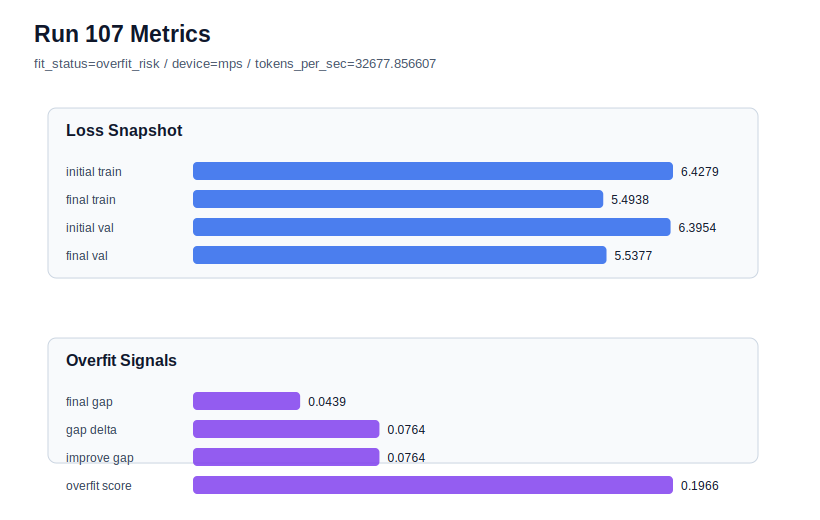

# run 107 실험 보고서

## 이번 가설

For the seed707 mish stride24 case that overfit at max_steps=100, shortening the horizon to max_steps=95 will preserve most of the strong validation loss while reducing the late train-side overfit signal.

## 왜 이 가설을 세웠는가

Run104 showed that the promoted mish stride24 max_steps100 configuration had excellent raw validation on seed707 (final_val_loss=5.533458) but failed the risk gate with final_generalization_gap=0.050492 and overfit_score=0.216414. Run106 proved that stride20 can rescue the same seed under the matched 413184-parameter architecture, lowering the gap to 0.012869 and overfit_score to 0.094330, but it paid a validation-loss cost (final_val_loss=5.539271) and stayed medium risk. Since the 100-step horizon is strong on seeds151/202 but too aggressive on seed707, a smaller optimization-only change is the next safest test: keep stride24, mish, architecture, regularization, and data windowing fixed, but stop at 95 steps to see whether the raw validation advantage can be retained before the overfit score spikes.

## 가설 작성 주체

llm_plan:docs/train/next_plan.json

## 바꾼 변수

```json
{
  "seed": 707,
  "max_steps": 95
}
```

## 고정한 변수

vocab_size, context_length, stride, batch_size, learning_rate, weight_decay, grad_clip, emb_dim, n_heads, n_layers, drop_rate, qkv_bias, ffn_mult, norm_first, norm_eps, activation_name, ffn_dropout_position, attention_impl, tie_embeddings, init_std

## 기대 결과

If seed707's run104 failure is mainly late-horizon over-optimization, max_steps=95 should keep final_val_loss in the 5.533-5.539 band while reducing final_generalization_gap below 0.03 and overfit_score below 0.10. A successful result would beat run106 on validation while staying generalizing or low-medium risk. If overfit_score remains high, stride20 is the better rescue than shorter stride24 training.

## 실험 설정

```json
{
  "run_id": 107,
  "hypothesis": "For the seed707 mish stride24 case that overfit at max_steps=100, shortening the horizon to max_steps=95 will preserve most of the strong validation loss while reducing the late train-side overfit signal.",
  "seed": 707,
  "vocab_size": 600,
  "min_frequency": 2,
  "context_length": 48,
  "stride": 24,
  "batch_size": 8,
  "max_steps": 95,
  "eval_batches": 4,
  "train_ratio": 0.9,
  "learning_rate": 0.0003,
  "weight_decay": 0.01,
  "grad_clip": 1.0,
  "emb_dim": 128,
  "n_heads": 4,
  "n_layers": 2,
  "drop_rate": 0.12,
  "qkv_bias": false,
  "ffn_mult": 3,
  "norm_first": false,
  "norm_eps": 1e-05,
  "activation_name": "mish",
  "ffn_dropout_position": "none",
  "attention_impl": "sdpa",
  "tie_embeddings": true,
  "init_std": 0.02
}
```

## 실행 환경

```json
{
  "timestamp": "2026-06-03T04:04:21+00:00",
  "hostname": "woonyong-MacBookPro.local",
  "platform": "macOS-26.3.1-arm64-arm-64bit-Mach-O",
  "machine": "arm64",
  "python": "3.13.13",
  "torch": "2.12.0",
  "cpu_count": 10,
  "memory_gb": 24.0,
  "cuda_available": false,
  "cuda_device_count": 0,
  "mps_available": true,
  "resolved_device": "mps",
  "profile": "mps_balanced"
}
```

- corpus: `src/learning/the-verdict.txt`
- artifact_dir: `docs/train/runs/run_107_artifacts`

## 실제 결과

| 지표 | 값 |
| --- | --- |
| initial_train_loss | 6.427897334098816 |
| initial_val_loss | 6.39542818069458 |
| final_train_loss | 5.493781328201294 |
| final_val_loss | 5.537662823994954 |
| final_generalization_gap | 0.043881495793660186 |
| generalization_gap_delta | 0.07635064919789603 |
| train_val_improvement_gap | 0.07635064919789603 |
| overfit_score | 0.19658279418945224 |
| fit_status | overfit_risk |
| parameter_count | 413184 |
| tokens_per_sec | 32677.856606778514 |
| elapsed_sec | 1.1104767499491572 |
| device | mps |

## 시각 지표




- 대시보드: `../dashboard.md`
- 지표 요약 CSV: `../metrics_summary.csv`

## 과적합 판단

과적합 위험. final gap=0.0439, overfit_score=0.1966. 다음 실험은 regularization 강화가 우선이다.

## 결론

현재 best 후보: run 102 / val=5.534507115681966 / status=generalizing

## 다음 실험 제안

- 성공 시: If max_steps=95 rescues seed707 with better validation than stride20, test max_steps=95 on seed151 or seed202 to see whether a slightly shorter horizon can become the safer default without losing run102's best score.
- 과적합 시: If max_steps=95 still overfits seed707, keep max_steps100 as the low-risk-seed default and document stride20 as the first rescue path for high-gap fresh seeds before trying another fresh seed variance probe.
